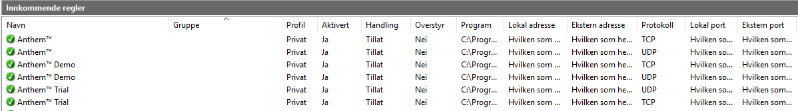

Let's firewall some stuff, shall we?

# Chapter 3, Part 1: Configure Windows Defender Firewall (act 1)

## Overview

So, what is a firewall? Let's not get philosophical, let's get down to business!

A firewall is hardware, or in this case, software that protects a host or zone by checking inbound (and if needed outbound) traffic on the network. Windows firewall is a host-based software firewall that's been a part of Windows Server since Windows Server 2003. 

With the release of Windows 10 build 1709  (September 2017), it was renamed Windows Defender Firewall.

### Configuring the Windows Defender Firewall with Advanced Security

We have many ways of interacting with the Windows Defender Firewall. I'm listing some of them below, but for the sake of simplicity we will do as the 744 exam ref does and focus on the advanced security console!

#### Control panel

~~~powershell
firewall.cpl
#opens the Windows Defender Firewall control panel
~~~

#### netsh

~~~powershell
netsh advfirewall firewall
#uses the now legacy netsh command-line program to configure
#the firewall programmatically
~~~

#### Show-ControlPanelItem

~~~powershell
Show-ControlPanelItem -Name 'Windows Defender Firewall'
#opens the windows defender firewall control panel
~~~

#### NetSecurity cmdlets

~~~powershell
Get-NetFirewallRule
Copy-NetFirewallRule
New-NetFirewallRule
#and many more
~~~

[This link](https://docs.microsoft.com/en-us/powershell/module/netsecurity/?view=win10-ps) provides you with all cmdlet descriptions and syntax for all Network Security cmdlets. Be aware, there's a lot more than just firewall things here.

#### Advanced Security MMC

~~~powershell
wf.msc
#opens the Windows Defender Firewall with Advanced Security MMC console
~~~

Finally, we get to the "big fish". For this step to make sense, please open the console on your own PC, or use the following picture for reference.

On the left hand side you'll notice four categories:

1. Inbound Rules - these are for inbound traffic
2. Outbound Rules - these are for outbound traffic
3. Connection Security Rules - Network policies that employ IPSec to control host-to-host authentication, encryption and data-integrity
4. Monitoring - Here we can monitor the behavior of the firewall, connection security rules and IPSec security associations.

Let's first start by getting to know how the firewall rules work!

#### Windows Defender Firewall rules

Let's dig deeper into the inbound rules. For this, I present to you a snip from my own personal firewall (mind you everythings Norwegian).

In this picture we get a sense of what we can configure - there's also three more categories to the right that got cut of in formatting, but bear with me.

* Name - identifies the purpose of the rule, like the image above, to make me able to play video games. You can't change the name of default rules.
* Group - an easy way to logically group firewall rules together by a name.
* Profile - which network location profile the rule belongs to, there are 3 total:
  * Domain
  * Public
  * Private
* Enabled - if it's on or not.
* Action - it's either allow or block.
* Override - allows the administrator to define a rule that overrides a conflicting rule.
* Program - the rule can target an executable program or a system service. This way you don't have to specify ports.
* Local Address - the ip address or ip range to which the rule applies.
* Remote Address - the ip address or ip range on the remote network to which the rule applies.

If we right click Inbound Rules we can filter the rules to make it easier to review, or create new rules.

#### Creating new firewall rules

For this we are going to create an inbound rule that allows us to recieve traffic on UDP port 1337, from all hosts on the 10.10.10.0/24 network.

First, let's do it the fast way, using PowerShell/cmd.

##### cmd

~~~powershell
netsh advfirewall firewall add rule name="Truls Example Rule 1337" dir=in action=allow protocol=UDP localport=1337 enable=yes remoteip=10.10.10.0/24 profile=private
~~~

##### powershell

~~~powershell
New-NetFirewallRule -DisplayName "Truls Example Rule 1337" -Direction Inbound -LocalPort 1337 -Protocol UDP -Action Allow -RemoteAddress 10.10.10.0/24 -Enabled $True -Profile Private
~~~

Alternatively, we can use the New Inbound Rule Wizard by right clicking the Inbound Rules node and selcting new rule. Here we would select Rule Type (Port), define Protocol and Ports (UDP/1337), choose an Action (allow), determine the Profile (private) and choose a Name (Truls Example Rule 1337).

#### Using netsh and PowerShell to list and export rules

##### Listing files and changing rules

To view the rule I just created, I can do

~~~powershell
Get-NetFirewallRule -DisplayName "Truls Example Rule 1337"
~~~

By that logic, to change rule settings easily in the same PowerShell session, I can do something like this

~~~powershell
Get-NetFirewallRule -DisplayName "Truls Example Rule 1337" | Set-NetFirewallRule -Description "Test" -LocalPort 1338 -Profile All
~~~

To add several rules to a group, I can create a simple loop to add all inbound rules that have SQL in the name to a generic SQL rule group

~~~powershell
$sql_rules = Get-NetFirewallRule -DisplayName "*SQL*" -Direction in
ForEach($rule in $sql_rules) {
  $rule | Set-NetFirewallRule -Group "Generic SQL rules"
}
~~~

Using netsh I can something similar, to list out the rule I just created for SQL

~~~console
netsh advfirewall firewall show rule name=all dir=in
~~~

##### Exporting and importing

To export using netsh, use the following command

~~~console
netsh advfirewall export "C:\temp\firewallz_rule.wfw"
~~~

Importing follows the exact same logic

~~~console
netsh advfirewall import "C:\temp\firewallz_rule.wfw"
~~~

Powershell does not have the same functionality, but we can use Copy-NetFirewallRule to either copy a group, or an entire policy store to a new one. A policy store is a container for firewall and IPsec policy - a Group Policy, in that sense, is also a policy store.

First, let's copy our single rule from earlier

~~~powershell
Copy-NetFirewallRule -DisplayName "Truls Example Rule 1337" -NewName "Truls Example Rule 1338"
~~~

Then, let's copy our SQL group!

~~~powershell
Copy-NetFirewallRule -Group "Generic SQL rules" -Enabled $True -PolicyStore truls.lab\SQL_Server -NewPolicyStore truls.lab\SQL_Server_New
~~~

Last, but not least, let's copy the entirity of the domain rules over to a new policy store! This requires access to the new policy store, obviously.

~~~powershell
Get-NetFirewallProfile -Profile Domain -PolicyStore truls.lab\Security_Baseline | Copy-NetFirewallRule -NewPolicyStore new.lab\Copied_Security_Baseline
~~~

### Configure network location profiles and deploy profile rules using Group Policy

Network location profiles are used by the Network Location Awareness service that runs on Windows Server and Client operating systems. There's three default profiles, which most people using Windows in some shape or form are familiar with:

1. Public - default profile, provides the strongest default firewall security.
2. Private - provides some isolation for systems on trusted networks.
3. Domain - automatically assigned when an Active Directory connection is detected by Windows.

For the 744 exam it's assumed that we are working with:

* A Windows Server system
* A domain joined system

So further on in this sub-chapter we'll be talking about the *domain* profile.

#### Deploying Windows Firewall Rules using GPO

This procedure is almost identical to configuring the firewall on a host, except for these first two steps:

1. On a Domain Controller (DC), open the Group Policy Management Console and open the desired GPO
2. Navigate to the firewall path

~~~CONSOLE
Computer Configuration\Policies\Windows Settings\Security Settings\Windows Defender Firewall with Advanced Security\Windows Defender Firewall with Advanced Security\Inbound Rules
~~~

Now, the process is the same as using the New Inbound Rule Wizard.

#### Importing "golden" firewall to GPO

Earlier we exported some rules we had created - if those rules are something you'd want to push to, say, all your clients, you can easily import the rules in the Group Policy Editor.
Simply navigate to this GPO:

~~~CONSOLE
Computer Configuration\Policies\Windows Settings\Security Settings\Windows Defender Firewall with Advanced Security\Windows Defender Firewall with Advanced Security
~~~

Right-click the 'Windows Firewall with Advanced Security' node and select Import Policy. All we need to do now is select our exported 'firewallz_rule.wfw', and we're done.

Next time we're taking a look at connection security rules and some more tips and tricks for configuring the Windows Defender Firewall

### Links

[70-744 Exam Reference on Amazon](https://www.amazon.com/Exam-70-744-Securing-Windows-Server/dp/1509304266) - check this out, it's really good!
[Windows Defender Firewall with Advanced Security on docs.microsoft.com](https://docs.microsoft.com/en-us/windows/security/threat-protection/windows-firewall/windows-firewall-with-advanced-security) - this has a PowerShell reference guide, Design Guide and Deployment Guide.
[NetSecurity cmdlets reference](https://docs.microsoft.com/en-us/powershell/module/netsecurity/?view=win10-ps)

#### Standard disclaimer

The world of security is always changing and that's also the case for Microsoft. To follow all their updates, new products, what's retiring and namechanges please use the following link to [stay updated](https://blogs.technet.microsoft.com/secguide/) on all their blogs and updates. Here they discuss updated baselines and so much more.

Most of this writing is strongly influenced by the 70-744 Exam Reference - so there will be a lot of similarities. It's a great book, please check it out.