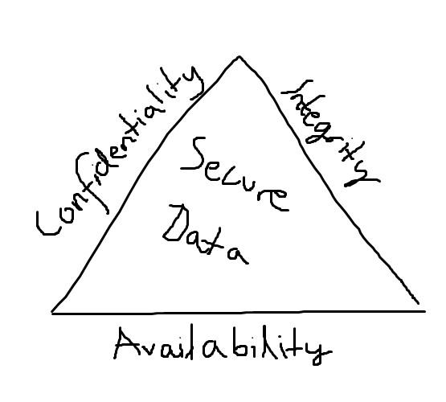
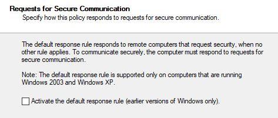

# Chapter 3, Part 2: Configure Windows Defender Firewall

## Overview

In this post we'll pick up where we left things last time, Windows *Defender* Firewall. Windows firewall in itself might be very trivial, but this time we're jumping straight into the world of network security rules and IPSec, which hopefully should be a bit more interesting

### Configure connection security rules

#### What are connection security rules?

While firewall rules provide security by checking traffic that are allowed to reach/leave the server/client, connection security rules are concerned with a different type of security. Everyone who's done a semester of CompSci have heard the "CIA" rule;

* Confidentiality - "data is encrypted such that only authorized parties can decrypt and examine it"
* Integrity - "data is guaranteed to be consistent from sender to reciever" 
* Authentication - "the identity of each communicating party is verified"

Having trouble understanding? I drew a picture for you:

This is where IPSec comes into the picture. Often mistakenly refered to as a protocol, this industry standard and protocol suite provides various protections for IP traffic. 
The 744 exam ref summarizes this for us very well; "IPv4 traffic was never designed to provide CIA, IPv6 has IPSec built in, but how many businesses have shifted to IPv6 exclusively?"

So, let's get a move on. For today, the exam itself is concerned with only two protocols from IPSec, namely;

* Authentication Header (AH) - provides authentication, anti-replay and integrity, but no encryption.
* Encapsulating Security Payload (ESP) - provides data encryption on the IP packet's payload without offering authentication.

Now, for real life purposes, keep in mind that implementing IPSec protocols such as ESP adds a minimal overhead on your internal network. Is encryption on internal network traffic something you need? Depends. Enabling only AH for authentication, however, results in no overhead at all.

#### IPSec connection security type rules

Creating an IPSec rule first and foremost includes knowing of and understanding different rule types:

* Isolation - restricts connections based on auth criteria
* Auth exemption - blocks auth request from specified nodes
* Server-to-server - auths connections between two specified nodes
* Tunnel - auths connections between two VPN gateway nodes

For more information in depth, see [this](https://support.microsoft.com/en-us/help/942957/security-rules-for-windows-firewall-and-for-ipsec-based-connections-in) link. It might seem outdated, but was last updated (at the time of writing) April 17th, 2018.

#### Defining a connection security rule

So, let's do some ACTUAL work now that we got all those words out of the way. Let's say that we have a Windows Server 2016 server named **server_truls1** that requires **encrypted** and **authenticated** communication to the other servers on the internal network. 

#### Group Policy

* First, navigate to the following path in your desired GPO (recommended that you create a new one)

~~~CONSOLE
Computer Configuration\Policies\Windows Settings\Security Settings\Windows Defender Firewall with Advanced Security\Connection Security Rules
~~~

* Right-click the node and select New Rule.
* Select Isolation, click next.
* Choose an authentication **option**:
  * Request for in- and outbound
  * Require for inbound and request for outbound
  * Require for in- and outbound

These three options give us some level of granularity. For our usecase, being that we want authentication and the ability to communicate with every node, select the second option (require for in, request for out).

This means that we can communicate with every single node, but only accept connections from authenticated nodes

* Click next
* Select an authentication **method**:
  * Choose between computer and/or user
  * For our usecase, select 'Computer and User (Kerberos V5)'
* Bind the rule to the network location profile (if you don't know what a NLP is, check out the [last blogpost I did.](https://www.infernux.no/2019-02-22-securingwindowsserver31/))
* Give the rule a name, then you're finished!

You should now be able to view the rule using Group Policy Management Editor to verify that it's set up correctly!

#### GUI Console

Ok, so the builtin MMC-snapins for mmc.exe are a bit outdated, but are included in Windows Server 2016 (and 2019) for backwards compability:
* IP Security Policy Management
  * This is used to create new IPsec Policies
* IP Security Monitor
  * Monitors stuff? Yes, yes it does. It's for viewing and troubleshooting policy config and comms!

Now, using this trying to create a new IPSec Policy will show that it default refers to Windows 2003 and XP. Sooooo, yeah. That's a thing.

The IPSec policies can be created using the mmc-snapins locally on your PC, or you can find the IP Security Policies node using Group Policies:

~~~CONSOLE
Computer Configuration\Policies\Windows Settings\Security Settings\IP Security Policies on Active Directory
~~~

You can create three default policies here:

1. Client (**Respond Only**) - Responds to requests for IPSec communications. Could be a client or a server.
2. Secure Server (**Require Security**) - Requires all inbound and outbound traffic to be IPSec.
3. Server (**Request Security**) - Does not require IPSec, but requests it actively.

And that's it for the legacy mmc-snapins.

#### Powershell

Ok, so this is the fun part of this blogpost. First, let's open an **elevated PowerShell** window! Then we'll run a simple query to find out what the NetSecurity module has to offer us when it comes to working with IPSec!

~~~Powershell
Windows PowerShell
Copyright (C) 2016 Microsoft Corporation. All rights reserved.

Truls profile loaded.
C:\temp $ Get-Command -Module NetSecurity | Where-Object {$_.Name -like '*ipsec*'}

CommandType     Name                                               Version    Source
-----------     ----                                               -------
Function        Copy-NetIPsecMainModeCryptoSet                     2.0.0.0
Function        Copy-NetIPsecMainModeRule                          2.0.0.0    
Function        Copy-NetIPsecPhase1AuthSet                         2.0.0.0    
Function        Copy-NetIPsecPhase2AuthSet                         2.0.0.0    
Function        Copy-NetIPsecQuickModeCryptoSet                    2.0.0.0    
Function        Copy-NetIPsecRule                                  2.0.0.0    
Function        Disable-NetIPsecMainModeRule                       2.0.0.0    
Function        Disable-NetIPsecRule                               2.0.0.0    
Function        Enable-NetIPsecMainModeRule                        2.0.0.0    
Function        Enable-NetIPsecRule                                2.0.0.0    
Function        Find-NetIPsecRule                                  2.0.0.0    
Function        Get-NetIPsecDospSetting                            2.0.0.0    
Function        Get-NetIPsecMainModeCryptoSet                      2.0.0.0    
Function        Get-NetIPsecMainModeRule                           2.0.0.0    
Function        Get-NetIPsecMainModeSA                             2.0.0.0    
Function        Get-NetIPsecPhase1AuthSet                          2.0.0.0    
Function        Get-NetIPsecPhase2AuthSet                          2.0.0.0    
Function        Get-NetIPsecQuickModeCryptoSet                     2.0.0.0    
Function        Get-NetIPsecQuickModeSA                            2.0.0.0    
Function        Get-NetIPsecRule                                   2.0.0.0    
Function        New-NetIPsecDospSetting                            2.0.0.0    
Function        New-NetIPsecMainModeCryptoSet                      2.0.0.0    
Function        New-NetIPsecMainModeRule                           2.0.0.0    
Function        New-NetIPsecPhase1AuthSet                          2.0.0.0    
Function        New-NetIPsecPhase2AuthSet                          2.0.0.0    
Function        New-NetIPsecQuickModeCryptoSet                     2.0.0.0    
Function        New-NetIPsecRule                                   2.0.0.0    
Function        Remove-NetIPsecDospSetting                         2.0.0.0    
Function        Remove-NetIPsecMainModeCryptoSet                   2.0.0.0    
Function        Remove-NetIPsecMainModeRule                        2.0.0.0    
Function        Remove-NetIPsecMainModeSA                          2.0.0.0    
Function        Remove-NetIPsecPhase1AuthSet                       2.0.0.0    
Function        Remove-NetIPsecPhase2AuthSet                       2.0.0.0    
Function        Remove-NetIPsecQuickModeCryptoSet                  2.0.0.0    
Function        Remove-NetIPsecQuickModeSA                         2.0.0.0    
Function        Remove-NetIPsecRule                                2.0.0.0    
Function        Rename-NetIPsecMainModeCryptoSet                   2.0.0.0    
Function        Rename-NetIPsecMainModeRule                        2.0.0.0    
Function        Rename-NetIPsecPhase1AuthSet                       2.0.0.0    
Function        Rename-NetIPsecPhase2AuthSet                       2.0.0.0    
Function        Rename-NetIPsecQuickModeCryptoSet                  2.0.0.0    
Function        Rename-NetIPsecRule                                2.0.0.0    
Function        Set-NetIPsecDospSetting                            2.0.0.0    
Function        Set-NetIPsecMainModeCryptoSet                      2.0.0.0    
Function        Set-NetIPsecMainModeRule                           2.0.0.0    
Function        Set-NetIPsecPhase1AuthSet                          2.0.0.0    
Function        Set-NetIPsecPhase2AuthSet                          2.0.0.0    
Function        Set-NetIPsecQuickModeCryptoSet                     2.0.0.0    
Function        Set-NetIPsecRule                                   2.0.0.0    
Function        Show-NetIPsecRule                                  2.0.0.0    
Function        Sync-NetIPsecRule                                  2.0.0.0    
Function        Update-NetIPsecRule                                2.0.0.0    
Cmdlet          New-NetIPsecAuthProposal                           2.0.0.0    
Cmdlet          New-NetIPsecMainModeCryptoProposal                 2.0.0.0    
Cmdlet          New-NetIPsecQuickModeCryptoProposal                2.0.0.0    
~~~

Okay, so that's quite a lot. For the sake of keeping this within reasonable length, lets assume we're working with a domaincontroller named **Truls_DC**. We wan to create an exemption rule for this server, mainly to make sure that AD-traffic keeps flowing! 

We do this directly on the server **Truls_DC**:

~~~powershell
New-NetIPSecRule -DisplayName 'Truls_DC_stop_blocking_me' -PolicyStore 'Truls_DC' -Profile 'Domain' -InboundSecurity 'None' -OutboundSecurity 'None'
~~~

If you've followed some of the previous posts you'll know that **PolicyStore** refers to either the servers local computer GPO (which is what we just did), or the domain policy, which would be 'truls.lab\FireWallPolicy'.

Likewise, **Profile** refers to the NLP - it can either be **Any, Domain, Private or Public**. In this case we chose **domain**.

Last, but not least, the **InboundSecurity** and **OutboundSecurity** parameters. These can be either **None** (which is the one we used), **Require** and **Request**. What these different values do is defined further up. Read the whole thing, come on..

Looking at the list of functions and cmdlets we see there's loads of possibilities. Again, like in the last post, I'll refer you to [this](https://docs.microsoft.com/en-us/powershell/module/netsecurity/?view=win10-ps) for a detailed overview. You can also use the **Get-Command** cmdlet to view all options.

#### Configuring IPSec defaults

In the Group Policy editor, let's right click the Windows Defender Firewall with Advanced Security node and select proprties. On the **IPSec settings** tab we have a number of configuration policies to choose from. 

Under **IPSec defaults** we can click **Customize** to set protocol defaults for data protection (encryption) and authentication. Default settings are most likely fine, but, this just shows that you could make it more granular if you wanted.

### Configure the Windows Defender Firewall for applications

So, Windows Defender Firewall is a software based firewall that does **stateful packet inspection** on inbound and outbound packets. This means that we can work on different layers of the OSI-model. In the previous post we used **IP-addresses** and **TCP/UDP ports** which correlates to **OSI layers 3 and 4**.

We can also create rules that work for specific applications, which means we can operate on **layer 7 of the OSI model**.

Now, a trick we didn't get into last time is loading GPO's. Let's look at this snippet:

~~~powershell
#First, open a GPO from your PolicyStore in a variable
$gpo = Open-NetGPO –PolicyStore truls.lab\MahFirewallz

#Create a new firewall rule, this one to block telnet outbound
New-NetFirewallRule -DisplayName “Block Outbound Telnet” -Direction Outbound -Program %SystemRoot%\System32\telnet.exe –Protocol TCP –LocalPort 23 -Action Block –GPOSession $gpo

#Save the GPO
Save-NetGPO –GPOSession $gpo
~~~

So what did we just do? Well, we cached the GPO in PowerShell, made a change to it and saving it. Please note that if someone else made a change to the same GPO after you loaded yours, you saving the GPO will overwrite their changes. 

Now, let's actually talk about creating rules for applications by using the **New-NetFirewallRule** cmdlet. Note, you can also do this via GUI for Windows Defender Firewall, locally and using GPOs.

First, let's create an **inbound** rule that allows traffic for the **Slack application**. 

~~~powershell
New-NetFirewallRule -DisplayName "Allow Slack" -Direction Inbound -Program "C:\Program Files (x86)\Slack\slack.exe" -Action Allow
~~~

That was easy. Let's make the rule a bit more secure, by only allowing the remote computer to connect IF it's authenticated using a separate IPSec rule.

~~~powershell
New-NetFirewallRule -DisplayName "Allow Authenticated Slack" -Direction Inbound -Program "C:\Program Files (x86)\Slack\slack.exe" -Authentication Required -Action Allow
~~~

Simples! If you've ever tried to play an online game you'll see that most of these games interact with the firewall to add their own rules that point towards the .exe files of the games themselves. This is in many ways better than opening up tons of ports, but you're also only as secure as the application you allow through. Please keep that in mind!

### Configure authenticated firewall exceptions

Ok, so now that we've set up some firewall rules and feel secure, cozy and safe we obviously have to let something through. Official MS-documentation says this is to "use enterprise configuration and security management tools that need to scan and update servers". So yeah, let's bypass some firewalls.

This works by specifying that **all authenticated IP traffic from approved computers bypass the Windows Defender Firewall**. We do this using GPO, and you can find the node here:

~~~console
Computer Configuration\Policies\Windows Settings\Administrative Templates\Network\Network Connections\Windows Defender Firewall
~~~

Here we are looking at the **Windows Defender Firewall: Allow Authenticated IPSec Bypass** policy. To allow bypass we **enable** the policy and then craft a **Security Descriptor Definition Language [(SDDL)](https://docs.microsoft.com/en-us/windows/desktop/secauthz/security-descriptor-definition-language)** string that defines the computers and/or computer groups whose network traffic shant be inspected and hindered.

The format is a null-terminated string with tokens to indicate each of the four main components of a security descriptor: owner (O:), primary group (G:), DACL (D:), and SACL (S:).

~~~c++
O:owner_sid
G:group_sid
D:dacl_flags(string_ace1)(string_ace2)... (string_acen)
S:sacl_flags(string_ace1)(string_ace2)... (string_acen)
~~~

So what does this mean?

##### owner_sid

A [SID string](https://docs.microsoft.com/en-us/windows/desktop/secauthz/sid-strings) that identifies the object's owner.

##### group_sid

A SID string that identifies the object's primary group.

##### dacl_flags and sacl_flags

Now, I've never been this deep in, but let me try to explain. If a Windows object has no DACL (which stands for discretionary access control list) then **EVERYONE** has full access to it. That would be bad. So we use DACL. That means the system only allows access to those allowed by the access control entries in the DACL. If there are NO ACEs in the DACL, no one can access the object. Does that make sense?

SACL on the other hand is a system access control list, which allows administrators to log access to a secure object.

For more information:

* [Access Control Lists](https://docs.microsoft.com/en-us/windows/desktop/secauthz/access-control-lists)
* [dacls and ACEs](https://docs.microsoft.com/en-us/windows/desktop/secauthz/dacls-and-aces)
* [security descriptor string format](https://docs.microsoft.com/en-us/windows/desktop/secauthz/security-descriptor-string-format)

Okay, so let's try with an example. Let's say we have this string:

~~~C++
"O:AOG:DAD:(A;;RPWPCCDCLCSWRCWDWOGA;;;S-1-0-0)"
~~~

That would translate into this:

~~~C++
Revision:  0x00000001
    Control:   0x0004
        SE_DACL_PRESENT
    Owner: (S-1-5-32-548)
    PrimaryGroup: (S-1-5-21-397955417-626881126-188441444-512)
DACL
    Revision: 0x02
    Size:     0x001c
    AceCount: 0x0001
    Ace[00]
        AceType:       0x00 (ACCESS_ALLOWED_ACE_TYPE)
        AceSize:       0x0014
        InheritFlags:  0x00
        Access Mask:   0x100e003f
                            READ_CONTROL
                            WRITE_DAC
                            WRITE_OWNER
                            GENERIC_ALL
                            Others(0x0000003f)
        Ace Sid      : (S-1-0-0)
SACL
    Not present
~~~

Let's break that down. Using [well-known SID-strings](https://docs.microsoft.com/en-us/windows/desktop/secauthz/sid-strings). First we have this part:

~~~C++
"O:AOG:DAD:(A;;RPWPCCDCLCSWRCWDWOGA;;;S-1-0-0)"

#this can be split up into three

"O:AO" #this is the owner_sid
"G:DA" #this is the group_sid
"D:(A;;RPWPCCDCLCSWRCWDWOGA;;;S-1-0-0)" #these are the dacl_flags
~~~

Now we use the sid-strings page to find what this means:

| String | Constant value | Account alias |
| --- | --- | --- | --- |
| "AO" | SDDL_ACCOUNT_OPERATORS | Account operators. The corresponding RID is DOMAIN_ALIAS_RID_ACCOUNT_OPS. |
| "DA" | SDDL_DOMAIN_ADMINISTRATORS | Domain administrators. The corresponding RID is DOMAIN_GROUP_RID_ADMINS. |

I won't get into DACL and SACL flags here, because I wouldn't be able to explain them properly and it's not in the scope for the 70-744 exam. Everything I've just done with explaining this is not in the scope in terms of allowing bypass. The string you'll need to know is:

~~~C++
0:DAG:DAD:(A;;RCG-W;;;S-1-0-0)
~~~

Obviously the S-1-0-0 is the **NULL-SID** which identifies a group with no members, so you'll want to use the SID of the object (computer or group) you want to let bypass the firewall.

To find the SID of an object do either of these on the DC (or a computer with the ActiveDirectory module loaded):

~~~powershell
Get-ADGroup
Get-ADComputer
~~~

And that's it. I got a bit carried away so some parts are a bit overboard, mainly going into SDDL as far as we did, but it's interesting and worth knowing about. If you're here only for that sweet 744 information, feel free to forget.

### Links

[Configuring the Firewall on TechNet using PowerShell and netsh]([https://docs.microsoft.com/en-us/windows/security/threat-protection/windows-firewall/windows-firewall-with-advanced-security](https://docs.microsoft.com/en-us/windows/security/threat-protection/windows-firewall/windows-firewall-with-advanced-security-administration-with-windows-powershell))

#### Standard disclaimer

The world of security is always changing and that's also the case for Microsoft. To follow all their updates, new products, what's retiring and namechanges please use the following link to [stay updated](https://blogs.technet.microsoft.com/secguide/) on all their blogs and updates. Here they discuss updated baselines and so much more.

Most of this writing is strongly influenced by the 70-744 Exam Reference - so there will be a lot of similarities. It's a great book, please check it out.