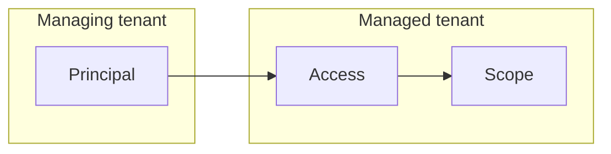
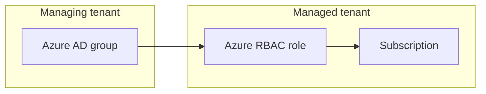
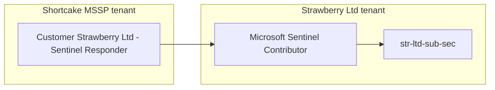

## Introduction

Azure Lighthouse is a hot topic, but based on my experiences not a lot of people know exactly what it does, how it works or how to use it themselves. 

So let's try to remedy that, however do keep in mind this is *my understanding* of how Azure Lighthouse works - I might be completely off, but I have made it work at least twice so atleast I've got that going for me.

## What is Azure Lighthouse?

In it's simplest form, Azure Lighthouse is a management tool - it allows us to perform management of Azure resources across tenants. 

### How does it give access across tenants?

It gives a **principal** in the **managing tenant** a level of **access** to a **scope** in the **managed tenant**:



In order to explain a bit better, consider this matrix for each of the terms used above:

|Legend|Description|
|--|--|
|Principal|Azure AD user, group or SPN (app registration)|
|Access|Azure RBAC role|
|Scope|Azure resource scope, i.e subscription or resource group|
|Managing tenant|The service provider tenant|
|Managed tenant|Customer tenant|

We can also draw the map again, assuming that we want to give an Azure AD group in the managing tenant an Azure RBAC role on a subscription in the managed tenant:



---

### So what does that mean, in plain english?

Let's assume we have two companies:
* Shortcake Company - managed service provider (MSSP)
* Strawberry Ltd - customer

Strawberry Ltd wants someone to manage their Microsoft Sentinel. Shortcake Company will create a managed service offer in the form of a lighthouse-template. In this template they define that:
1. Their internal Azure AD group `Customer Strawberry Ltd - Sentinel Responder` needs access to the [Microsoft Sentinel Contributor](https://learn.microsoft.com/en-us/azure/role-based-access-control/built-in-roles#microsoft-sentinel-contributor). 
2. This access is required on the subscription `str-ltd-sub-sec` where Strawberry Ltd has deployed their Log Analytics Workspace.

If we expressed this in the form of the mermaid-diagram used earlier, it would look like this:



---

## How do you set up Azure Lighthouse?

As mentioned earlier, Azure Lighthouse requires two tenants; the managing tenant and the managed tenant, but a part from that all that is required is a template, or an **offer**. The offer is defined by the MSSP and is either published to the Azure marketplace or sent directly to the customer as an ARM-template:


### Defining an offer

We can find some [samples](https://learn.microsoft.com/en-us/azure/lighthouse/samples/) directly from Microsoft. For this blogpost I will break down a template for the `subscription`-level scope. You can find Microsoft-templates for [resource groups here](https://github.com/Azure/Azure-Lighthouse-samples/blob/master/templates/delegated-resource-management/rg/rg.json) and [marketplace here.](https://github.com/Azure/Azure-Lighthouse-samples/blob/master/templates/marketplace-delegated-resource-management/marketplaceDelegatedResourceManagement.json)

### Azure Lighthouse managed subscription

Let's break a template down to it's parts in order to understand it. We will use a template I've created for the above example - to view the full template, [click here.](https://github.com/infernuxmonster/MicrosoftSentinel-Templates/blob/main/AzureLighthouse/azurelh-sub.json)

#### Parameters

**mspOfferName** 

This refers to the name of your managed service offering - which needs to be unique.

```json
"parameters": {
        "mspOfferName": {
            "type": "string",
            "metadata": {
                "description": "Specify a unique name for your offer"
            },
            "defaultValue": "Shortcake Company - Managed Sentinel"
        }
```

**mspOfferDescription**

Description of the managed service offering.

```json
        "mspOfferDescription": {
            "type": "string",
            "metadata": {
                "description": "Name of the Managed Service Provider offering"
            },
            "defaultValue": "Managed Sentinel as a Service"
        }
```

**managedByTenantId**

As it says, this is the `tenantId` of the managing tenant - in this case the the Shortcake Company, which is the MSSP. This value is also how Azure Lighthouse knows where to look for the defined `principals` we talked about above.

```json
        "managedByTenantId": {
            "type": "string",
            "metadata": {
                "description": "Specify the tenant id of the Managed Service Provider"
            },
            "defaultValue": "tenantId"
        }
```

**Authorizations**

This is where we combine the the `principals` with the `access`. 

* `principalId` refers to the Azure AD `objectId` of the `principal` you want to assign access to. In this case, our value for `principalId` is the `objectId` of the Azure AD group `Customer Strawberry Ltd - Sentinel Contributor`.
* `principalIdDisplayName` (as far as I know) is the name that will show up in the customer tenant when they look at their "Service Providers" tag.
* `roleDefinitionId` refers to the GUID of the Azure RBAC-role you want to assign. In this case this is the Microsoft Sentinel Contributor - we can find the GUID by looking at the [built in roles](https://learn.microsoft.com/en-us/azure/role-based-access-control/built-in-roles).

```json
        "authorizations": {
            "type": "array",
            "metadata": {
                "description": "Specify an array of objects, containing tuples of Azure Active Directory principalId, a Azure roleDefinitionId, and an optional principalIdDisplayName. The roleDefinition specified is granted to the principalId in the provider's Active Directory and the principalIdDisplayName is visible to customers."
            },
            "defaultValue": [
                {
                    "principalId": "00000000-0000-0000-0000-000000000000",
                    "principalIdDisplayName": "Customer Strawberry Ltd - Sentinel Contributor",
                    "roleDefinitionId": "ab8e14d6-4a74-4a29-9ba8-549422addade"
                }
            ]
        }              
    }
```

#### Resources

**Microsoft.ManagedServices/registrationDefinitions** 

We can look at what this type does by going to the [deployment reference](https://learn.microsoft.com/en-us/azure/templates/microsoft.managedservices/2020-02-01-preview/registrationdefinitions?pivots=deployment-language-arm-template). In my mind (which might be wrong), this creates a definition in the managed (customer) tenant - I read this similar as creating a policy definition, but not assigning it. 

For our example, this means that it will create a managed services registration definition that says that a group in the tenant of the Shortcake Company will be allowed to access a subscription with a certain role once the definition is applied.

```json
"resources": [
        {
            "type": "Microsoft.ManagedServices/registrationDefinitions",
            "apiVersion": "2019-09-01",
            "name": "[variables('mspRegistrationName')]",
            "properties": {
                "registrationDefinitionName": "[parameters('mspOfferName')]",
                "description": "[parameters('mspOfferDescription')]",
                "managedByTenantId": "[parameters('managedByTenantId')]",
                "authorizations": "[parameters('authorizations')]"
            }
        }
```

**Microsoft.ManagedServices/registrationAssignments**

Again we can peek at the [deployment reference](https://learn.microsoft.com/en-us/azure/templates/microsoft.managedservices/2020-02-01-preview/registrationassignments?pivots=deployment-language-arm-template). 

This registers the definition - in effect applying it and registering the offer.

```json
        {
            "type": "Microsoft.ManagedServices/registrationAssignments",
            "apiVersion": "2019-09-01",
            "name": "[variables('mspAssignmentName')]",
            "dependsOn": [
                "[resourceId('Microsoft.ManagedServices/registrationDefinitions/', variables('mspRegistrationName'))]"
            ],
            "properties": {
                "registrationDefinitionId": "[resourceId('Microsoft.ManagedServices/registrationDefinitions/', variables('mspRegistrationName'))]"
            }
        }
    ]
```

### Onboard the template

At this point the customer can onboard the template - this is usually done by deploying a custom template in the [Azure Portal, but you can also use Azure CLI and Azure Powershell.](https://learn.microsoft.com/en-us/azure/lighthouse/how-to/onboard-customer#deploy-the-azure-resource-manager-template)

This is also where you would chose what subscription to deploy into. For templates on the resource group level, the difference would be that the second block (the `registrationAssignments`) would instead refer to a resource group (which could be set with a parameter value, or the customer inputs it during onboarding):

```json
{
    "type": "Microsoft.Resources/deployments",
    "apiVersion": "2018-05-01",
    "name": "rgAssignment",
    "resourceGroup": "[parameters('rgName')]",
    "dependsOn": [
        "[resourceId('Microsoft.ManagedServices/registrationDefinitions/', variables('mspRegistrationName'))]"
    ],
    "properties":{
        "mode":"Incremental",
        "template":{
            "$schema": "https://schema.management.azure.com/schemas/2015-01-01/deploymentTemplate.json#",
            "contentVersion": "1.0.0.0",
            "parameters": {},
            "resources": [
                {
                    "type": "Microsoft.ManagedServices/registrationAssignments",
                    "apiVersion": "2019-06-01",
                    "name": "[variables('mspAssignmentName')]",
                    "properties": {
                        "registrationDefinitionId": "[resourceId('Microsoft.ManagedServices/registrationDefinitions/', variables('mspRegistrationName'))]"
                    }
                }
            ]
        }
    }
}
```

## So what can we use Azure Lighthouse for?

I would say only imagination really stops you - personally I enjoy using it with Microsoft Sentinel because it allows for a shared incident view and doing cross-workspace queries using the `workspace()` function in Kusto. 

This isn't really the post to get into details on this - but I will share some more on how to use Azure Lighthouse for service principals and Sentinel in the future.

## Disclaimer

Hopefully this gives some insight into Azure Lighthouse - if anything is wrong, unclear or you have any other questions feel free to reach out to me, as I mentioned in the start this is my understanding of Azure Lighthouse. I will update the post if I find any errors (or I'm made aware of them). 

I am aware there are more use cases for Azure Lighthouse than simply managed services, if you are looking for ideas you can check out [Microsoft's own samples.](https://learn.microsoft.com/en-us/azure/lighthouse/samples/) We can also do stuff like [deploy Sentinel](https://github.com/Azure/Azure-Lighthouse-samples/blob/master/templates/deploy-azure-sentinel/deploySentinel.json) or create policies.

There are also multiple blocks to play around with in the schema, like `eligibleAuthorizations` which allows you to assign users as eligible to a role via Azure PIM. 

Also do keep in mind that Azure Lighthouse currently **does not** support Azure AD roles - if this ever changes I will most likely write about how to use that as an addition to this post.

## Sources and more resources

If you want to know more you can read Microsofts very good documentation on [onboarding customers](https://learn.microsoft.com/en-us/azure/lighthouse/how-to/onboard-customer) or [what Azure Lighthouse is.](https://learn.microsoft.com/en-us/azure/lighthouse/overview) 

If you want to read some of my old posts regarding Lighthouse, check out how to use Azure Lighthouse and deployment-templates to [assign roles to a managed identity](https://www.infernux.no/AzureLighthouse-ManagedIdentity/) or if you prefer a user managed identity [you can read about that as well.](https://www.infernux.no/AzureLighthouse-UserManagedIdentity/)