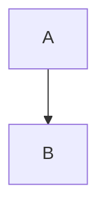

## Introduction

Azure Lighthouse is a hot topic, but based on my experiences not a lot of people know exactly what it does, how it works or how to use it themselves. So let's try to remedy that, however do keep in mind this is *my understanding* of how Azure Lighthouse works - I might be completely off, but I have made it work at least twice so atleast I've got that going for me.

**What is Azure Lighthouse?**

In it's simplest form, Azure Lighthouse is a management tool - it allows us to perform management of Azure resources across tenants. 

