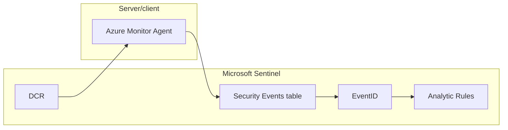
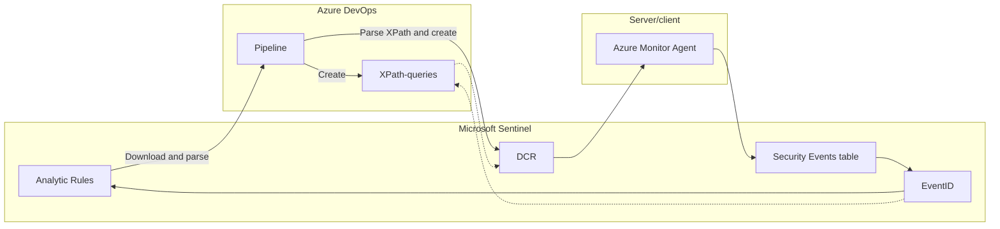

## Introduction

[Data Collection Rules](https://learn.microsoft.com/en-us/azure/azure-monitor/essentials/data-collection-rule-overview) are rules that allow us to specify what data is collected, how it's transformed and where to send it. We will be looking specifically at a scenario where we use the Azure Monitor Agent on Windows machines for gathering security events from the event log.

### Assumptions

From this point on I'm assuming knowledge of the following things:

* Data Collection Rules
* XPath queries

If you need some resources, please look at [this excellent blog](https://techcommunity.microsoft.com/t5/microsoft-sentinel-blog/testing-the-new-version-of-the-windows-security-events-connector/ba-p/2483369) by Roberto Rodriguez ([@Cyb3rWard0g](https://twitter.com/Cyb3rWard0g)).

## Scenario

* We have Windows servers or workstations and we want to ingest logs to Microsoft Sentinel
* We want to keep costs low 

We can look to some projects like [OSSEM-ATTACK](https://github.com/OTRF/Microsoft-Sentinel2Go/tree/master/microsoft-sentinel/linkedtemplates/data-collection-rules/rules/ossem-attack) and [Palantir](https://github.com/OTRF/Microsoft-Sentinel2Go/tree/master/microsoft-sentinel/linkedtemplates/data-collection-rules/rules/palantir) for inspiration, but they are both very verbose in terms of logging. In an ideal world we would log everything, but if that's not an option due to budget constraints then this post is for you.

## Idea

The idea behind "smart" DCR is simple - we log only what we can use, and we keep the DCR updated every time we can use more data. 

If we explain it using an illustration, we can see that analytic rules will consume event ids from the security events table. If we ingest 100 event ids, but we only have analytic rules that utilize 20 of them, we are ingesting 80 of them with no real utility except hunting and for audit purposes.



## Solution

My suggested solution for this comes in the form of a Powershell-script running in an Azure DevOps pipeline (or locally), which will download all analytic rules, find all event ids and create XPath queries for them:



## Creating the script

There's 4 things we need to do in our script:
1. Download analytic rules
2. Parse out all unique event ids
3. Create XPath-queries from event ids
4. Create an XML-file from the XPath-queries

*This script will be built for running locally, if you want to adapt it for pipelines please look at [this blogpost](https://www.infernux.no/MicrosoftSentinel-TemplateAnalyticRules/) I wrote where I touch on adapting Powershell-scripts for running in pipelines.*

### 1. Download analytic rules

```powershell
    $uri = "/subscriptions/${subscriptionId}/resourceGroups/${resourceGroup}/providers/Microsoft.OperationalInsights/workspaces/${workspaceName}/providers/Microsoft.SecurityInsights/alertRules?api-version=2022-01-01-preview"
    $DownloadedRules = (Invoke-AzRestMethod -Path $uri).Content | ConvertFrom-Json -Depth 15
```

### 2. Parse out all unique event ids

We can put the code from step 1 and create a function to grab event ids from analytic rules:

```powershell
function Get-EventIdFromAnalyticRules {
    PARAM(
        $subscriptionId,
        $resourceGroup,
        $workspaceName
    )
    $uri = "/subscriptions/${subscriptionId}/resourceGroups/${resourceGroup}/providers/Microsoft.OperationalInsights/workspaces/${workspaceName}/providers/Microsoft.SecurityInsights/alertRules?api-version=2022-01-01-preview"
    $DownloadedRules = (Invoke-AzRestMethod -Path $uri).Content | ConvertFrom-Json -Depth 15
    $eventIds = @()
    foreach($rule in $DownloadedRules.Value) {
        $eventIdRules = $rule.properties.query | select-string -pattern "EventID\s==\s[0-9]+" -AllMatches | ForEach-Object {$_.Matches.Value}
        $eventIdRules = $eventIdRules -replace " ",""
        foreach($eventId in $eventIdRules) {
            $eventIds += ($eventId.Split(" ")).Split("==")[1]
        }
    }
    $uniqueEventIds = $eventIds | Sort-Object | Get-Unique
    return $uniqueEventIds
}
```

### 3. Create XPath queries

```powershell
function New-XMLQuery {
    PARAM(
        $eventId,
        $queryId
    )
    $query = @"
<Query Id="$queryId" Path="Security">
    <Select Path="Security">*[System[(EventID=$eventId)]]</Select>
</Query>
"@
}
```

### 4. Create XML-file

```powershell
function New-XMLFile {
    PARAM(
        $eventIdList
    )
    $queryArray = @()
    $queryId=0
    foreach($eventId in $eventIdList) {
        $query = New-XMLQuery -eventId $eventId -queryId $queryId
        $queryArray += $query
        $queryId++
    }
    $queryFile = @"
<?xml version="1.0" encoding="utf-16"?>
<QueryList>
    $queryArray
</QueryList>
"@
}
```

## Running the script

```powershell
$eventIdList = Get-EventIdFromAnalyticRules -subscriptionId "1234567890abc" -resourceGroup "demo-rg" -workspaceName "demo-law"
$xmlFile = New-XMLFile -eventIdList $eventIdList
$xmlFile | Out-File DCR.xml
```

You can find the full script [here.](https://github.com/infernuxmonster/MicrosoftSentinel-Scripts/blob/main/Create-DataCollectionRuleFromAnalyticRules.ps1)

## Results

You should now have an XML-file ready* for deployment. 
Whenever we want to push Data Collection Rules, we can use [this guidance](https://github.com/OTRF/Microsoft-Sentinel2Go/blob/master/microsoft-sentinel/linkedtemplates/data-collection-rules/rules/ossem-attack/README.md) to programmatically create new Data Collection Rules based on our detection coverage. I might write some more about pushing Data Collection Rules using scripts in a later post.

**The XML-file has an issue where the formatting is only correct if you supply one event id - adding more will result in broken formatting. This can be fixed manually, or you could insert all event ids into the same node.*

## Sources

* [Data Collection Rule overview](https://learn.microsoft.com/en-us/azure/azure-monitor/essentials/data-collection-rule-overview)
* [Testing the new Windows Security Events connector](https://techcommunity.microsoft.com/t5/microsoft-sentinel-blog/testing-the-new-version-of-the-windows-security-events-connector/ba-p/2483369)
* [OSSEM-DM](https://github.com/OTRF/OSSEM-DM)
* [Palantir Windows event forwarding](https://github.com/palantir/windows-event-forwarding)
* [Sentinel2Go](https://github.com/OTRF/Microsoft-Sentinel2Go)
* [Cyb3rWard0g](https://twitter.com/Cyb3rWard0g)