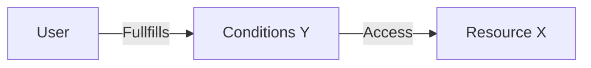
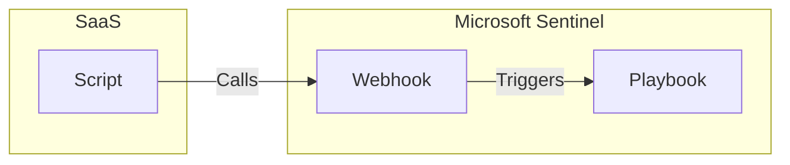
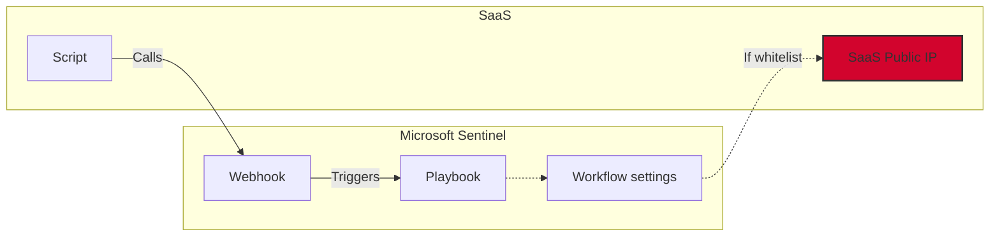

# Whitelisting introduction

Many of the components we use in Azure (and other cloud providers) allow us to whitelist IP adresses that are allowed to communicate and use the service. This is useful for normal access in order to enforce access to sensitive data only from approved locations as an added layer of security. 

The general idea is that in order to access resource X you will need to fullfill certain conditions Y. In this scenario a IP in the whitelist will be the condition:



To make this as practical as possible I've created a scenario from real life where can look at how to implement IP whitelisting and hopefully avoid making any errors or wrong assumptions while doing so. The general idea is that we want to send updates to Sentinel from a SaaS-platform, using a playbook with webhook-triggers. 

## Inbound HTTPS requests

In the context of Azure Logic Apps, a webhook trigger is basically something that allows us to monitor for inbound (or incoming) HTTPS requests. This allows us to send POST-requests to said endpoint to start our workflows.

The API-endpoint we will be sending updates to will look something like this:

```
https://prod-100.westeurope.logic.azure.com:443/workflows/c4e66a8e80e14fd59a29f088ec6a1337/triggers/manual/paths/invoke?api-version=2016-10-01&sp=%2Ftriggers%2Fmanual%2Frun&sv=1.0&sig=Test_bTmdhVpHkR04jArwgvM-ZenxmiP_sbKQPUIsU
```

In order for a threat actor to actually utilize this, they will have to know:
* The correct endpoint URI
* The resource ID of the workflow
* The signature

For all intents and purposes, given enough time (or human error, like committing the webhook to a public git repository), a threat actor might be able to trigger your playbook. It's important to note that it's **never** advisable to give your playbooks access only based on their function and needs. 

Managed identities, API-connectors and other components of the playbooks should follow the same principle, and playbooks with different functions should be split. It's also never advisable to have any sort of managed identity with AzureRM access on a playbook that can be triggered via webhook.

# Scenario

**Sending updates from SaaS-platform to Microsoft Sentinel playbook using webhook-trigger.**

Consider a SaaS-platform that will send updates to Sentinel via a Playbook using a webhook trigger. This will look something like the below flowchart:



---

## Whitelisting the SaaS public ip(s) 

One possible solution is to whitelist the SaaS-platform, so that only calls made from the range of public IPs that it works from will be allowed. 

This is a decent solution and will result in a better security posture, but as you can see in the flowchart below it will move our point of weakness to the SaaS-platform itself. By this I mean that anyone that uses the same platform will be able to use the SaaS-platform to trigger the webhook:



---

### Add whitelisting to Microsoft Sentinel Playbook

Now, in order to limit the access we can go into workflow settings in the Playbook:


From here we can chose to either allow "Any IP", "Only other Logic Apps" or "Specific IP ranges":


# Summary

Just some basic thoughts about IP whitelisting for a single scenario. I'll be trying to explore two more scenarios in the near future:

* Sending data to an Azure storage account from an Azure DevOps pipeline task
   * Trying to explore how to whitelist Microsoft-hosted agents (both statically and dynamically during build)
* Conditional access named location policy for accessing certain applications
   * Exploring different levels of IP whitelisting for Conditional Access, namely country-based, IP-range or specific IP