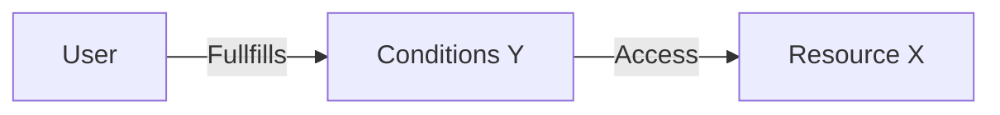

# Introduction

Last post I talked about some [simple whitelisting of IPs for Microsoft Sentinel Playbooks](https://www.infernux.no/MicrosoftSentinel-IPWhitelisting/) - today we're looking into similar topics when working with webhook triggers in Azure DevOps pipelines.

Like last time, we're the general idea of IP whitelisting is that in order to access a resource X, you need to fullfill conditions Y (in this case, the IP you're trying to work form needs to be added to an allowlist).



This time we are following the same idea, but using some different parameters than IP for our allowlist.

# Pipelines triggered by webhooks

Using webhooks we can trigger pipelines from a range of different applications, scripts and flows (like Power Automate). 
One big downside to using this is that there's no way to add a list of allowed IPs and the only supported "security" feature is the secret field in the screenshot below, which, by looking quickly at [Github issues on the topic](https://github.com/MicrosoftDocs/azure-devops-docs/issues/8913) isn't very well documented.


So how can we secure our pipelines? Well, first, let look at how we configure it for usage in a pipeline.

## Implementing a webhook trigger in a Azure DevOps pipeline

I've created a simple `hello world`-pipeline over in my [github repo](https://github.com/infernuxmonster/MicrosoftSentinel-Templates/blob/main/webhook_trigger.yml) to demonstrate how to add the webhook resource. The relevant portions are the `resources`-block:

```yaml
resources:
  webhooks:
    - webhook: infernux_webhook     ### Webhook alias
      connection: infernux_webhook  ### Incoming webhook service connection
      filters:
        - path: allowlistvalue      ### JSON path in the payload
          value: SuperSecureJK1     ### Expected value in the path provided
```

So, let's look at the different parameters here:
* First of all the `- webhook:` is an alias you can set. This can be set to whatever you want, it has no bearing other than further references (usually you never use it again in my experience).
* `connection:` refers to the service connection name (from the above screenshot)
* `filters:` allows us to provide values from the body of the incoming webhook
    * `path` refers to the json path in the payload 
    * `value` tells us what value we should expect and can work as a sudo security feature

## Triggering our pipeline via webhook

So let's try to trigger our pipeline using a webhook - I will use PowerShell for this, but you can also just use Postman or other similar tools.
The URI for triggering pipelines is `https://dev.azure.com/<org>/_apis/public/distributedtask/webhooks/<WebhookName>/?api-version=6.0-preview`. 
Please note that this is the **Webhook Name** from the configuration of the webhook trigger, NOT the alias or the service connection name. 

This [topic from the developercommunity](https://developercommunity.visualstudio.com/t/cannot-use-generic-webhook-based-triggers-for-yaml/1135943#T-N1203277) let's us know some other common errors.
The most important thing however is that **you will need to manually trigger the pipeline once before the webhook trigger will work**. 

First, let's try to trigger it without providing the expected JSON from above:

```powershell
$Org = "secretOrg"
$Webhook = "infernux_webhook"
$Url = "https://dev.azure.com/$Org/_apis/public/distributedtask/webhooks/$Webhook/?api-version=6.0-preview"

Invoke-WebRequest -Uri $Url -Method Post -ContentType 'application/json' 
```
Remove the filters and this would have worked - we get a 200 but the pipeline doesn't trigger:


Let's try again, this time I'll provide the expected JSON in the body:

```powershell
$Body = '{"allowlistvalue":"SuperSecureJK1"}'

Invoke-WebRequest -Uri $Url -Method Post -ContentType 'application/json' 
```

This time it works as expected and the pipeline triggers:


## Adding the secret value

As mentioned above, the usage of the secret parameter isn't very well documented (yet) but if we go looking we can actually find out what we need to make it work.
In the topic mentioned above from the dev community [this comment](https://developercommunity.visualstudio.com/t/cannot-use-generic-webhook-based-triggers-for-yaml/1135943#T-N1182958-N1567727) leads us to this [gist](https://gist.github.com/igoravl/41f75084ab0207c56b522b0a6cdf253c) that shows an example PowerShell-code for triggering using the secret variable. The original author is [Igor Abade](https://gist.github.com/igoravl), big ups. Let's test it!

### Updating our webhook trigger with a secret value

First lets add a secret to our trigger. We can do this by editing the service connection, adding our secret (`WeLikeIce`). We also add the `Http Header` parameter as `X-Hub-Signature` before saving.

### [Post-Message-to-AzDO-Webhook.ps1](https://github.com/infernuxmonster/MicrosoftSentinel-Scripts/blob/main/Post-Message-to-AzDO-Webhook.ps1)

```powershell
Param
(
    # URL to the Azure DevOps incoming webhook endpoint. Expected format is 
    # https://dev.azure.com/<org>/_apis/public/distributedtask/webhooks/<svc-trig>/?api-version=6.0-preview. 
    [uri]
    $Url,

    # Shared secret used to sign the JSON payload. Must be the same value supplied during 
    # the creation of the Incoming Webhook service connection
    [string]
    $Secret,

    # HTTP header name to send the hash signature. When omitted, defaults to "X-Hub-Signature"
    [string]
    $HeaderName = 'X-Hub-Signature',

    # JSON payload to send to the Azure DevOps web hook
    [string]
    $Body 
)

$hmacSha = New-Object System.Security.Cryptography.HMACSHA1 -Property @{
    Key = [Text.Encoding]::ASCII.GetBytes($secret)
}

$hashBytes = $hmacSha.ComputeHash([Text.Encoding]::UTF8.GetBytes($body))
$signature = ''

$hashBytes | ForEach-Object { $signature += $_.ToString('x2')}

$headers = @{
    $headerName = "sha1=$signature"
}

Invoke-WebRequest -Uri $Url -Body $Body -Method Post -ContentType 'application/json' -Headers $headers
```

Running the script gives us the following output:


Woop, it works.

# Summary

First of all, for anyone trying to trigger my pipeline - I've already deleted it ;) 

Hopefully this allows more people to use both the secret value and add filters for working with pipelines. 


Filters are not really a security mechanism, but can be used for triggering different pipelines from one location without having to use multiple webhooks.
The usage of the secret-value and the `Http Header` field still isn't very well documented, so hopefully someone from Microsoft picks that up and fixes it.
