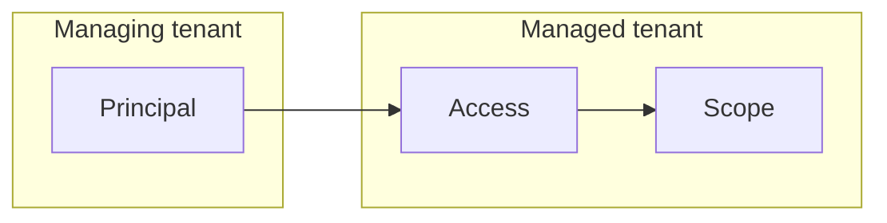
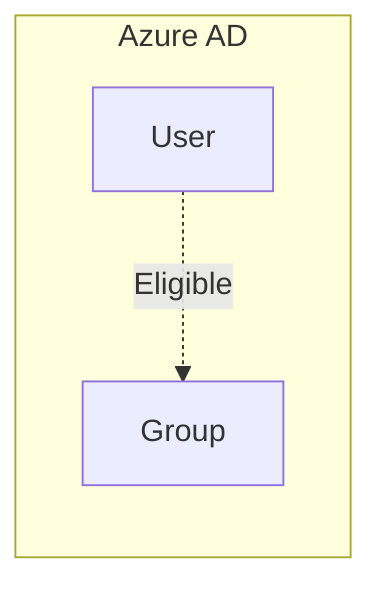
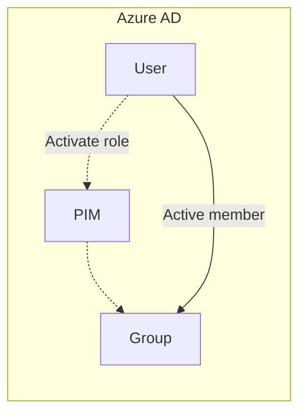
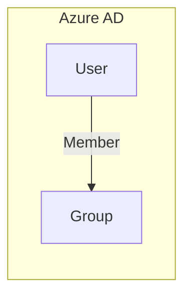
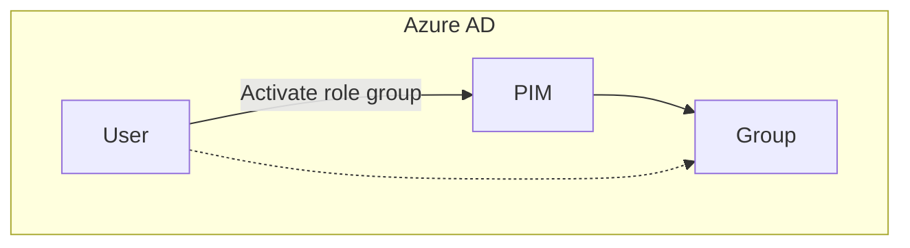
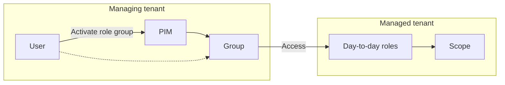
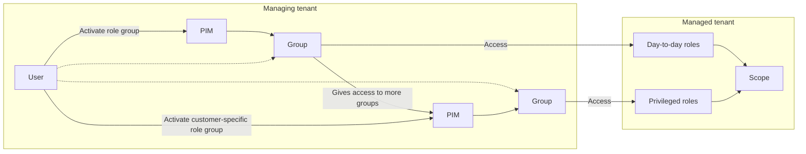

# Design an MSSP access strategy

This post is inspired by the [Microsoft Sentinel's Technical Playbook for MSSPs](https://techcommunity.microsoft.com/t5/microsoft-sentinel-blog/update-to-microsoft-sentinel-s-technical-playbook-for-mssps-is/ba-p/3670838) which just released in version 1.5. The playbook itself is great and a very recommended read for any security engineers or architects planning to touch Microsoft Sentinel at any point.

## Some concepts

In order to understand the rest of the post, there are some prerequisites you'll need to be familiar with:

### Azure Lighthouse

I wrote a little [intro to Azure Lighthouse earlier](https://www.infernux.no/AzureLighthouse-101/), but to summarize it quickly:

> Azure Lighthouse gives a **principal** in the **managing tenant** a level of **access** to a **scope** in the **managed tenant**:

---

### Privileged Identity Management and Privileged Access Groups

I haven't really touched on PIM and PAG yet, but one can describe it as just-in-time access. Users are assigned as eligible to certain groups and are able to activate them, either freely or behind certain conditions like an MFA prompt or a colleague approving your request for access. The basic idea looks something like this:

A user can then activate a role, or access to a Privileged Access Group:

---

### Relevant roles for Microsoft Sentinel

#### Sentinel-specific roles

|Role|Description|
|--|--|
|Microsoft Sentinel Reader|Can view data, incidents, workbooks, and other Microsoft Sentinel resources.
|Microsoft Sentinel Responder|Can, in addition to the above, manage incidents (assign, dismiss, etc.).
|Microsoft Sentinel Contributor|Can, in addition to the above, create and edit workbooks, analytics rules, and other Microsoft Sentinel resources.
|Microsoft Sentinel Automation Contributor|Allows Microsoft Sentinel to add playbooks to automation rules. It isn't meant for user accounts.
|Microsoft Sentinel Playbook Operator|List, view and run playbooks.|

Read more:
* [https://learn.microsoft.com/en-us/azure/sentinel/roles](https://learn.microsoft.com/en-us/azure/sentinel/roles)

---

#### Other relevant roles

|Role|Description|
|--|--|
|Logic App Contributor|For specific members of your security operations team, you might want to assign the ability to use Logic Apps for Security Orchestration, Automation, and Response (SOAR) operations.|
|Log Analytics Contributor/Reader|Log Analytics roles grant access to your Log Analytics workspaces.|
|Owner, Reader, Contributor|Azure roles grant access across all your Azure resources, including Log Analytics workspaces and Microsoft Sentinel resources.|
|Managed Services Registration Assignment Delete Role|Users in a managing tenant can remove access to delegated resources if they were granted the Managed Services Registration Assignment Delete Role for the customer's resources.|

Read more:
* [https://learn.microsoft.com/en-us/azure/sentinel/roles](https://learn.microsoft.com/en-us/azure/sentinel/roles)
* [https://learn.microsoft.com/en-us/azure/lighthouse/how-to/remove-delegation](https://learn.microsoft.com/en-us/azure/lighthouse/how-to/remove-delegation)

If you read the MSSP Playbook there are also a plethora of other roles mentioned:

* Managed Identity Contributor
* Security Admin
* Monitoring Contributor
* Virtual Machine Contributor
* Microsoft Sentinel Playbook Operator
* Azure Connected Machine Resource Administrator
* Template Spec Contributor

I personally haven't used them, but for all intents and purposes - **design for your own mandate.** This means, if you work on a subscription level and manage data connectors, log ingestion VMs and more you'll probably want to have a quite involved least privilege setup. 

For all intents and purposes, **I'm assuming you're an MSSP providing SIEM management and 24/7 monitoring.**

# Keep it simple, stupid

Let's try our hand at a access strategy - first of all let's split our teams. We usually work with two teams, `analysts` and `engineers`. We also need to consider Service Principals (SPNs) if you deploy using pipelines and scripts. 

If you have a big team you might also split into Tier 1 and Tier 2 analysts, but I won't do that here. If you need to split, generally give Tier 1 read/respond access only and Tier 2 read/respond/modify within the bounds of Sentinel.

## Analyst access

### Scope

According to least privilege principles we should scope our access to the resource group level - either to the group containing Sentinel, or the group containing logic apps/other components.

### Base access (active authorizations)
* See any incidents (Microsoft Sentinel Reader)
* Respond to incidents (Microsoft Sentinel Responder)
* List, view and run playbooks (Microsoft Sentinel Playbook Operator)

### On demand access (eligible authorizations)
* Edit playbooks (Logic App Contributor)
* Create and edit analytic rules, workbooks and other Sentinel resources (Microsoft Sentinel Contributor)

## Engineer access 

### Base access (active authorizations)
* Edit playbooks (Logic App Contributor)
* Create and edit analytic rules, workbooks and other Sentinel resources (Microsoft Sentinel Contributor)
* Remove the managed services link (Managed Services Registration Assignment Delete Role)

***Note:** Microsoft Sentinel Contributor also covers reader and responder.*

### On demand access (eligible authorizations)

* Manage resources like Metric Alert (Contributor or Monitoring Contributor)
* Manage Azure Functions (Contributor is the only solution for this currently)
* Manage log ingestion VMs (Contributor or Virtual Machine Contributor)
* Manage Azure Arc assignments (Contributor or Azure Connected Machine Resource Administrator)

Now this is a hotly debated topic - I'm in favor of the "keep it simple, stupid"-approach, but I'm open to being wrong. 

Instead of complicating your access with multiple roles, I'd like to argue that giving contributors eligible access to contributor on the resource group level is the easiest way to go. This is in big part thanks to the fact that multiple of the data connectors we implement require Azure Functions and there's [currently no role implemented to give the required access](https://learn.microsoft.com/en-us/answers/questions/427829/is-there-a-role-like-azure-function-contributor.html) and as far as I'm aware there's [no support](https://github.com/MicrosoftDocs/azure-docs/issues/60635) for custom roles in Azure Lighthouse ([yet](https://feedback.azure.com/d365community/idea/148efdcb-f824-ec11-b6e6-000d3a4f0da0)).

## Service principal access

SPNs [can't use PIM](https://github.com/MicrosoftDocs/azure-docs/issues/49166) so all of these roles will be permanently active. 
The SPN will need to:
* Create and remove resources (Contributor)
* Assign roles to Managed Identities (User Access Administrator)

**For more information on the use of User Access Administrator with SPNs, check out my posts on this topic:**
* [Create Managed Identity and assign roles using Azure Lighthouse](https://www.infernux.no/AzureLighthouse-UserManagedIdentity/)
* [Assign roles to managed identities in Microsoft Sentinel playbooks using Azure Lighthouse](https://www.infernux.no/AzureLighthouse-ManagedIdentity/)

---

## Other considerations for Azure Lighthouse

### Azure Security Insights Enterprise Application

This enterprise application will need to be assigned the Microsoft Sentinel Automation Contributor in your managing tenant and the managed tenant. The scenario as that an automation rule created in the customer workspace (while signed into the service provider tenant) is configured to run a playbook located in the customer tenant.

For this scenario to work, permissions to execute the playbook need to be granted to Microsoft Sentinel in both tenants. In the customer tenant, you grant them in the Manage playbook permissions panel, just like in the scenario above. To grant the relevant permissions in the service provider tenant, you need to add an additional Azure Lighthouse delegation that grants access rights to the Azure Security Insights app, with the Microsoft Sentinel Automation Contributor role, on the resource group where the playbook resides.

This scenario will look like this:

* [https://learn.microsoft.com/en-us/azure/sentinel/automate-incident-handling-with-automation-rules#permissions-in-a-multi-tenant-architecture](https://learn.microsoft.com/en-us/azure/sentinel/automate-incident-handling-with-automation-rules#permissions-in-a-multi-tenant-architecture)
* [https://learn.microsoft.com/en-us/azure/sentinel/tutorial-respond-threats-playbook?tabs=LAC](https://learn.microsoft.com/en-us/azure/sentinel/tutorial-respond-threats-playbook?tabs=LAC)

---

# Privileged Identity Management

We got our Lighthouse-configuration ready to go, but what about the assignment of groups?

The idea is to split the access as we did above with role-groups. The two roles we are working with, and hence the two groups we will create is:
* `Analyst`
* `Engineer`

We could use basic groups - you know them, you love (hate?) them. Any user you want to have access will be assigned to the group:

This setup is fine, but the problem is that if someone manages to snatch a token and [bypass your conditional access](https://aadinternals.com/post/ests/) - that's it.
We can use eligible roles in our Lighthouse-configurations, but the groups we use to assign access via Lighthouse can also be rolled into PIM as Privileged Access Groups!

## Privileged Access Groups

Instead of active assignments of our users into the role groups, we will use Privileged Access Groups. Now, for full clarity - this feature is still in preview, in large part to the fact that it's missing an API to configure, manage and interact with PAG. From personal experience the PIM-menu is one of, if not the biggest, painpoint in our day to day operations.

For our solution we would have our analysts and engineers activate their roles daily, preferably requiring another MFA activation to do so:

This allows us another layer of "defense" (against the dark arts) - but should you have all access to everything by default, or could you split it up even further?

### Layering access

Maybe you want to split up your access a bit more? There are multiple strategies to this and there's no "one size fits all" solution, you'll have to design around your mandate. Two approaches I've used is the day-to-day separation and the customer-based separation:

#### Day-to-day separation

This works in a very simple way - the base role group `analyst` will be given access to all customers as a `reader` and `responder`. This allows the analysts to work their daily tasks without the hassle of having to activate multiple PIM-groups for different customers, or PIM for roles.

You would then create a separate group, or multiple groups (see the chapter below) to grab access to more privileged roles to perform tasks like editing rules, automation etc.

**A word of caution:** diving deeper into this strategy and having a "privileged role group" for analysts, and then also having the roles only be eligible will cause more pain than be helpful. Just imagine one PIM for the basic role group, another PIM for the privileged role group and then having to PIM once for each RBAC-role you'd need? Hell on earth.

#### Customer separation

This works both as a single concept, or in conjuction with the above. Basically you'll create one analyst- and one engineering-group per customer, which will give access to more privileged roles. You could add highly privileged roles (like `contributor`) to the eligible authorizations in the Lighthouse-config for even more depth here:

# Final thoughts

Lighthouse-configurations come in all shapes and sizes and that is fine. 

## Summary

* You need to be aware of what your mandate is.
* Which parts of Sentinel will be managed by what team? Split responsibilities and give everyone the correct level of access.
* Do you manage any resources outside Sentinel? Identify what roles are needed and add them.
* Will you scale in close future and require more access? Plan ahead.
* Less is more - both in terms of RBAC-roles you use and the amount of PIM-activations required.
