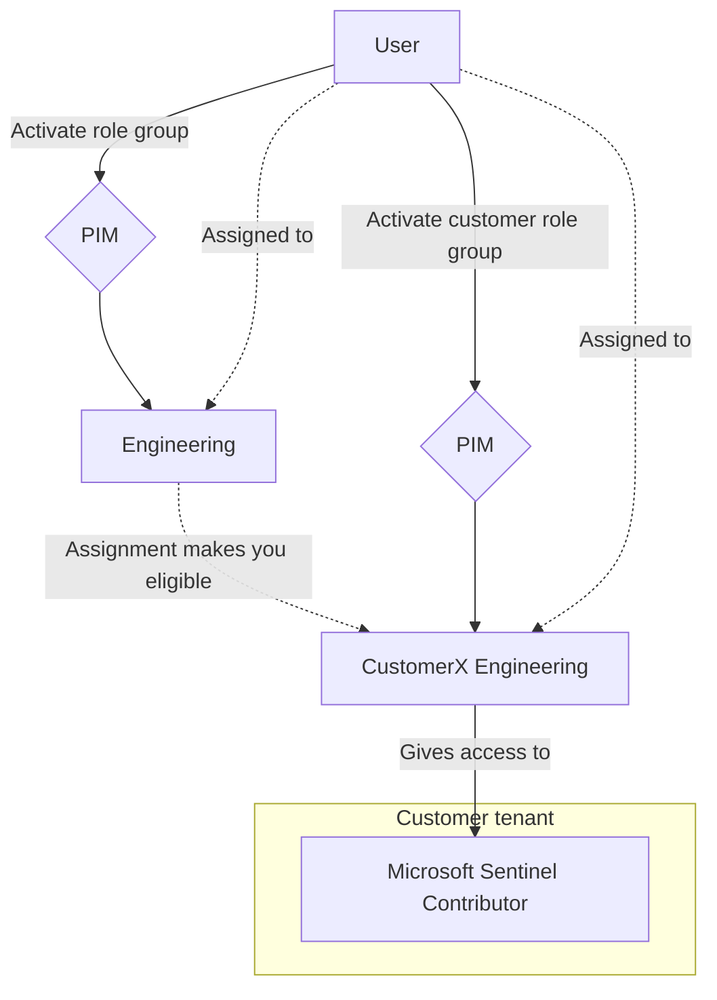
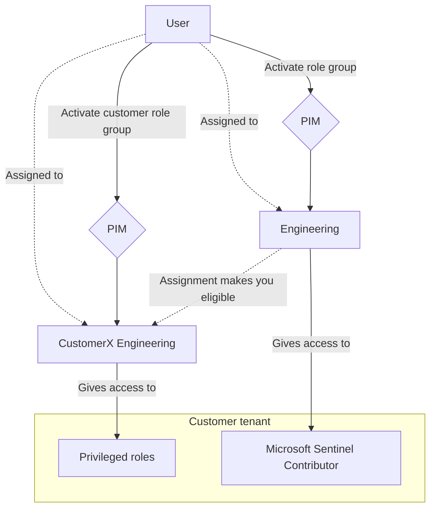
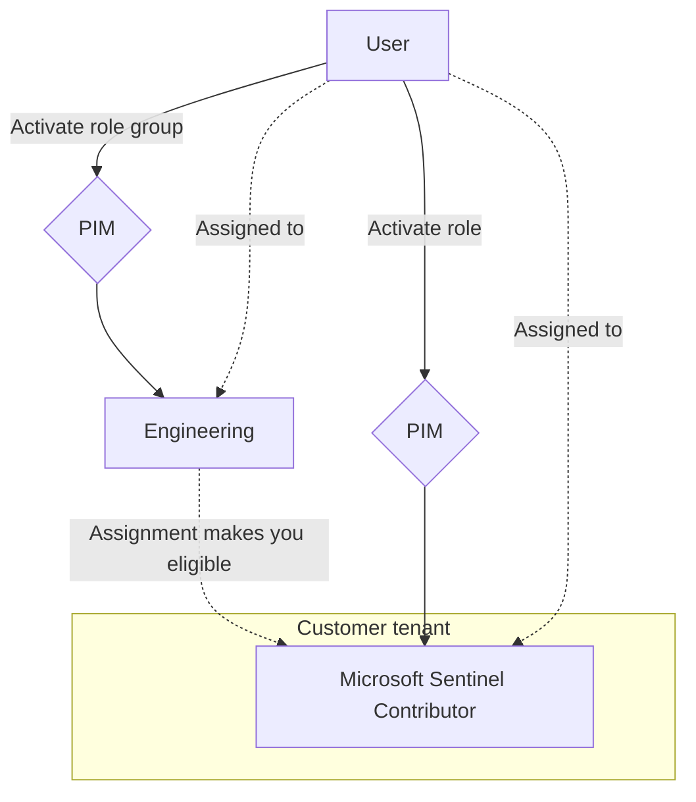

# Introduction

In this blog post we will be going over two ways of setting up Azure Lighthouse. The general idea is to compare a design where we do all of the Privileged Identity Management (both roles and groups) through our own managing tenant to a design where we use eligible authorization ([now that they are GA](https://techcommunity.microsoft.com/t5/security-compliance-and-identity/azure-lighthouse-pim-enabled-delegations/ba-p/3682255)) to enable certain roles. The two main things I will look at are **ease of use** in relation to PIM fatigue (too many activations in a day makes Jack a dull boy) and **what is logged** to the MSSP/Customer tenants in the different designs.

This is a follow-up to my previous blog on [Designing MSSP access strategies for Azure Lighthouse.](https://www.infernux.no/AzureLighthouse-MSSPAccess/)

## What is Azure Lighthouse?
I went over this earlier in my [Azure Lighthouse 101 post](https://www.infernux.no/AzureLighthouse-101/), but the TL;DR is that Azure Lighthouse is a management tool - it allows us to manage Azure resources across tenants. 

# The setup

So our imagined setup for this will be pretty basic - we are an MSSP managing Microsoft Sentinel for our customer. In this case we are setting up permissions for the engineering team. The components we will be working with are the following:

## Azure AD 

* Role group (Azure AD Security group, PIM enabled) - `engineering`
* Customer specific role group (Azure AD Security group, PIM enabled) - `customerX-engineering`
* Customer tenant - `customerX tenant`
* Managing tenant - `MSSP tenant`

## Azure RBAC

* Job specific role - `Microsoft Sentinel Contributor`

## Azure resources

* Resource group (in customer tenant) - `customerX-security`
* Log analytics workspace (in above RG, Sentinel enabled) - `customerX-security-law`


# Design 1 - "Local" PIM

* Every engineer is assigned as eligible to the `engineering`-group.
* Activating the `engineering` group now also makes you eligible to all `customerX-engineering` groups.
* The `customerX-engineering` groups will give you the `Microsoft Sentinel Contributor`-role on the `customerX-security` (resource group) scope.

---

The flow is intended to be as follows:



---

## Ease of use

This design relies on making two PIM activations for each customer you want to work on. Based on your risk assessments you could make the case that an improvement on PIM fatigue would be to include the `Microsoft Sentinel Contributor`-role into the base `engineering`-group - and you would probably be right. Check if you really need the contributor level role for day to day work, or if a less privileged role also could do the trick; any way you go about it, day to day roles should probably only require one PIM-activation:



---

## Logging

### MSSP tenant 

Any PIM activations in this design (so both role group activations) will show the `Add member to role requested/completed (PIM Activation)` entry in the `AuditLogs`-table.

### Customer tenant

PIM activations will not show in any logs in the customer tenant. The only logs will be actions taken on resources in Azure (in the `AzureActivity`-table) and any searches performed (in the `LAQueryLogs`-table, [if auditing in the workspace is enabled.](https://www.infernux.no/MicrosoftSentinel-LAQueryLogs/))

# Design 2 - "Remote" PIM

* Every engineer is assigned as eligible to the `engineering`-group.
* Activating the `engineering`-group makes you eligible to activate the `Microsoft Sentinel Contributor`-role for each customer. 
* You could, optionally, add a customer-specific group you would have to activate in order to then be able to activate specific roles, but that seems a bit overkill.
* The `Microsoft Sentinel Contributor`-role is added as an eligible authorization in the Lighthouse-template (example given from [Microsoft Learn](https://learn.microsoft.com/en-us/azure/lighthouse/how-to/create-eligible-authorizations#define-eligible-authorizations-in-your-parameters-file)):

```json
"authorizations": {
    "value": [
        { 
            "principalId": "00000000-0000-0000-0000-000000000000",
            "roleDefinitionId": "acdd72a7-3385-48ef-bd42-f606fba81ae7",
            "principalIdDisplayName": "PIM group"
        }
    ]
}, 
"eligibleAuthorizations":{
    "value": [
        {
                "justInTimeAccessPolicy": {
                    "multiFactorAuthProvider": "Azure",
                    "maximumActivationDuration": "PT8H",
                    "managedByTenantApprovers": [ 
                        { 
                            "principalId": "00000000-0000-0000-0000-000000000000", 
                            "principalIdDisplayName": "PIM-Approvers" 
                        } 
                    ]
                },
                "principalId": "00000000-0000-0000-0000-000000000000", 
                "principalIdDisplayName": "Tier 2 Support",
                "roleDefinitionId": "b24988ac-6180-42a0-ab88-20f7382dd24c"

        }
    ]
}
```

---

The flow is intended to be as follows:



---

## Ease of use

At this point this is as easy to use as the role groups for each customer, but if we modify the base `engineering` role group to also include day to day roles and add only privileged roles either to a customer specific role group or as eligible authorizations then that would be easier to use than having to activate roles across multiple customers.

---

## Logging

### MSSP tenant

As with design 1, any PIM activations in this design (so both role group activations) will show the `Add member to role requested/completed (PIM Activation)` entry in the `AuditLogs`-table.

### Customer tenant

I was pretty sure that eligible authorizations would show up in the `AuditLogs`-table, but [boy was I wrong](https://learn.microsoft.com/en-us/azure/lighthouse/how-to/create-eligible-authorizations#how-eligible-authorizations-work) - it will be in the `AzureActivity`-table. It will show up as either `Create role assignment` for activation and `Delete role assignment` for deactivation.

The drawback here is that the log entries only contain the `PrincipalId` of the user activating the role, which corresponds to the Azure AD `ObjectId` of the user. So it's possible, with some help from an administrator in the managing tenant to map activations to users, but it's not straight forward for the customer. You can still see what role is being activated, so you can set up monitoring for highly privileged role activations if you want to track that.

As with design 1 the only logs will be actions taken on resources in Azure (in the `AzureActivity`-table) and any searches performed (in the `LAQueryLogs`-table).

# Summary

I was pretty sure going in that the different in my two design was going to be that eligible authorizations would be better for customers in order to monitor roles activations made by the MSP/MSSP - this is sort of the case, but not quite. 

I'd argue that you'll have equal control of actions taken on your resources with either strategy, but eligible authorizations in Azure Lighthouse will allow you to set up monitoring for activation of highly privileged roles if that's included in scope.

Also, much like alert fatigue for security incidents is a big problem for security analysts, PIM fatigue is going to be a problem for everyone if we are too strict on it. 

My takeaway is:
* One PIM activation should cover day to day work.
* Any write-access to customer tenants should (probably) require two activations, but this depends on multiple factors like the scope of the assignment, the actual actions the role can perform, etc.
* Highly privileged roles should (probably) always be behind a manual review, again, this comes down to scope and role.