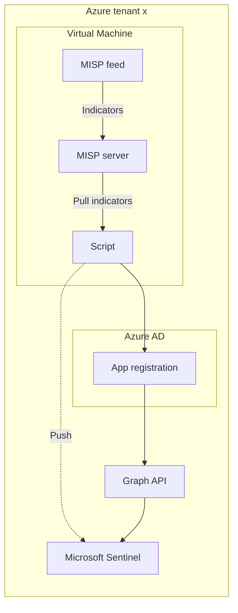
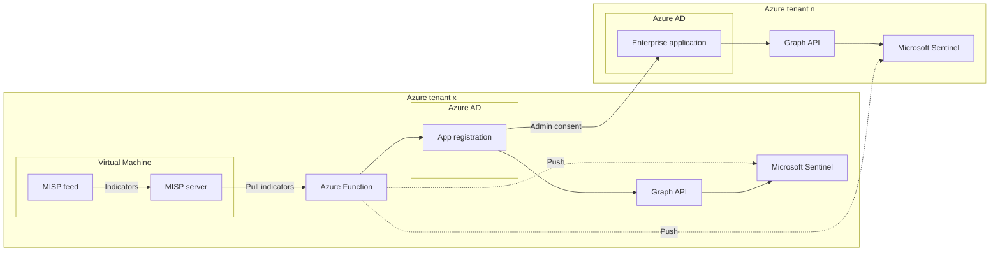

# Background

See my [previous post](https://www.infernux.no/MicrosoftSentinel-AzureFunctionDataConnectorsTimeout/) for more information. The TL;DR is simply this: I borrowed some code from two projects and splyced them together, so that I can push threat intelligence from MISP to Microsoft Sentinel in multiple Azure tenants.

## MISP

For those of you who are unaware of what MISP is, it's short for Malware Information Sharing Platform. It's an open source threat intelligence platform used among other things to share indicators of compromise. For more information, please visit their site at [https://www.misp-project.org/](https://www.misp-project.org/).

## 'Borrowing' some code 

The two github projects I've used as a base for this update are the following:
- [cudeso/misp2sentinel](https://github.com/cudeso/misp2sentinel)
- [zolderio/misp-to-sentinel](https://github.com/zolderio/misp-to-sentinel)

They are both based on the original sample [MISP to Microsoft Graph Security Script](https://github.com/microsoftgraph/security-api-solutions/tree/master/Samples/MISP) presented in the [Integrating open source threat feeds with MISP and Sentinel](https://techcommunity.microsoft.com/t5/microsoft-sentinel-blog/integrating-open-source-threat-feeds-with-misp-and-sentinel/ba-p/1350371) techcommunity blog post from 2020.

---

### How the script works

1. The script, using the MISP key and URL, fetches the latest indicators from MISP.
   - The indicators are fetched based on a filter, usually the type of indicators, tags, etc.
2. The script will then upload the indicators in chunks to the Microsoft Graph Security API.



---

## The problem

If you wanted to push indicators from a single MISP-server to a single Microsoft Sentinel instance, you could run the script locally (and there's even great guidance from the MISP project [on how to accomplish this](https://www.misp-project.org/2023/04/03/MISP-Sentinel.html/)).

This however does not scale very well without modifications, and it feels a bit dated to push data from a virtual machine directly to Sentinel. It's easier to integrate error handling, logging and alerts if we use Azure Functions to run the script instead. 

**The solution already exists - *sort of***. The project from [zolderio](https://github.com/zolderio/misp-to-sentinel) already solves putting the misp2sentinel script into an Azure Function. That is already taken care of. It also covers the multi-sentinel part, but only for a single Azure tenant (as of writing this). It's also not up to date with the latest developments going on in the [cudeso/misp2sentinel](https://github.com/cudeso/misp2sentinel) repository, which has been pushed by the MISP-project as it's updating the original script to account for the lastest MISP changes, and soon to allow for the use of the new `Upload Indicators API` instead of the `Graph Security API`.

---

## My solution

Isn't very different from the solution from zolderio presented - it's a multi-sentinel version of the script, but updated with the cudeso code. I've also updated the guidance so that one might be able to push to multiple Azure tenants instead of just one. 

### How the updated version works



Keep in mind, the logical diagrams might not correctly display what is going on, but the idea here is that we can create a multi-tenant app registration and use the enterprise application (once admin consent has been given) to push to multiple Azure tenants.

---

### List of changes from the other projects

- Moved the `mispkey` and `mispurl` to the environment settings of the script, allowing them to be set through the Azure Function configuration.
   - These will now be set in the `config.py` file using the os library.
- Added the multi-Sentinel feature from [zolderio](https://github.com/zolderio/misp-to-sentinel) to the updated [cudeso/misp2sentinel](https://github.com/cudeso/misp2sentinel) scripts.
- Updated the `INSTALL.MD` with guidance for these changes.
- Updated the `INSTALL.MD` with guidance for multi-tenant setup.
- Updated the `README.MD` with the short-form guidance of the above changes.
- Updated `requirements.txt` to account for new dependencies and running in Azure Functions.
- Some other minor fixes, will update this chapter with the finished PR once (if) it's accepted.

---

# Setup

## MISP server

1. Create a new Azure VM called MISP running Ubuntu LTS 20.04:

    

2. All default settings except for adding an NSG with only port 22 open to my IP address for SSH access, and changed the username to `misp`.
3. Followed the [MISP installation guide](https://misp.github.io/MISP/INSTALL.ubuntu2004) to install MISP on the VM by running the following command:

```bash
wget --no-cache -O /tmp/INSTALL.sh https://raw.githubusercontent.com/MISP/MISP/2.4/INSTALL/INSTALL.sh
```


4. Opened port 443 in the NSG to allow for access to the MISP server from the Azure Function.
5. We can now log in to the MISP server using default credentials.

    

5. Go to the `Feeds` tab.

    

6. Enable the two default feeds.

    

7. Pull data from the feeds by clicking on the arrow pointing down next to the feed name.
8. We should be able to see events being pulled from the feeds now if we head over to the `Administration` tab and select `Jobs`.


    

 

8. The output we need from the MISP server is the following:
    - **URL** (this will be the Azure public IP address of the VM in the format of `https://<ip address>/`)
    - **API key** (this was in the output when the install finished, but we can also add a new one by going to `Administration` and selecting `Add authentication key`.)

---

## Azure AD App Registration

1. Created a new App Registration in Azure AD called `MISP2Sentinel` using all default settings.

    

2. Add a new secret under Certificates & secrets - remember to take a note of the value.
3. Under API permissions, choose "Add a permission" and select Microsoft Graph.

    

4. Select Application Permissions.

    

5. Add `ThreatIndicators.ReadWrite.OwnedBy`.

    

6. We then need to grant admin consent for the permissions by clicking on "Grant admin consent for <tenant>". Click yes to the prompt.

    

7. Make sure the API permissions are granted correctly:

    

8. Output that we need to save from this step are the following:
    - **Application (client) ID**
    - **Directory (tenant) ID**
    - **Client secret**

---

## Azure Key Vault

1. Create a new Azure Key Vault called `MISP2Sentinel-kv` using all default settings.
2. Add the following secrets to the Key Vault:
    - `mispkey`
    - `mispurl`
    - `tenants`
3. The `tenants` secret is a JSON object containing the tenant ID, client id and secret of each tenant you want to push TI to:

```json
{"<TENANT_ID>": {"id": "<APP_ID>", "secret": "<APP_SECRET>"}}
```

4. You can limit access to the Key Vault by removing the public endpoint access, and only allowing access from the Azure Function by specifying the Azure Functions outbound IP addresses in the Key Vault firewall. This is not required, but recommended.

---

## Microsoft Sentinel

1. Make sure the ThreatIntelligence data connector is enabled.

    

 
---

## Azure Function

1. Go to the service *Function App*
2. Click *Create* to generate a new Azure Function
- Give the function a descriptive name like `MISP2Sentinel`
- Choose at Publish for *Code*, and *Python* as the Runtime Stack.
- OS can remain Linux
- At plan type choose *App service plan* or *Premium* for production workloads. I'll use consumption for this demo.
- Other settings can be left to default values. Click *Review + Create*
3. After the creation of the Azure Function, add a [system managed identity to the Azure Function](https://learn.microsoft.com/EN-us/azure/app-service/overview-managed-identity?toc=%2Fazure%2Fazure-functions%2Ftoc.json&tabs=portal%2Chttp#add-a-system-assigned-identity). This will be used to authenticate with the Key Vault.

    

4. Give the managed identity the `Reader` role on the Key Vault.
5. Go to the Key Vault and click on *Access policies*.
6. Click on *Add Access Policy*.
7. Select the *Secret permissions* tab and choose *Get* and *List* from the options.
8. Select the *Select principal* tab and search for the name of the Azure Function.
9. Click *Add* and *Save*.
10. Go back to the Azure Function and click on *Configuration*.
10. Add a new application setting with the the following settings:
    - **Name**: `tenants` 
    - **Value**: `@Microsoft.KeyVault(SecretUri=https://<keyvaultname>.vault.azure.net/secrets/tenants/)`
11. Add a new application setting with the the following settings:
    - **Name**: `mispkey`
    - **Value**: `@Microsoft.KeyVault(SecretUri=https://<keyvaultname>.vault.azure.net/secrets/mispkey/)`
12. Add a new application setting with the the following settings:
    - **Name**: `mispurl` 
    - **Value**: URL of your MISP instance (e.g. `https://<url>` or `https://<ip address>`)
13. Add a new application setting with the the following settings:
    - **Name**: `timerTriggerSchedule`
    - The `timerTriggerSchedule` takes a cron expression. For more information, see [Timer trigger for Azure Functions](https://learn.microsoft.com/en-us/azure/azure-functions/functions-bindings-timer?tabs=python-v2%2Cin-process&pivots=programming-language-python).
    * Run once every two hours cron expression: `0 */2 * * *`
14. *OPTIONAL* - Add a new application setting with the the following settings:
    - **Name**: `AzureFunctionsJobHost__functionTimeout` 
    - **Value**: `00:10:00` if using the consumption plan, or `02:00:00` if using premium or dedicated plans. *This setting is required to prevent the function from timing out when processing large amounts of data.*

This is how the application settings should look like (*I like to start of with a low frequency on the timer trigger to make sure everything is working as expected*):


---

## Upload the Function Code with Visual Studio Code

1. Download and install [Visual Studio Code](https://code.visualstudio.com/)
2. Install the [Azure Functions extension](https://marketplace.visualstudio.com/items?itemName=ms-azuretools.vscode-azurefunctions)


3. Clone [this repo (link will update once PR is merged)](https://github.com/infernuxmonster/misp2sentinel) and open the folder in Visual Studio Code.
3. If required, make changes to `config.py` - this will mainly consist of updating the filter and lifetime of the IOCs. 
   - The parameters for the filter object can be found [here](https://buildmedia.readthedocs.org/media/pdf/pymisp/latest/pymisp.pdf) on page 34 and onward.
4. Right click on the folder called `Azure Function` and select *Deploy to Function App...*
5. Select the Azure Function you created in the previous steps and click *Deploy*
6. You should see `Deployment succesful` in the output window after a short while.
7. The `MISP2Sentinel` function should also show up under the Function App.

    

---

## Adding multi-tenancy support

0. Add a redirect URI to the app registration we created earlier, like `https://portal.azure.com`

    

1. To make the app registration work in the other tenants you will need to grant admin consent to the enterprise app in each tenant. This can be done by navigating to the following URL:
 
```
https://login.microsoftonline.com/common/adminconsent?client_id=<APP_ID>&sso_reload=true
```
2. If done correctly, you should see the following page:

    

3. Update the `tenants` secret in the Key Vault to include the new tenant ID. The client ID and secret should remain the same.
4. Make sure the ThreatIntelligence data connector is enabled in the new tenant.

---

## Verify successful execution

1. Go to the Azure Function and click on *Monitor*
2. Click on *Logs* to see the output of the function live, or check the *Invocations* to see the execution history.

    

3. You should see that indicators are being pushed to the tenants you specified in the `tenants` secret
4. You can also check the `ThreatIntelligenceIndicator` table in the Log Analytics workspace to see the indicators that have been pushed to Sentinel. 

    

---

# Final thoughts

This is a temporary update to the misp2sentinel project to allow it to run multi-tenant and in an Azure Function, deployed directly from the repository. 

With the new [Upload Indicators API](https://learn.microsoft.com/en-us/azure/sentinel/upload-indicators-api) being released and the work being done [to port the current project to the new API](https://github.com/cudeso/misp2sentinel/tree/upload_indicators_api), this update will be deprecated soon. 

Once the project is up and running on the new API I will update this repository to reflect the changes and transfer this code to the new API to the best of my limited abilities.

If you spot any errors or bugs in this code, please let me know.

Happy hunting!