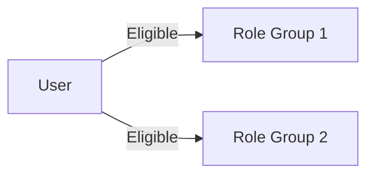

# Background

As always, some context. For a long time one of the **biggest painpoints of PIM** is having to **activate multiple eligible roles and groups**. One could argue that this is a fault of the access design, but in some organizations it's a **requirement** due to the kind of work you are doing (*or service you are providing*). The issue wasn't with activating the roles, but rather the **UX** of the PIM portal. It's not only impossible to activate multiple roles or groups at once, the **activation process is very slow**.

So the solution in the case of activating roles in PIM is to **semi-automate** it, in my case using PowerShell and Graph API. This does **not** mean circumventing the solution, but rather allowing for looping through multiple roles **quicker than the UI allows** and then manually refreshing the site after the script has completed.

**This was not possible for role assignable groups** however, as there was no way to activate them using Graph API. This has luckily changed in the latest iteration of the beta PIM API.

## Problem scenario

Let's say we have two groups, `Role Group 1` and `Role Group 2`. These groups correspond to a certain job role, or task, whatever you might like to define it as. A user might be assigned as eligible to one, both or none. 



The gist of this issues is that PIM is a **painpoint** for users. Yes, two activations a day isn't a lot, but if you have to do that every day it quickly becomes an issue - not to mention that some days you **might have to activate even more** groups and roles. If we only need to activate a certain **preset of roles** in a **single Azure tenant** then we might just use **PIM for Groups** to create groups scoped to different tasks. But if you use PIM in combination with **Azure Lighthouse** as an MSP or MSSP, then this might not be an option as you will probably have **multiple groups for each tenant you manage**.

Depending on how you fall on your **access design** you might only use a **single group** for access to a customer, but that would still require multiple group activations. The ability to select multiple groups of the same **category** in the PIM portal would be a huge improvement here, but that's not what we're here to talk about.

# Solution station

Privileged Identity Management iteration 3 is currently in beta, and the [PIM for groups](https://learn.microsoft.com/en-us/graph/api/resources/privilegedidentitymanagement-for-groups-api-overview?view=graph-rest-beta) specifically covers our use case of **activating multiple PIM groups at once**. By activating a group we mean that we are **activating access to the group** that your user is assigned as eligible to.

Using the [assignmentScheduleRequests](https://learn.microsoft.com/en-us/graph/api/privilegedaccessgroup-post-assignmentschedulerequests?view=graph-rest-beta&tabs=http) API endpoint we can either **assign users as active** to a group using `adminAssign`, or **activate a group for ourselves** by using `selfActivate`.

## Finding our own principal id

First of all we can the `/me` graph endpoint to grab our own `principalId`.

```powershell
# Assumes you've already ran Connect-AzAccount
$me = ((Invoke-AzRestMethod -Method Get -Uri "https://graph.microsoft.com/v1.0/me").Content | ConvertFrom-Json).Id
```

## Finding eligible groups

```powershell
# Assumes you've at some point ran Install-Module Microsoft.Graph and Connect-MgGraph
Import-Module Microsoft.Graph.Users
```

Then we can use the `eligibleRoles` endpoint to grab all the eligible roles for our user.

```powershell

