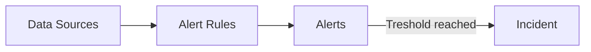
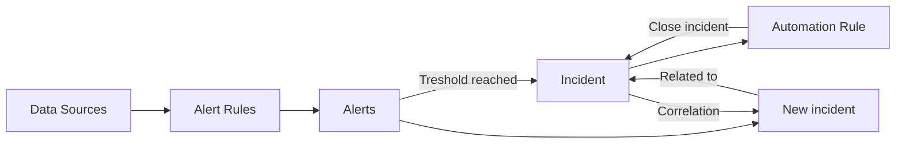
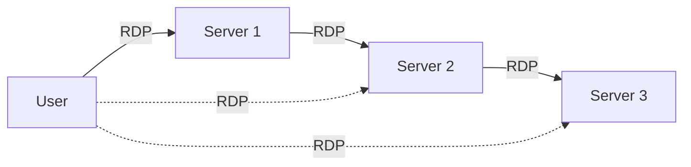

### Table of contents

- [A brief comment on the need for good use cases](#a-brief-comment-on-the-need-for-good-use-cases)
    - [Why are you writing about this?](#why-are-you-writing-about-this)
- [What is a use case?](#what-is-a-use-case)
  - [Actionable and informational use cases](#actionable-and-informational-use-cases)
    - [Informational use cases as parts of the puzzle](#informational-use-cases-as-parts-of-the-puzzle)
    - [Actionable use cases](#actionable-use-cases)
- [Developing the use case](#developing-the-use-case)
    - [Finding the correct events](#finding-the-correct-events)
    - [Writing the query](#writing-the-query)
- [Testing the use case](#testing-the-use-case)
    - [Simulating the activity](#simulating-the-activity)
    - [Checking historic data](#checking-historic-data)
    - [Monitoring the query over time](#monitoring-the-query-over-time)

# A brief comment on the need for good use cases

In the world of security monitoring we have some components that will be the same no matter what tool or platform you are using;

1. Data sources that create logs
2. Alert rules, detection rules, use cases, etc (whatever you want to call them) that query said logs
3. Alerts and incidents created from the aforementioned rules

So our job is to identify the logs we need to collect, create rules to query that data and then respond to the alerts and incidents that are created. Of course, this is very simplified but this is the essence of what security monitoring is.

## Why are you writing about this?

Simply because I think **good detection engineering** and **use case development is important**. A lot of **alert fatigue and burnout** in our industry is **because of poorly written use cases** that generate **a lot of false positives**. This is why I think it's important to write about this topic.

I'm not a detection engineer, I'm not very good at KQl nor am I a SOC analyst, but I've been a part of the process enough to have a grasp of it works and how I think it should be done. As always, this is my opinion and *you are free to disagree with me*.

I've also been quite vocal about my distaste for the **all the logs, all the queries** approach some seem to favor. I've written about this before in my post [**Field notes on Security Strategy**](https://www.infernux.no/SecurityStrategy/).

# What is a use case?

Different people with have varying definitions of a use case, but in my a use case is;

> A hypothesis that a certain malicious activity or behaviour will occur in your environment and how to detect it.

So, for example, a use case could be;

> An attacker will attempt to brute force a user account in my environment and I want to detect it.

## Actionable and informational use cases 

Let's take a look at our example; *"An attacker will attempt to brute force a user account in my environment and I want to detect it."*

Is this a good use case? I'd say it's alright. It lets us see activity that most likely is malicious (*unless the password sync didn't reach your RADIUS server and now your PC is trying to connect to the office Wi-Fi with the wrong password*). But it's not actionable. **What do we do when we see this activity?**

### Informational use cases as parts of the puzzle

Let me put it like this; any brute force alerts, even if tuned decently, will usually result in a lot of alerts. These are usually not actionable. **Do we block the IP address?** No, you can't block the IP address because it could be a VPN, proxy or a shared ISP/Cloud provider PIP that will rotate into legitimate use after burn. 

**Do we reset the user's password?** Why? It's just attempts at brute force, not successful logins (and hopefully there's MFA involved). **Do we just ignore it?** No, because this could be a part of a larger operation. If we only had actionable alerts, we'd only see fragments of the puzzle. 

Having use cases that cover all parts of an operation is integral to a good security monitoring program - however, a big part of the reason why **alert fatigue** is so common is that a lot of people mistake a decent use case for a actionable use case that needs to be handled by a human. 

This is where **automation** comes in to play. In Microsoft Sentinel, we can use **automation rules** to automatically close certain alerts that we know are not actionable. These will still be used for correlation and can be visualised in a workbook or in the incident graph, but they won't be sent to the SOC for triage on their own. 

---

### Actionable use cases

So what exactly is an actionable use case? Well, it's a use case that has a clear response. Let's take a look at a use case that is actionable, first by **defining a scenario that we want to monitor**;

> An attacker will try to pivot between my servers using RDP and I want to detect it.

This is what we refer to as [**RDP Nesting**](https://learn.microsoft.com/en-us/troubleshoot/windows-server/remote/run-remote-desktop-connection-session) - it's a technique that attackers use to move laterally between servers by RDPing from one server to another, usually deploying tooling **like Mimikatz** to extract credentials and move further into the environment.

The diagram shows the **idea behind RDP nesting**. The user will not logon to each server directly, but will instead RDP to the first server and then RDP from that server to the next server and so on.

First, before we move on with developing a use case, we need to take into account our environment and our own usage patterns. Ask yourself relevant questions to the scenario you are trying to monitor. In this case, one question would be;

- **Do we we normally RDP between servers as a part of our daily work?**

**If the answer is yes**, then this use case would probably not be worth it to implement. Yes, it would be actionable, but it would probably **generate more false positives than actual alerts**. We could probably implement it as an informational use case in that case.

*Your IT operations team when you implement a use case that generates a lot of false positives from their normal usage, probably.*

**If the answer is no** we can go ahead and start implementing the use case. First of all, we need to identify the data sources that we need to collect. In this case, we need to collect event logs from our relevant Windows servers. This blog won't dive into the specifics on how to ingest the logs themselves, but you can read more about [connecting data sources here](https://docs.microsoft.com/en-us/azure/sentinel/connect-data-sources).

## Developing the use case

At this point we've defined our hypothesis and identified the data sources we need to collect. Now we need to look into what information we need from our data sources to detect the activity we are looking for.

### Finding the correct events

When it comes to detecting RDP nesting, first we need to detect that someone has logged on to the server. This is usually indicated by an event with the ID **[4624](https://learn.microsoft.com/en-us/windows/security/threat-protection/auditing/event-4624)** in the **Security** log. 

In these events we can see the field **Logon Type**. This field will tell us how the user logged on to the server. In this case, we are interested in **[Logon Type 10](https://learn.microsoft.com/en-us/windows-server/identity/securing-privileged-access/reference-tools-logon-types)** which indicates a remote interactive logon.

### Writing the query

Luckily, as I'm not a KQL-guru (and hopefully will never claim to be), someone else has already written a query for this. You can find it [on the official Microsoft Sentinel repository](https://github.com/Azure/Azure-Sentinel/blob/master/Detections/SecurityEvent/RDP_Nesting.yaml).

The query is actually has comments that let us know what it's doing, which is great. But let's break it down a bit further (*I've had Github Copilot help me with this, but it should be pretty accurate - at least more so than my own KQL skills would allow me to be on my own*).

This code is written in Kusto Query Language (KQL) and is used to query security events related to Remote Desktop Protocol (RDP) connections. The code starts by defining two variables, `endtime` and `starttime`, which are used to specify the time range for the query. The code then uses the `union` operator to combine two sets of security events, `SecurityEvent` and `WindowsEvent`, that are related to RDP connections.

The code then uses the `join` operator to join the two sets of events on the `Account` field. The `where` operator is used to filter the joined events to only include those where the second RDP connection occurs after the first connection, the two connections are made to different computers, and the second connection occurs within 30 minutes of the first connection. The `distinct` operator is used to remove duplicate events.

The code then uses the `join` operator again to exclude events where the same `Account` and `IPAddress` have connected to 5 or more computers in the previous 7 days. This can for all intents and purposes be removed if it doesn't fit your detection requirements.

The `summarize` operator is used to group the remaining events by `Account`, `FirstComputer`, `FirstIPAddress`, `SecondHop`, `SecondComputer`, `SecondIPAddress`, `AccountType`, `Activity`, `LogonTypeName`, and `ProcessName`. Finally, the `extend` operator is used to add a `timestamp`, `AccountCustomEntity`, `HostCustomEntity`, and `IPCustomEntity` field to the output which allows us to map these in the query itself.

# Testing the use case

Now that we have our use case, we need to test it. This is where we need to **simulate the activity** that we are looking for to make sure that we are getting the results we want, and we need to check (if we have the option) our historic data to see if we have any hits. We should also monitor the query over a given time period to make sure that it's correctly tuned to fit our environment.

## Simulating the activity

In this case, we need to simulate RDP connections between servers. In this case, it's quite simple to have someone RDP into one server and then RDP from that server to another server.

## Checking historic data

Microsoft Sentinel allows you to check historic results when creating the query. This is done in the **Set rule logic** tab by clicking the **Test with current data** button.

## Monitoring the query over time

Follow up the query, maybe annotate the name so it's clear that the query is in testing, and then monitor the query over a given time period. This will allow you to see if the query is generating any **false positives** or if it's missing any activity that you want to detect.

# Final thoughts

This blog post is not meant to be a comprehensive guide on how to write use cases, but rather a brief introduction to the process. If you take anything away from it, let it be the following;

1. **Use cases are hypotheses about malicious activity you want to detect**
2. Use cases that create alerts/incidents should be actionable
3. **Use cases that are not actionable should be used for correlation and automation should be used to close them**
4. Use cases should be tested before being put into production
5. **Use cases should be monitored over time to make sure they are tuned correctly**
6. Use cases templates should NOT be implemented without being changed to suit your own usage patterns
7. **Use cases should be updated as your environment changes**

I hope that it has been helpful. If you have any corrections, disagreements or questions feel free to reach out (check the about me page for contact details).