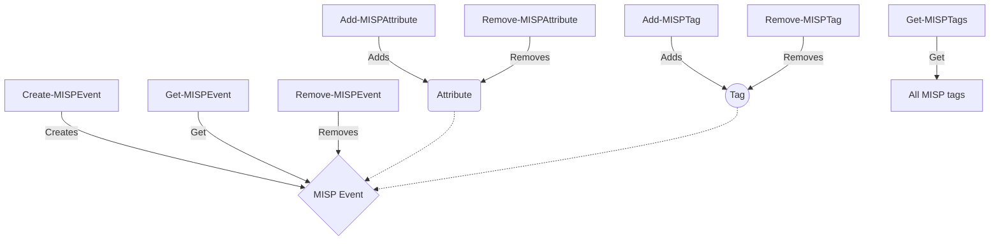

One of my earliest posts was ["Building a function"](https://www.infernux.no/Automation-BuildingAFunction/). It was my attempt at teaching people to build a function in Powershell. It's a bit outdated now, but I still think it's a decent read - however, the time has come to revisit the topic of Powershell-functions. This time, in the spirit of the season, we'll be looking at how to create a wrapper script.


## What is a wrapper script?

A wrapper script is a script that wraps around another script, function or API. It's a way to add functionality to a script without modifying the original script. This is useful if you want to add logging, error-handling or other functionality to a script without modifying the original script.

## Choosing an API

In this example we'll be using the [MISP API](https://www.misp-project.org/openapi/). MISP is a threat intelligence platform that allows you to share threat intelligence with other organizations. I've written about MISP [not once](https://www.infernux.no/MicrosoftSentinel-PushTIfromMISP/), [not twice](https://www.infernux.no/MicrosoftSentinel-MISP2SentinelUpdate/) but [three times](https://www.infernux.no/MISP2Sentinel-EventFilters/) on this blog. I'm a big fan of the platform and I think it's a great way to share threat intelligence.

### But we need a use case

So what are we creating? A pretty normal thing to do in MISP is work with events. Events are collections of attributes, objects and other data. In this example we'll be creating a wrapper script that allows us to create events in MISP.

## Creating the wrapper script

### What functions do we need?

My thought process is pretty simple; **I want to create an event**. This means I need to check if a similar **event already exists**, before I create it. 

In MISP, an event can have a bunch of different data set, but the most basic is **attributes and tags**. So I want to have an event with attributes and tags, then I should also **be able to check that the attributes and tags I want to add doesn't already exist on the event**. Both tags and attributes actually return a handy error-message if you try to add a tag or an attribute that already exists on the event. So we don't need to create a function for that, we can just **add a try/catch to the function that handles the error**.

We do, however, need a function to **get the tags** from MISP. This is because we need the **ID of a tag** to be able to add it to an event. So I'll add a function to get the tags from MISP and return their ID based on the name of the tag.

It's also good hygiene to **be able to remove events, attributes and tags**. So I'll add those functions as well, just to cover all the bases.

Lastly, MISP requires an **authentication key** to be able to interact with the API. So I'll add a **function to create the authentication header** and a **function to invoke the REST-methods against the API**.

In my head, I'm thinking we need the following functions:

| Function | Description |
| --- | --- |
| Create-MISPEvent | Creates a new event in MISP |
| Get-MISPEvent | Gets an event from MISP |
| Remove-MISPEvent | Removes an event from MISP |
| Add-MISPAttribute | Adds an attribute to an event in MISP |
| Remove-MISPAttribute | Removes an attribute from an event in MISP |
| Add-MISPTag | Adds a tag to an event in MISP |
| Remove-MISPTag | Removes a tag from an event in MISP |
| New-MISPAuthHeader | Creates an authentication header for MISP |
| Invoke-MISPRestMethod | Invokes a REST-method against the MISP API |


### Function map



### Creating the functions

Starting of, we can see from the OpenAPI spec that we need to create headers. The example looks like this:

```bash
curl  --header "Authorization: YOUR_API_KEY" \
      --header "Accept: application/json" \
      --header "Content-Type: application/json" https://<misp url>/ 
```

We can accomplish the same in Powershell by creating a hashtable with the headers we need. We can then use this hashtable as input to the `Invoke-WebRequest` cmdlet.

#### New-MISPAuthHeader

This functions requires an authentication key as input and returns a hashtable with the authentication header.

```powershell
function New-MISPAuthHeader {
  param(
    $MISPAuthKey
  )
  $Headers = @{
    Authorization = $MISPAuthKey
    Accept = 'application/json'
    'Content-Type' = 'application/json'
  }
  return $Headers
}
```

If we want to run the function:

```pwsh
$MISPHeader = New-MISPAuthHeader -MISPAuthKey "dadada..."
```

#### Invoke-MISPRestMethod

This function requires the output from `New-MISPAuthHeader`, a method, a body and a URI as input. It then invokes the REST-method against the MISP API and returns the result. 

We will also implement our `try/catch` logic here, so that we can handle the error-message from MISP if we try to add an attribute that already exists on the event.

```powershell
function Invoke-MISPRestMethod {
  param(
    $Headers,
    $Method,
    $Body,
    $URI
  )
  try {
    # Run the query against MISP
    $Result = Invoke-WebRequest -Headers $Headers -Method $Method -Body $Body -Uri $URI
  }
  catch {
    $errorReturn = $_ | ConvertFrom-Json
    if($errorReturn.Errors.Value -eq "A similar attribute already exists for this event") {
      Write-Host "Attribute already exists"
    }
    else {
      Write-Host "Error: $($_)"
    }
  }
  return $Result
}
```

If we want to run the function:
  
```pwsh
$MISPResult = Invoke-MISPRestMethod -Headers $MISPHeader -Method "POST" -Body $MISPBody -Uri $MISPURI
```

#### Get-MISPEvent

Next up, if we want to create MISP events we first need to know if **the event already exists**. We do this by creating a function that can lookup an event from MISP. 

We have multiple options of accomplishing this, the first being the [`/events`](https://www.misp-project.org/openapi/#tag/Events/operation/getEvents) endpoint. This endpoint is used with the `GET`-method to return a list of events. We can then filter the list to see if the event we want to create already exists. Depending on the size of your MISP-instance, this method is quite slow and resource-consuming.

Another option is the [`/events/index`](https://www.misp-project.org/openapi/#tag/Events/operation/searchEvents) endpoint. This endpoint is used with the `POST`-method and allows us to include a search-query in the body of the request. This is a lot faster and more efficient than the previous method, especially since we only need to check if an event already exists for this implementation, so we'll use this one.

We'll be looking at the event name, in MISP this will be the `eventinfo`-field. In some cases multiple events have the same name, so we can also look at an attribute we might expect to see in the event. Here, we'll use the `attribute`-field which allows us to filter on the attributes of events. We can also specify the organization we want to search in with the `org`-field, as we'll most likely want to use our own MISP organization. 

```powershell
function Get-MISPEvent {
  param(
    $AuthHeader,
    $MISPUri,
    $MISPOrg,
    $MISPEventName,
    $MISPAttribute
  )
  # Create the body of the request
  if($MISPAttribute) {
    $Data = @{
    org = $MISPOrg
    eventinfo = $MISPEventName
    attribute = $MISPAttribute
    }
  } else {
    $Data = @{
    org = $MISPOrg
    eventinfo = $MISPEventName
    }
  }
  $return = Invoke-MISPRestMethod -Headers $AuthHeader -Method "POST" -Body ($Data | ConvertTo-Json) -Uri "$MISPUri/events/index"
  return $return
}
```

Using this function:

```pwsh
$MISPEvent = Get-MISPEvent -AuthHeader $MISPHeader -MISPUri https://misp.domain -MISPOrg "infernux.no" -MISPEventName "Test Event 1011" -MISPAttribute "exampleText"
```

## Summary

That was it for part 1 - in part 2 we'll look at the rest of the functions and how to put it all together.

Happy holidays to all 🏂


## Links

- [MISP-Scripts](https://github.com/lnfernux/MISP-Scripts) - contains the current version of this module, will be updated as I add the next parts.
- [MISP OpenAPI spec](https://www.misp-project.org/openapi/)

