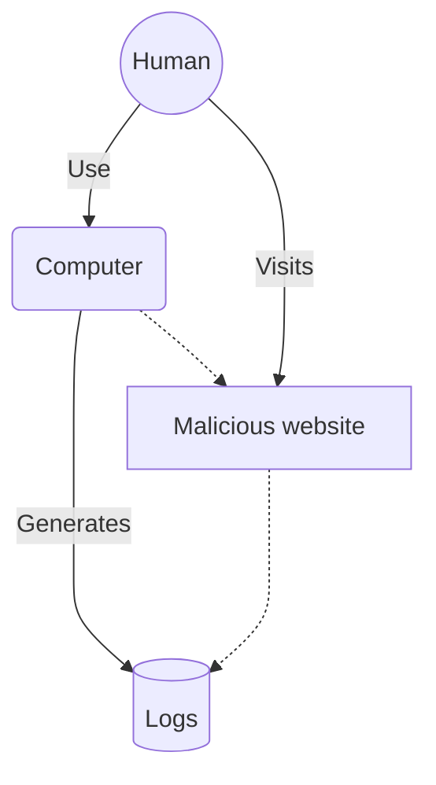
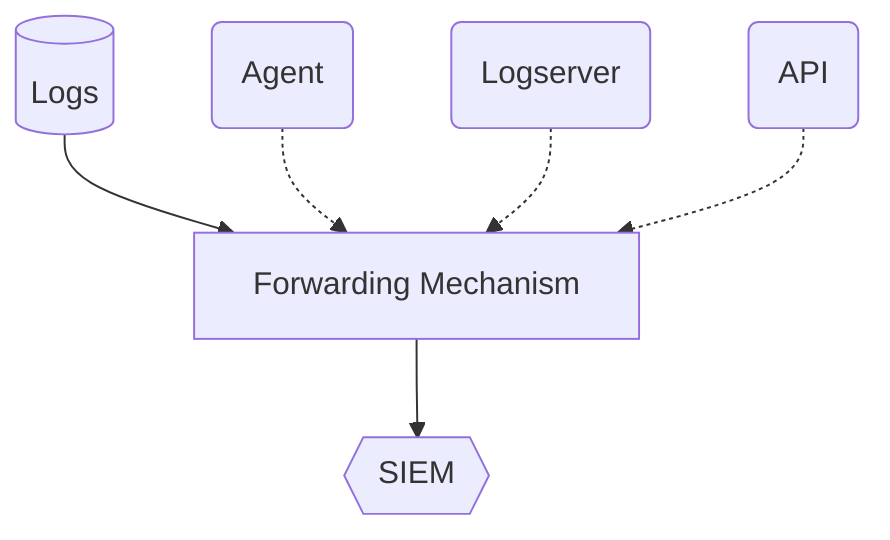
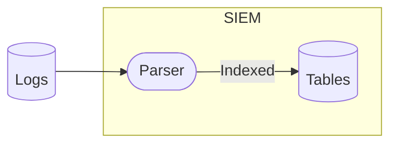
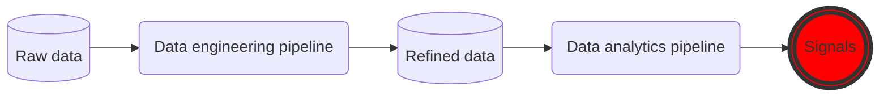

Lately I've been presenting a few times on the topic of automation and in particular for security monitoring to combat alert fatigue. One of the most important parts of this is the automation part. It's not so much about security or security monitoring, but about teaching what automation is, what tools we have available and how to get started. **Most automation is done by and for those with the know-how to get it done**, so my goal is to try and make it more accessible to everyone.

### Table of Contents
- [An introduction to the issue](#an-introduction-to-the-issue)
  - [The Challenge of Alert Fatigue](#the-challenge-of-alert-fatigue)
  - [What is alert fatigue?](#what-is-alert-fatigue)
  - [How do we combat it?](#how-do-we-combat-it)
- [Data: Quantity vs. Quality](#data-quantity-vs-quality)
  - [The Data Dilemma](#the-data-dilemma)
  - [Data Epilogue](#data-epilogue)

---

# An introduction to the issue

Alert fatigue happens when we have too many alerts compared to our capacity. Alerts are usually surfaced based on detection queries. These queries in turn are hypothesis that something bad will occur if we observe certain conditions in our data, something malicious is going on. The consequence, then, is that we risk missing the true positives in the sea of false positives. Automation can help us combat this, in addition to two other factors:

1. Data
2. Detection queries

---

## Data ingestion scenario

Let's imagine a scenario where a user interacts with a malicious website. We assume that the machine has some level of protection, like an Endpoint Detection and Response (EDR) tool.

As we can see, the user uses the computer to visit the malicious website. This _should_ trigger some level of response from the EDR-tool and in turn generate logs. From here we can usually ingest the logs into our SIEM tool of choice.

During this operation, the data is usually parsed or indexed to make it searchable in the query language of the SIEM. 

## Data manipulation

We can to a certain degree work with our data to make sure we have a good balance of quality and quantity, and we can tune and tweak our detection queries to make sure we limit the amounts of false positives we get. 

That being said, there's only so much we can do with this - at some point we need to agree that even though not all alerts are equally interesting on their own, they help paint a broader picture of what's going down. 

This is where Security Automation, Orchestration and Response (SOAR) comes into play. This is a broad term we use to describe what we can do with alerts and incidents that have been surfaced. Using SOAR we can close, enrich, label, change and respond to our alerts in bulk, making the security team able to pick out the true positives much more easily.

*I've already spent some time discussing [use cases and their development in a previous post](https://www.infernux.no/SecurityMonitoring-DevelopingUseCases/), so I will refrain from talking too much about detection queries and use cases in this post.*

## The Challenge of Alert Fatigue

In security monitoring, alert fatigue poses a significant challenge, with security teams overwhelmed by the sheer volume of alerts. This chapter delves into the consequences of alert fatigue and explores the inherent limitations of relying solely on detection queries to manage the deluge of security alerts.

## What is alert fatigue?

Imagine you're at work, whatever you're currently working as, and you have 4 very important tasks you need to get done by the end of the day. Even at full speed it would take you the entire day to complete 2 of the 4 tasks. You're not going to be able to complete all 4 tasks, and you're going to have to prioritize. Now imagine all the tasks are similar, maybe you're compiling a report and their all similar, but for different departments. How would you prioritize?

It's the same for security monitoring, except here the stakes (might) be a bit higher. You have 4 alerts of high priority, all involving phishing of different users. Which do you prioritize? Which do you investigate first? If you're only able to investigate 2 of the 4 alerts, how do you know you're investigating the right ones? This is alert fatigue in a nutshell, and you're just hoping that the ones you are able to get to are the actual true positives.

## How do we combat it?

There are three main components (aside from staffing, training and other non-technical solutions) that we can use to combat alert fatigue:

1. Work with our data
2. Work with our detection queries
3. Work with our alerts (automation/SOAR)

As I've already covered a bit on detection queries [earlier](https://www.infernux.no/SecurityMonitoring-DevelopingUseCases/), let's start with data.

# Data: Quantity vs. Quality

In the realm of cybersecurity, the effectiveness of our defense mechanisms hinges on the data we collect and analyze. As we strive to fortify our digital perimeters, a critical dichotomy emerges—balancing the quality of data against its sheer quantity. This chapter delves into the pivotal role that data plays in the generation of security alerts.

## The Data Dilemma

Since the dawn of monitoring and detection, the challenge of data has been a constant. The more data we have and the more we can analyze, the more we can detect. If we have "all" the data, this would mean that we would be able to detect everything, right? Not really, as I've [written about before](https://www.infernux.no/SecurityStrategy/), since it's very dependant on your ability to actually analyze and understand the data, build good queries and actually be able to work the alerts.

So should we just ignore data? Yes, to a certain degree. And before everyone gets mad at me for this point, not forever, of course. My stance is one of building brick by brick, or to quote Will Smith:

> **You don't set out to build a wall. You don't say 'I'm going to build the biggest, baddest, greatest wall that's ever been built.' You don't start there. You say, 'I'm going to lay this brick as perfectly as a brick can be laid.' You do that every single day. And soon you have a wall.**

To summarize this point, I'll refer to myself;

1. Identify what you want to protect (let’s say identity).
2. Gain a clear image of what your perimeter is (for identity this will be where it’s being used, for what, etc).
3. Implement security controls, feature, logs or tools (keep it simple, work in batches).
4. Monitor the impact of your added security controls and tune them (this also goes for security monitoring and analytic rules).
5. Finish implementing.
6. See 1.

Doing it this way, you'll be able to build a solid foundation for your security monitoring, and you'll be able to build on it as you go. This helps us make good use of the tools and data sources we currently have and it helps build a solid foundation. When we start onboarding new data sources, we can use the same process to make sure we're not just adding data for the sake of adding data, but that we're actually able to use it.

**People and processes over tools and data, *always*.**

## Data Epilogue

For some actual "but what should I do about this" advice on data, I refer to [Alex Teixeira](https://ateixei.medium.com/) and his blog [on why you need data engineering pipelines](https://detect.fyi/why-you-need-data-engineering-pipelines-before-an-enterprise-siem-0be553584aa9) before an Enterprise SIEM. 

The flow presented in the article looks something like this;

The general idea here is that we should have some level of control over the data we ingest - **not ingesting it for the sake of ingesting**, but because it holds a value. The cost/value is determined by the risk profile of the company, the data source itself and the maturity of the security team.

### Data engineering pipelines

A simple example of a data engineering pipeline can be tools like [Cribl Stream](https://cribl.io/stream/), [fluentd](https://www.fluentd.org/), [Tenzir](https://www.tenzir.com/) or some homebrew concoction using [Logstash](https://www.elastic.co/logstash/). We can also look for native tooling like the Azure Monitoring Agent with [workspace transformations](https://learn.microsoft.com/en-us/azure/azure-monitor/essentials/data-collection-transformations), but comparing this to a lot of the other tooling here leaves something to be desired in terms of user experience, ease of use and integrations. 

We can use these tools to ingest data, transform it and send it to our SIEM.
If the value is deemed to low to be used as a source for detection we might send it to long term storage to be used for compliance, hunting or correlation. This way we can make sure we're not just ingesting everything, but that we're actually **able to use the data we ingest**. We can also filter the raw logs to only relevant data, reducing the amount of data we need to ingest and store.

# Summary

In this post we've looked at the issue of alert fatigue, what it is and how we can combat it. We've done this mainly by looking at the importance of data and how we can work with it to make sure we're not just ingesting everything, but that we're actually able to use it. In the next post we'll look at automation, specifically security automation, orchestration and response (SOAR) and how we can use it to combat alert fatigue.