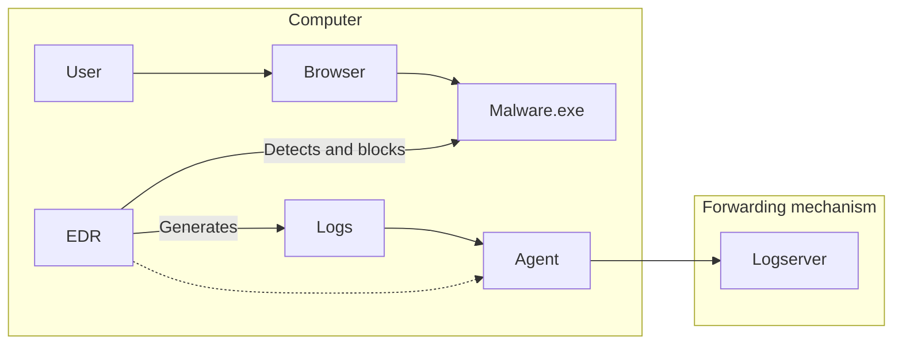
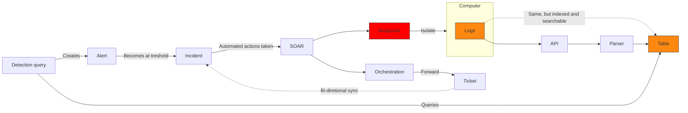
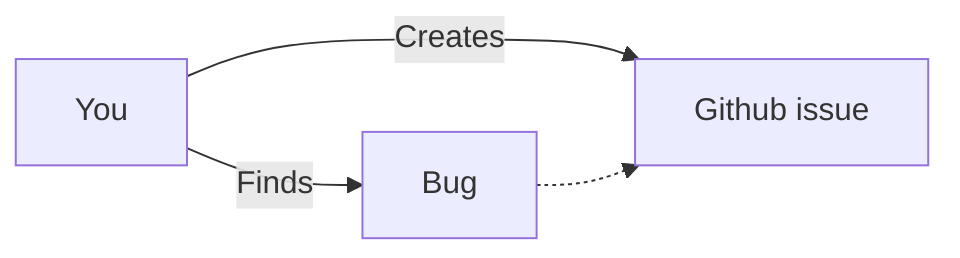

Let's get straight to the point; **security monitoring** is the process of **consuming data**, **analyzing** it and **detecting malicious activity**, then **handling** that malicious activity. There are **more factors** at play that will influence some of your decisions:

* What **data sources** you focus on
* What **security tooling** you opt for
* What **detection rules** you need to write
* How you **handle different alerts**,
* And so on and so forth..

In essence, we are looking at the three same core components, **data, detection and automation**.

We've already looked a little bit at **[data](https://www.infernux.no/AutomatingSecurityMonitoring1/) in part 1** of this series. Earlier I've also talked about **writing good detection [in my post on use-case development](https://www.infernux.no/SecurityMonitoring-DevelopingUseCases/)**. Thus, in this post we will be focusing on the last component; **automation**. I'd also love to recommend my post on **[security strategy](https://www.infernux.no/SecurityStrategy/)** which goes a bit more into details on how to approach security and security monitoring.

## Table of Contents

* [An introduction to automation in security monitoring](#an-introduction-to-automation-in-security-monitoring)
* [The Security Monitoring flow](#the-security-monitoring-flow)
* [Automation in practice](#automation-in-practice)
    * [What to automate](#what-to-automate)
    * [Identifying what to automate](#identifying-what-to-automate)
    * [Jumping back into security](#jumping-back-into-security)
    * [Making the case for user input and testing](#making-the-case-for-user-input-and-testing)
* [Some automation samples](#some-automation-samples)
    * [Mapping everything to Microsoft Sentinel](#mapping-everything-to-microsoft-sentinel)
    * [Enrichment](#enrichment)
    * [Orchestration](#orchestration)
    * [Response](#response)
* [Conclusion](#conclusion)

# An introduction to automation in security monitoring

Automation in this context is usually referred to as SOAR, which stands for "Security Automation, Orchestration and Response". Translating this into human, we can say that it's what we do once a top level security alert is triggered. Whatever you chose to call this, I will refer to this as an **incident**. When an incident is triggered, we need to perform some incident response. This can be a lot of different things.CrowdStrike breaks down SOAR itself into the following categories ([source](https://www.crowdstrike.com/cybersecurity-101/security-orchestration-automation-and-response-soar/)):

| Category | Description |
|----------|-------------|
|Orchestration| A SOAR solution can facilitate the connection between security and productivity tools, such as firewalls and intrusion detection tools.
|Automation| A SOAR solution can automate standard cybersecurity workflows, such as the identification of security alerts and possible intrusions.
|Response| A SOAR platform can work with both automated and manual processes to support a timely response to security threats.
|Integration| A SOAR platform can work with a variety of complementary security products to support the organization’s overall security posture.

I've created a diagram for presentation to sort of visualize this:

**Expanding on this** to give you an idea about what this might actually include, here are some examples:

* **Alerting/Forwarding/Ticketing** - so the right people know about the incident
* **Responding** - to the incident, for instance by isolating a machine
* **Investigating/Enriching** - the incident, for instance by gathering more data from an external source

# The Security Monitoring flow

Let's attack this from a high level perspective. We have a security monitoring flow that will break down into something like the following:

1. **Somewhere something happens**, usually a user interacts with a computer.
2. This **generates logs**, which are forwarded to a SIEM.
3. The **SIEM ingests the logs**, where they are **parsed** and stored in a table.
4. A **detection** query is run against the logs, and if something malicious is found this creates an **aler**t.
5. At a certain treshold alert(s) become an **incident**, which **triggers automation**.
6. The SOAR component takes over, **enriches** the incident with more data and **orchestrates** the flow.

I've visualized this flow in the two following diagrams:

---

# Automation in practice

So what have we **actually** automated here? We've automated some of the things we mentioned in the introduction, namely **ticketing** to the ITSM too, **responding** to the incident by isolating the computer and **investigating** the incident by gathering more data from an external source.

Now, let's ask ourselves the most important question; **what should we automate**? Because it's not just about automating everything, it's about automating the right things. It's a bit similar to chosing what data sources to ingest based on what your **crown jewels** are and what detection queries to write based on the same thing. In the same way, we need to chose what to **automate based on what our needs are**. Chances are, a lot of the time SOAR is being **created by someone in the Security Engineering** team and the **output is consumed by a SOC-analyst**. This means that **the SOC-analyst is the one who should be the one to decide what to automate**. 

## What to automate

There are a few things to consider when you are creating automation flows. I will give some examples of flows you can create later, but it's important that they serve a purpose and they're not just created because someone thought it would be cool, or to solve some imagined problem. **A very real problem with engineers** is that they like to create things and solve problems that **they believe are important**. 

Let's look outside the security world for a little example. Imagine, you are company and you're creating an application. Who is the application for? Are we using it only internally? Does it only need to be functional enough, and the users will understand it because they have a certain level of compentence? Or are we creating an application for the general public? In that case, we need to make sure that the application is easy to use, and that it's intuitive. 

At this point, you'd usually start by doing user testing, likely led by someone working in design. Yes, it's your application, but the **user has to get a say** in how it works and looks, because if they **don't like or understand it, they won't use it.**  The same goes for automation. **Whoever is going to be consuming the output of your automation is the user**, and they should be the one to decide what needs to be automated and how the output should look. I can honestly say, as someone who just likes to think that *"ah this would be cool to have automated"*, I've created a lot of automation that is **of little to no use or value before**. 

### Identifying what to automate

Let's step back for a second and look a little at **how to identify what to automate**. This time we will use the Norwegian platform `helsenorge.no` and Github issues as an example. Ever been sick or found a bug in a system before? Well, in both cases you want to report it. In the case of the bug, the flow would go something like this:

Now, let's imagine that this project on Github had a template for submitting bugs. This template would ask you for a lot of information, such as what browser you were using, what operating system you were using, what the bug was and how to reproduce it. This is a good idea, because it makes it easier for the developer to understand what the bug is and how to fix it. However, users, when not enforced to do so will often just straight ignore the template and write something like *"**I found a bug with X when doing Y, please fix**"*.

This is the same when going to the doctor. Disregarding all privacy protection and laws for a minute, you feel sick (you've got a bug) and you need to see the doctor. In Norway, you can go to `helsenorge.no` and book an appointment. When booking an appointment with my doctor, I usually had the option of adding a title and a short **description of what was wrong**. This is the same as the Github issue. Some people would probably write "**I'm sick, I need to see the doctor**". How does that **help the doctor prepare? It doesn't**. This is the **same for the developer** trying to sort out your bug. 

On `helsenorge.no`, at least for my doctor, I'm currently **forced to submit more information**. What symptoms I've experienced, what medications I've tried, when I first felt sick, etc. This forces me to **think about the information the doctor needs to know**, and it makes it easier for the doctor to **understand what's wrong** with me. We could do the same for the Github issue, by taking the input from a form and parsing it into a Github issue. This *can be automated*, and this way we suddenly have the same information in the same place with a similar amount of steps. **I know that I can't force people through a form with strict requirements**, but as an example I think it makes sense, *no*?

As you can probably tell, there are cases to be made for both sides. At this point, we need to ask the doctor - or the developer - what they need to know. **What information is important to them**? How is todays solution working for them, are they able to be effective with the information they have? If not, what can we do to make it easier for them?

### Jumping back into security

Let's take the last couple of paragraphs and apply it to security. Let's imagine that access to a certain system requires, among other things, your IP being added to an allowlist. Let's also imagine that this list needed to be curated, so any user should only be allowed to hold a certain amount of IPs on the list. Doing this manually would be a pain, because it would require you to keep tabs of who has what IPs on the list, and then remove them when they're not needed anymore. This is a perfect example of something that can be automated.

There are also some automations, as I've mentioned, that aren't necessarily making any sense. Let's say I as the security engineer decided that I wanted to make sure that every time we see a `domain` or `url` entity in an incident, we should check it against a tool like `dnsdumpster` and add that information to the incident. 

There are levels to how good of an idea this can turn out to be, so let's assess:

1. **First and foremost**, are any of the analysts **actually using** the information provided, or is it **just noise?**
2. If they are using it, is it **useful in all cases or just some?**

Based on these two questions, we can quickly decide if it's a good idea to have this automation active. **Also consider that it might be a part of a larger automation flow**, and that it might be just one more piece of noise that drowns the analyst in information that might not be useful in the context of the incident. We also need to consider things like **every analyst having their own way of work** and that while some might find it useful, others might simply see it as noise.

## Making the case for user input and testing

Maybe you're already doing this, working closely with the SOC-analysts to make sure that the automation you're creating **is useful**. If you're not, I'd recommend you to start doing so. **However**, this is a two-way street. The **SOC engineers** will most likely **know best** what the **options for automation** are in terms of **tools and technical limitations**. **SOC analysts** on the other hand **might not be as familiar** with the tools and the technical limitations, and **might not be able to see the full picture** of what's possible. This leaves us with a **problem**.

We want the SOC-analysts to inform the creation of automation, maybe even participate in creating it at a tier 2 and tier 3 level. So they **need to learn it, right**? Well, if time was not a concept and we could just learn everything, then yes. However, time is a concept and we can't learn everything. This is where the security engineer comes in. **The security engineer needs to be able to explain the technical limitations and the options for automation to the SOC-analyst**. This is a part of the **security engineers job**. Facilitating for this to happen should be in the hands of management, making sure there is ample time to communicate between the two teams so the **automation flows** that you implement **make sense and serve a purpose**.

Moving on from this, once you get to a certain level of being able to communicate around automation, part of the process of creating these tools should entail **user testing**. This is not revolutionary in any way, but usually when you're not creating something for public consumption we tend to think that it's not as necessary. **It is**. Let's **imagine that we are creating an enrichment flow**. User testing here will allow us to make sure that the **information is correct**, that it's actually **useful** and it's **formatted in a understandable way**. 

# Some automation samples

Now that we've talked a little (**I know, a lot**) about the hows, whats and whys of automation, let's look at some examples of what you can automate. These will follow a **simple formula**; I will explain **what the flow is supposed to do** and what the **input and output is**, along with a **simple diagram of said flow**. ***Simply put, these are just rapid fires ideas that hopefully will give you some inspiration to create your own automation flows***.

## Mapping everything to Microsoft Sentinel

Now, I've created these to be agnostic in terms of tooling, but these are all things that have been created in Microsoft Sentinel originally. To brief explain how it works in Sentinel, I have created this table to explain the different components:

| Component | Description |
|-----------|-------------|
|Analytic Rule|This is the detection query in Sentinel|
|Alert|This is the alert that is created when the detection query is triggered|
|Incident|This is the incident that is created when an alert reaches a certain treshold, can be 1|
|Automation Rule|First "line of automation" that will trigger on incident creation and updates. Is pretty basic in terms of what it can do, works like an [if-then-else conditional](https://en.wikipedia.org/wiki/Conditional_(computer_programming))|
|Playbook|A more advanced automation flow that can do a lot more than the automation rule. Can be triggered by an automation rule, or manually|

To visualize how automation rules work, I've created a simple flowchart:

The **do something** can refer to starting a playbook. Playbooks are a bit more advanced, and can do a lot more than automation rules. [Microsoft does a great job of introducing them here](https://learn.microsoft.com/en-us/azure/sentinel/automate-responses-with-playbooks/?wt.mc_id=SEC-MVP-5005030). They are Azure Logic Apps beneath the surface and can be compared to lego robotics, for those of you who have tried that. With that I mean that you have a library of **triggers** and **actions** that you can drag into order, give a little input and that's your flow.

---

## Enrichment

### Simple URL lookup

**What it does**: Takes a URL from an incident and looks it up in an external API. If it finds anything, it adds it to the incident.

**Input**: Incident with a URL entity

**Output**: Incident comment with the URL entity and information

### Simple Entity lookup

**What it does**: Takes an entity from an incident and looks it up against a Threat Intelligence service, here using MISP. If it finds anything, it adds it to the incident.

**Input**: Incident with an entity

**Output**: Incident comment with the entity and information

---

## Orchestration

### Group Incidents

**What it does**: Takes incidents with some level of similarity and groups them together. Microsoft Sentinel has this as a built in feature, but sometimes you will have duplicate incidents that you want to group together.

**Input**: Incidents with some level of similarity

**Output**: Grouped incidents

### Generate close comments

**What it does**: Takes an incident and the comments with what steps were taken and generates a comment using OpenAI that can be used to close the incident. This is one of the things AI does well, which is summarize existing information.

**Input**: Incident title, description, severity, comments, entities and activities

**Output**: Comment that can be used to close the incident

---

## Response

### Isolate Computer

**What it does**: Isolates a computer from the network, for instance by adding it to a VLAN that has no access to the internet. This is done via approval in teams during the day, and automatically at night. Depends on size of organization and what you're isolating.

**Input**: Incident with a computer entity

**Output**: Computer is isolated

## Summary on examples

These were as mentioned just some quick examples of what you can automate. I hope they give you some inspiration to create your own automation flows. **Remember to always consider the user** and what they need, and to **test your automation**. Just because something sounds cool doesn't mean it's useful.

Also, some other flows that might be good to keep in mind, in order of usefulness:

1. **Bi-directional integration with ITSM**
2. **System for automatically closing certain incidents**
    * Based on certain criteria, for instance if a certain amount of time has passed, or we know that the incident is a false positive
3. **System for automatically escalating certain incidents**
    * If user entity is a VIP or admin
    * If the server is a domain controller
    * If an entity has a match in a threat intelligence service

# Conclusion

Automation is complex. There's a lot of variables to consider, and it's **not just about automating everything**. I think the **most important thing** you can take from this is that all **stakeholders needs to be involved in process** of creating automation. Those who know the **capabilities and limitations must explain them**, and **during the creation** of automation you should **strive to involve the recipients actively**.

This might not be as easy to achieve as it sounds, because every team has their own way of work, priorities and measurements for success. However, I think that if you can get this to work, you will have a **much better chance of creating automation that is useful the first time around**.