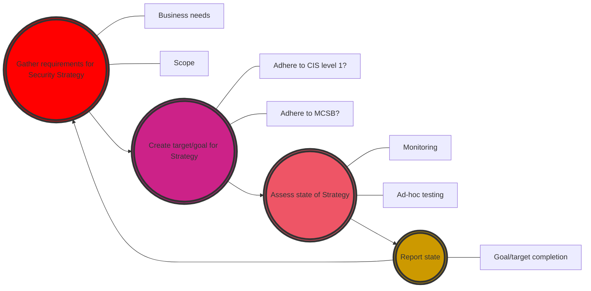

Cloud infrastructure is by nature complex, and it's **constantly changing** (at least the names, looking at you *Defender ~~365~~ XDR*). At least, it seems that way. Truth is, security in itself hasn't evolved a lot. Basic security, according to the [Microsoft Digital Defense Report from 2023](https://www.microsoft.com/en-us/security/security-insider/microsoft-digital-defense-report-2023) can help us protect 99% of all attacks by following these basic principles:

1. **Multi-Factor Authentication**: Should be a no brainer at this point. 
2. **Follow Zero Trust Principles**: Zero trust has been co-opted as a buzzword in the same way AI has, but what we are getting at here is basically "don't let anyone skip MFA or other security protocols just because they are on the internal network".
3. **Use XDR**: What is XDR? NDR? EDR? Who knows - we'll get back to this at some point.
4. **Patch stuff**: Just do it.
5. **Protect data**: Know where your data is, protect said data. 

Okay, so I might have lied a bit - we throw in some **XDR** and a sprinkle of **Zero Trust** and it sounds a bit fancy, doesn't it? Truth is, good security is very boring. It's about getting the basics right, and then building on top of that. 

## Table of Contents

- [An intro to testing yourself](#an-intro-to-testing-yourself)
  - [Example: Bob Industries](#example-bob-industries)
    - [Some background on Bob Industries:](#some-background-on-bob-industries)
    - [Conclusion](#conclusion)
  - [Back to reality](#back-to-reality)
    - [Process](#process)
- [Testing yourself](#testing-yourself)
  - [Starting with the basics](#starting-with-the-basics)
    - [Microsoft Cloud Security Benchmark and Secure Score](#microsoft-cloud-security-benchmark-and-secure-score)
    - [Entra ID Identity Secure Score](#entra-id-identity-secure-score)
    - [Auto Patch in Azure](#auto-patch-in-azure)
  - [Moving to tools](#moving-to-tools)
    - [AADInternals](#aadinternals)
    - [BloodHound/AzureHound](#bloodhoundazurehound)
  - [Specific tooling](#specific-tooling)

# An intro to testing yourself

## Example: Bob Industries

To eximplify this, let's start with an example. **You're now an IT consultant, congratulations**. You have a client, **Bob Industries**, which is a **small/medium business** in the market for an **XDR or SIEM solution**. They also want to know about **Copilot for Security**. Their reasoning is:

> We don't have enough people to monitor all of our systems, and we need to be able to respond to incidents faster
> Our current tools don't cover all their bases

### Some background on Bob Industries:

- They have a small IT team, with a mix of on-prem and cloud infrastructure.
- They have a mix of Windows and Linux servers.
- They don't have a process or plan for patching servers and it's handled "when we have time".
- They have Active Directory, but no one knows how it's set up since it was configured by a previous sysadmin that left for greener pastures.
- They pay for E5 licenses, but everything is out of the box.

In other words, they seem to be **lacking a strategy and a process for implementing it**. They are looking for **tools to cover their bases**, but they **don't have the people or processes in place to handle these tools**. They also have E5 licenses, which includes Microsoft XDR, but maybe they are using it out of the box and not **configuring it properly**?

### Conclusion

**What would you do**? If this company came asking for a security test, I could write it up to the CISO wanting to show how bad things were to secure more budget. But, in this case, let's review:

- They need a security strategy
- This strategy needs to outline patching, backups, inventory management (to mention some things...) - just in general proccesses for good IT hygiene.
- They need people to put these processes into place, and people to perform the tasks outline in these processes.
- Their current tools SHOULD be covering their bases, but likely they don't have the people or processes in place to make it work.
- Out-of-the-box are usually not enough - they need to be configured and maintained.

---

## Back to reality

My list would be something like this instead:

1. **MFA**: Implement MFA for all users, no exceptions.
2. **Asset management**: Start with a simple inventory of all devices and services.
3. **Patch management**: Outline a patching regime that can be followed, automate as much as possible.
4. **Backup**: Have a backup policy, and test this regularly.
5. **Basic security**: Review what your core business is, and how you go about protecting that. Act accordingly - this might be a lot of different things, but things like making sure you are properly segmenting your network, make sure you are adhering to best practices in terms of identity management and permissions, etc. Look for quick wins as well - endpoint detection and response is a great way to do this, but keep in mind that there are ways to bypass tools like this, and we need people to handle incidents that come from our tools - it's not a magic solution even if you sprinkle some AI on top.

On top of this, I'll add in that all of these points should make a point to follow **Zero Trust principles**. There should be MFA no matter where you are on the network, or what location you are at. We also need to know **where our critical data and systems are**, and protect them accordingly. Not all systems are equally important, so we need to know what to prioritize. 

## Process

**You should have a strategy** (duh). How you implement this strategy needs to be up to the company, but ideally in my eyes **it should** be some sort of **multi year plan**, and this plan should start with people and process. **If you need a tool, it should be to support your people and process, not the other way around**.

**The point I'm trying to make is;**

If your security strategy is ***"buying missing tools from your puzzle of coverage"*** or ***"we need copilot because we are understaffed"*** you are **doing it wrong** *in my mind*. For most companies, a **solid foundation is more important than the latest and greatest tool**. It's also easier to build on top of a solid foundation, than it is to try to build foundations under a lot of different tools with no processes, no people and no plan.

Visualizing helps me understand stuff, so I created a simple diagram to show **how I see this process when it comes to high level security strategy**:



This is a cyclical process that has to be followed. **The tests you run and the tools you run will change as you go along, as you will reach target/goals and mature your security posture.**

# Testing yourself

**With all this in mind, why test yourself?** What's the point? Well, we need to know where we are at and how we are looking. From the perspective of the defender, we have a bunch of settings in different parts of the portals we manage (and tools, and services, and...). **Attackers? They run some scripts and easily find our weak spots. So what's stopping us from doing the same?**

They key idea here is - **we don't always need a penetration test or architecture review to check our security**. Some of it we can do ourselves, and some of it we can automate. This is where tools come in.


## Starting with the basics

Just a simple reminder here, I will mainly focus on cloud for this part as that's where I have the most experience. If anyone has any good tips or resources for on-prem, please let me know and I'll add them in as reference for future articles.

The first two chapters here we'll touch on are **Microsoft Cloud Security Benchmark and Secure Score** and **Entra ID Identity Secure Score**. These are built-in features in Azure and Entra ID that can help us get started with testing our configurations. These are mainly here because it's a good place to start if you haven't really been into this before, and the recommendations will tell you what to do for the most part. You can also obviously google to find out more.

### Microsoft Cloud Security Benchmark and Secure Score

First of all, we don't even need any external tools to get started. If we **look at Azure** (*or even AWS and GCP*), we will have [a security score in Defender for Cloud](https://learn.microsoft.com/en-us/azure/defender-for-cloud/secure-score-security-controls/?wt.mc_id=SEC-MVP-5005030) that we can look to for guidance. This score for Azure is based on the [Microsoft Cloud Security Benchmark](https://learn.microsoft.com/en-us/security/benchmark/azure/introduction/?wt.mc_id=SEC-MVP-5005030) and can be used as a good place to start. Simply follow the basic process of looking at the recommendations, and then implementing them.

These recommendations are usually mapped against CIS, NIST, PCI-DSS and other standards, so you can be sure that you are following best practices. After implementing, you can look at the score and see if you are improving over time. This is something that needs to be put into a process, and you need to have people to follow up on this. Best practices change, so your score will drift back down. 

### Entra ID Identity Secure Score

We also have a similar score for identity in [Entra ID](https://learn.microsoft.com/en-us/entra/identity/monitoring-health/concept-identity-secure-score/?wt.mc_id=SEC-MVP-5005030) that can be used to follow up on your identity security. Use this similarly to the Secure Score in Defender for Cloud described above.

## A concept of moving to higher level functions

I read a brilliant article by the UK NCSC on [Anti-Patterns in Security Architecture](https://www.ncsc.gov.uk/whitepaper/security-architecture-anti-patterns). I'd read it if I was you, but for this I specifically want to discuss [higher level functions](https://www.ncsc.gov.uk/whitepaper/security-architecture-anti-patterns#section_6). 

If we refer to the [shared responsibility matrix for Azure](https://learn.microsoft.com/en-us/azure/security/fundamentals/shared-responsibility/?wt.mc_id=SEC-MVP-5005030):


If we decide that we trust Microsoft, the chance that you as an SMB or even as an enterprise will be able to patch your servers better than Microsoft is slim. So if we migrate onto higher level functions and let Microsoft handle that for us, we are able to focus on other things. 

This **increases security by reducing the attack surface**, and it also **reduces the complexity** of our environment, while **freeing up resources to focus on other things**.

I'll admit that for some companies this is not an option, because legacy is legacy and we still need it. But for new companies, **designing to avoid legacy** and a lot of **overhead in terms of IT maintenance is a (probably) good idea**.

### Auto Patch in Azure

If we need Virtual Machines we can look to [Automatic VM Guest Patching](https://learn.microsoft.com/en-us/azure/virtual-machines/automatic-vm-guest-patching) in Azure to help us with patching. 

Another option is to look to migrate whatever workload we are running on our compute onto higher level functions, like Azure SQL Managed Instance for databases or Azure App Services for web applications.

## Moving to tools

Tools have layers. Some tools are broad, while some are specialized. There are a bunch of cool tools for testing your configurations in Azure and Entra ID, things like the [AzureADAssessment tool](https://github.com/AzureAD/AzureADAssessment), [Extensible Azure Security Tool or EAST](https://github.com/jsa2/EAST) which is tool for assessing Azure and to some extent Azure AD security controls and something I recently wrote about, [ScubaGear](https://www.infernux.no/ToolsYouShouldKnow-ScubaGear/). These tools are pretty broad - they cover a lot of ground, and will validate a lot of settings quickly. 

### [maester.dev](https://maester.dev/)

When starting out and testing very broadly, I'd recommend [Maester](https://maester.dev/). Maester is, and I quote:

> "... a PowerShell based test automation framework to help you stay in control of your Microsoft security configuration."


It incorporates the entire set of tests from [CISAs SCuBA](https://www.cisa.gov/resources-tools/services/secure-cloud-business-applications-scuba-project), the [Entra ID Attack and Defense Playbooks](https://github.com/Cloud-Architekt/AzureAD-Attack-Defense) own config analyzer [EIDSCA](https://github.com/Cloud-Architekt/AzureAD-Attack-Defense/blob/main/AADSecurityConfigAnalyzer.md) and a bunch of Maester-only tests. It also allows you to implement custom tests. It's a great tool to start with, and one that can be implemented into a CI/CD workflow to continuously test and monitor your configurations.

I'm not going to tell you how to use, because this is not the article for that, but they have a pretty good [installation](https://maester.dev/docs/installation) guidance as well as guides on implementing it for [CI/CD](https://maester.dev/docs/monitoring/). 

Running a simple test standalone is as simple as following the installation guidance and running the following command:

```powershell
Invoke-Maester
```

Which will [run all tests (`*.Tests.ps1` files)](https://maester.dev/docs/commands/Invoke-Maester/) in the current directory and subdirectories.

## Specific tooling

For more specific use cases, I will discuss tools in more detail in future posts. **The idea with these tools is to verify more specific use cases and settings**. Say you are at a level where you are pretty **confident in your security posture**, but you want to **test if that is the case**. These tools will help you with that, in that they will **either validate your settings** or help you **emulate an attack** to see if you are vulnerable.

For now, I'll just mention two familiar tools that I've used in the past:

### [AADInternals](https://aadinternals.com/) 

Follow this [guidance](https://aadinternals.com/aadkillchain/) and you'll be able to test your own configurations in Entra ID. This tool gives great insight into what you can do against an Azure tenant from the outside, or even as a guest or normal user.


### [BloodHound/AzureHound](https://github.com/BloodHoundAD/AzureHound)

AzureHound is the Azure collector for BloodHound. We can usually with an unprivileged user gather the entire set of information on relationships between users, groups, computers, applications and roles in Entra and Azure RBAC using this tool. It will help you visualize attack paths and thus help you understand where you are vulnerable. A quick win with this tool is to check for shortest paths to privileged admin roles or users and close them down as soon as possible.

# Summary

This post is a bit messy, I'll admit, but it boils down to a few simple points. 

1. **A lot of security is at it's core just good, basic IT**. Might be boring, but it's what works. When we have implemented that, we can start adding on more complexity, but only after we have people and processes to handle it.
2. **Once we get to a higher level, we need to actually start putting our money where our zero trust spouting mouth is**. This means testing and continuously monitoring our configurations. We can do this with a bunch built-in features in most clouds, some of which you have to pay a license for of course. There are also external tools that help us with this. 
3. **The focus for tools should still be *"keep it simple, stupid"***. No need to go overboard and run a bunch of very specific hacking tools if you are **not able to detect them, or do anything with the output**. 

