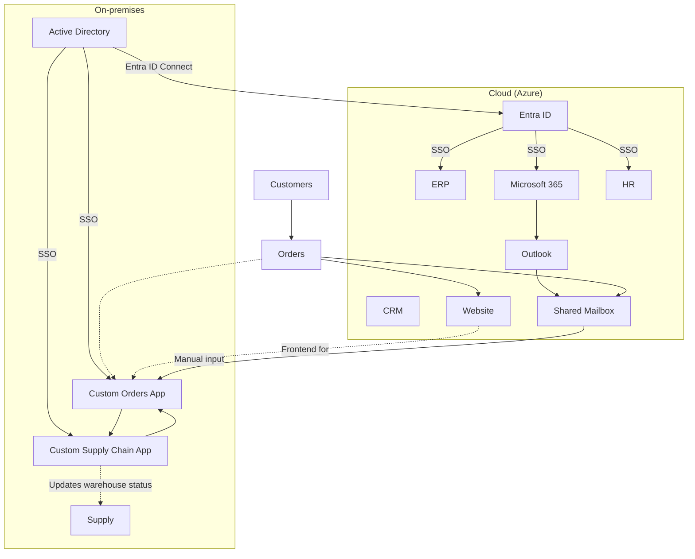
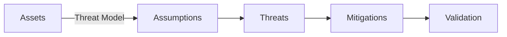
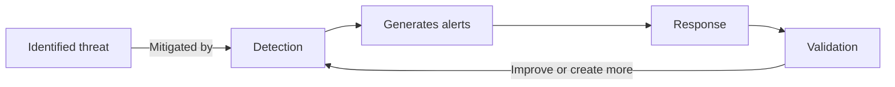
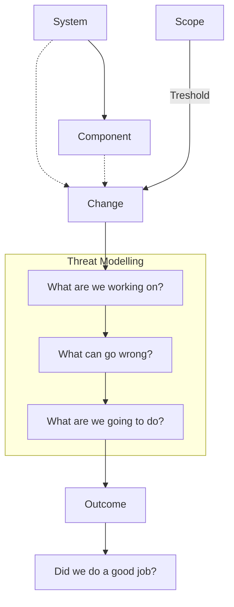
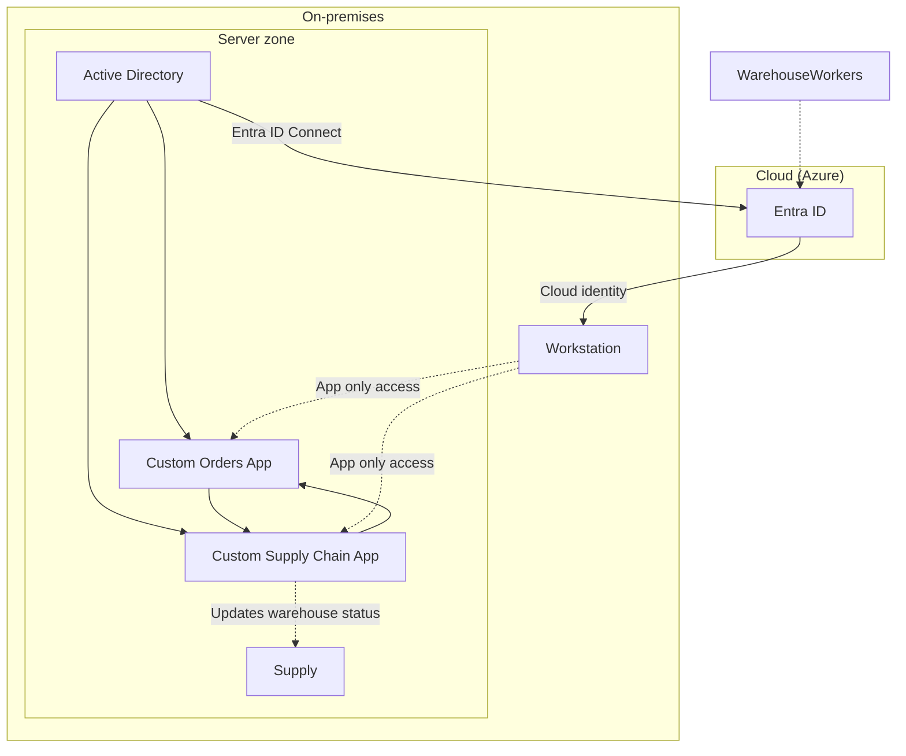

The idea that ingesting [all the data](https://www.infernux.no/SecurityStrategy/) and enabling [all the use cases](https://www.infernux.no/SecurityMonitoring-DevelopingUseCases/) is the best approach to security monitoring is something we have explored [time](https://www.infernux.no/SecurityMonitoringAntipatterns/#collection-is-not-detection) and [time again](https://www.infernux.no/AutomatingSecurityMonitoring1/) here on this blog. So I thought, instead of just ranting about it, let's show you how I would go about doing it. For this purpose I have create a mock company, which I will present, and a mock infrastructure. I will then go through the process of determining what data sources to use for what purpose, where to prioritize developing use cases and how to plan for the future.

I will also touch a little bit on threat modelling. For those of you who are adept at this, please bear with me. I've dumbed it down quite a bit, but I think it's important to show how threat modelling can be used in a practical sense for small and medium sized companies. 

## Table of Contents

* [The Company](#the-company)
* [The Business](#the-business)
* [The Infrastructure](#the-infrastructure)
  * [On-premises](#on-premises)
  * [Cloud](#cloud)
* [The Security perspective](#the-security-perspective)
* [Determining Data Sources](#determining-data-sources)
  * [Business-Critical Assets](#business-critical-assets)
  * [An important acknowledgement](#an-important-acknowledgement)
  * [What are you afraid of?](#what-are-you-afraid-of)
  * [Threat Model Example: A Five Year Old's Toys](#threat-model-example-a-five-year-olds-toys)
  * [Threat Model: Infernux Corp](#threat-model-infernux-corp)
* [Next steps](#next-steps)
    * [Tune and "perfect" our use cases](#tune-and-perfect-our-use-cases)
    * [Create new use cases](#create-new-use-cases)
    * [Monitor the alerts](#monitor-the-alerts)
    * [Implement a feedback loop](#implement-a-feedback-loop)
    * [Threat modelling lifecycle](#threat-modelling-lifecycle)
        * [Applying the four question framework to Infernux Corp](#applying-the-four-question-framework-to-infernux-corp)
* [Conclusion](#conclusion)

## The Company

Welcome to the world of **Infernux Corp** - tagline *"Definetively not evil"*. The company, which sells paper, is a medium size company with 100 employees, 3 offices and a datacenter. The company has a mix of on-premises and cloud infrastructure, with a mix of Windows and Linux servers. The company has an internal IT team of 7 people with two of them focused solely on security, and a CISO. 

## The Business

The company has the following "tech stack":

| Application | Description | Hosted |
| --- | --- | --- |
| ERP | Enterprise Resource Planning system | Cloud |
| AD | Active Directory | On-premises |
| Orders | Custom built application for managing orders, AD integrated | On-premises |
| Supply Chain | Custom built application for managing inventory and supply chain, AD integrated | On-premises |
| Website | Company website | Cloud |
| Office 365 | Email and productivity suite | Cloud |
| Azure | Cloud services | Cloud |
| Entra ID | Identity and Access Management system | Cloud |
| Entra ID Connect | Connects Entra ID to on-premises AD | Cloud |
| HR | Human resources system for managing employees and salary | Cloud |

This is how it looks in terms of the logical flow of information:

**The gist is that the customer orders either through one of two points of contact:**
1. The website, which is the main point of contact for customers and accounts for 90% of orders.
2. The shared mailbox, which is used by the sales team to receive orders from customers who prefer to order through email. This accounts for 10% of orders and has to be manually input into the custom orders application.

**For each order the following flow is followed:**
1. The order is received.
2. The order is processed in the custom orders application, which communicates with the custom supply chain application to make sure the order can be fulfilled.
3. The order is sent to the warehouse for fulfillment.
4. Based on the size of the order and the inventory, the order is either fulfilled or put on backorder.
5. The customer is notified of the status of the order immediately, and if the order is put on backorder, the customer is given an estimated time of arrival.
6. The supply chain application will also update the inventory in the warehouse and notify if the inventory is low, given a stock threshold.
7. The order is marked as fulfilled in the custom orders application.

## The Infrastructure

The infrastructure is as follows:

### On-premises

| Server | Description | OS | Role | 
| --- | --- | --- | --- | 
| DC01 | Domain Controller | Windows Server 2019 | Active Directory | 
| Orders01 | Orders Application | Windows Server 2019 | Custom Orders Application |
| SupplyChain01 | Supply Chain Application | Windows Server 2019 | Custom Supply Chain Application | 
| Firewall01 | Firewall | Palo Alto | Firewall | 
| ESXi01 | ESXi Host | VMware ESXi | Virtualization |
| WorkstationX | Workstation | Windows 10 | Workstation |

Some more information about the infrastructure:
* The servers are all virtualized on a VMware ESXi host. 
* The servers all run on the same virtual network and are connected to the internet through the firewall. 
* The firewall is a layer 7 firewall configured with default outbound allow and default inbound deny. 
* The firewall also serves the purpose of VPN termination for a site-to-site VPN to the Azure cloud and router. 
* There are no other network devices in the network, and the firewall is the only device that can route traffic between the servers and the internet. 
* The DC01 server is the only domain controller and is the primary domain controller, it also functions as the DNS server for the network.
* The domain controller is connected to Entra ID using the Entra ID Connect service.
* The Orders01 and SupplyChain01 servers are AD-enrolled, and the custom applications are integrated with AD for SSO, which in turn also allows for using Entra ID users to log in.
* The workstations are used by the warehouse workers to view the orders and update the inventory in the supply chain application.
* The workstations are domain joined and use AD for authentication.
* The warehouse workers have one account per workstation, and the account is used by multiple workers.

### Cloud

| Service | Description | Type | Role | IP |
| --- | --- | --- | --- | --- |
| ERP | Enterprise Resource Planning system integrated with Entra ID using an Enterprise Application | SaaS | Business Application | N/A |
| Website | Company website deployed using Azure App Service | PaaS | Frontend | N/A |
| Office365 | Email and productivity suite | SaaS | Email and Productivity | N/A |
| Azure | Cloud services | N/A | Infrastructure | N/A |
| Entra ID | Identity and Access Management system | SaaS | Identity and Access Management | N/A |
| Entra ID Connect | Connects Entra ID to on-premises AD | SaaS | Identity and Access Management | N/A |
| HR | Human resources system for managing employees and salary integrated with Entra ID using an Enterprise Application | SaaS | HR | N/A |

Some more information about the cloud services:
* The cloud services are all integrated with Entra ID for SSO.
* The websites has an input form that when submitted sends information to the custom orders application over the VPN.
* The HR system is integrated with Entra ID for both SSO and lifecycle management of users.

## The Security perspective

The company has the following security controls or products in place:

| Product | Description | Role |
| --- | --- | --- |
| Palo Alto | Firewall | Network Security |
| Microsoft Sentinel | SIEM | Security Monitoring |
| Microsoft 365 licenses | The company has a mix of licenses, mainly Enterprise Mobility + Security E3 for office workers and Microsoft 365 E5 for the IT and Security team  | Microsoft licensing |
| Defender for Endpoint | Endpoint protection rolled out to all office clients | Endpoint Security |
| Defender for Servers | Endpoint protection rolled out to all servers | Endpoint Security |
| Defender for Office 365 | Email protection enabled for all users | Email Security |
| Defender for Cloud | Cloud security posture management for Azure, not configured | Cloud Security |

Some more information about these controls or products: 

* The firewall is configured with default outbound allow and default inbound deny, except for the VPN. 
* The firewall is configured to allow only specific traffic outbound from the servers on the network.
* The workstations all have open access to the internet, and are able to communicate with the servers on the network.
* The users on the workstations in the warehouse are not licensed and do not have MFA.
* Defender for Endpoint is installed on all office clients, and Defender for Servers is installed on all servers - with default settings.
* Defender for Identity is not configured.
* Defender for Office 365 is configured with default settings.
* The company has not configured any alerting in Microsoft Sentinel, and the only logs being sent to Sentinel are currently the Azure Activity logs.
* Defender for Cloud Apps is not configured.
* Defender for Cloud is configured for all subscriptions with all plans, but is not integrated with Microsoft Sentinel.

## Determining Data Sources

So now we get to the fun part. In this case, we assume that we are not able to change the infrastructure or the security controls. We can at most install agents on the servers for logging purposes. Frustrating as that may be, this allows us to focus solely on the data sources that are available to us and how we can use them to monitor the security of the company. 

The first order of business (pun intended) is to determine what we want to protect in this scenario. As we have a decent understanding of the business and the infrastructure, we can start by defining the business-critical assets.

### Business-Critical Assets

Our general understanding of the business needs to be translated into a list of assets to protect. In this case, since we know that we have two ways of receiving orders, we can start by defining the applications that are used to process orders.

| Asset | Description | Criticality |
| --- | --- | --- |
| Orders Application | The custom orders application that is used to process orders | High |
| Supply Chain Application | The custom supply chain application that is used to manage inventory and supply chain | High |
| Active Directory | The domain controller that is used to manage users and computers and is required for the applications | High |
| Office 365 | The email and productivity suite that hosts the shared mailbox used to take orders | High |
| Website | The company website that is used to take orders | High |
| VPN | The site-to-site VPN that connects the on-premises network to the Azure cloud | High |

This is the list that I came up with. My reasoning is the following:
1. **The applications are obviously critical to the business**, as they are used to process orders and manage inventory.
2. **Anything that supports these applications is also critical**, such as the domain controller.
3. **The shared mailbox is critical** as it is used to take orders.
4. **The website is critical** as it is the main point of contact for customers and it's used to take orders.
5. **The VPN is critical** as it connects the on-premises network to the cloud, which is required for both the website and the sales team to communicate with the orders application. 

Now, if we dig even deeper, we see that as long as the on premise infrastructure is up and running, along with either the shared mailbox or website, the company can continue to receive orders. As the workstations in the warehouse are able to communicate with the servers, they can be used to enter orders manually if the VPN is down. In case of emergency, we could update the website to include a phone number and separate email address for orders, which would allow the sales team to take orders over the phone and manually input them into the orders application by using the workstations.

What we have here is the semblance of a business continuity plan. We have identified the critical assets and we have identified a way to continue operations in case of a failure. This is important, as it allows us to focus our monitoring efforts on the critical assets and the critical paths.

### An important acknowledgement

At this point, I want to acknowledge for everyone reading that, yes, what this company needs the most is not security monitoring. We don't know anything about the actual security strategy, BCP, patch management, inventory management, etc. We are just focusing on security monitoring for the sake of this post.

That being said, some things to obviosuly consider based on what we know are:
1. **Architecture review**, primarily the network architecture and the on-premises infrastructure.
2. **Identity and Access Management review**, primarily the AD and Entra ID setup. 
   * We already know that the company could benefit from implementing MFA for the warehouse workers, so maybe a F3 or F5 license for them would be a good idea.
3. **Defender XDR configuration**, in this case making sure that all the services are configured after best practices.
4. **Consider enabling Defender for Identity and configuring it, same with Defender for Cloud Apps.**

Usually I would **always advise to start with the basics**, but in this case, we are focusing on security monitoring. So let's get back to that.

### What are you afraid of?

So now comes the *fun part*. In an **ideal world, we would enable all the data sources and all the use cases**, then have a **stacked team of analysts** to go through the alerts together with some magic **automation and AI to help us out**. This however, **is not the case**. Usually most companies are in a situation where they have to prioritize what they do and what they do should probably have good effect for the amount of effort it takes. **It's also the case of cost and resources - logs cost money, and analysts cost money**.

To this point, the idea is that if we can determine what is the most important things to us and monitor that, then we are in a good place. If we can create use cases using this data that are high fidelity, then the time spent looking into alerts will be time well spent rather than time wasted. In our case, we have only two people dedicated to security, which in reality means no full time security analysts. So we need to be smart about what we do.

So what are we afraid of?

To accomplish this, let's do some threat modelling.

> *"Threat modelling works to identify, communicate, and understand threats and mitigations within the context of protecting something of value."* - [OWASP](https://owasp.org/www-community/Threat_Modeling)

A threat model typically includes:

  * Description of the subject to be modeled
  * Assumptions that can be checked or challenged in the future as the threat landscape changes
  * Potential threats to the system
  * Actions that can be taken to mitigate each threat
  * A way of validating the model and threats, and verification of success of actions taken

In laymans terms, it's a way of thinking about what you want to protect, what you are afraid of, and what you can do to protect it. When I talk to people about what logs to prioritize, we usually start with something that resembles a threat model, but is actually much simpler. It's a few questions:

- What are the most business critical assets?
- What is the most devastating thing that could happen to these assets?
- What is the most likely thing that could happen to these assets?
- Thinking of the system/company as a whole, what is the most devastating thing that could happen?
- What is the most likely thing that could happen to the system/company as a whole?

When working in security, you will usually *never* know the systems as well as the people who work with them every day. So it's important to involve the people who know the systems best in this process, and to ask them these questions. Even if they don't have the security knowledge or context, they will know what might bring the system down, or what can cause the most damage.

Now, let's do a simple threat model for a five year old with some toys they want to protect.

### Threat Model Example: A Five Year Old's Toys

#### Subject

An assortment of toys.

#### Assumptions

1. The toys are in a castle.
2. The toys are valuable.
3. The castle has a door.
4. Dragons like to steal gold.
5. Bandits like to steal toys.
6. Bandits wear masks.

#### Threats

1. Bandits, who like to steal toys.
2. Dragons, who like to steal gold.

#### Mitigations

1. Put a lock on the door to keep bandits out.
2. Look for people wearing masks to keep bandits out.
3. Put a sign on the door that says "No gold here" to keep dragons out.

#### Validation

1. Check if the toys are still in the castle.
2. Check if the lock is still on the door.
3. Check if the sign is still on the door.
4. Check if there are any people wearing masks inside the castle.

### Threat Model: Infernux Corp

Now that we have a general idea of how a threat model works, let's do one for Infernux Corp.

#### Subject

The business-critical assets of Infernux Corp.

#### Assumptions

The assumptions are what we know about the company and the infrastructure. We could probably come up with a very long list of assumptions here, but let's keep it simple. We will limit ourselves to 10 assumptions:

1. The company has an on premise network that is connected to the internet through a firewall.
2. The network is flat and all servers and workstations are on the same network.
3. The firewall is configured with default outbound allow and default inbound deny, but the servers are limited to specific outbound traffic. 
4. The workstations can communicate with the servers and the users on the workstations are shared among the warehouse workers.
5. The servers are virtualized on a VMware ESXi host, running Windows Server 2019.
6. The domain controller is the primary domain controller and is the DNS server for the network.
7. The custom applications are integrated with AD for SSO.
8. The shared mailbox is used by the sales team to receive orders.
9. The website is the main point of contact for customers and accounts for 90% of orders, and it communicates with the custom orders application over the VPN.
10. The VPN is used to connect the on-premises network to the Azure cloud.

Another assumption for this specific example is that we can't change any security products, controls or the infrastructure.

#### Threats

The threats are what we are afraid of. This can be anything from a ransomware attack to a disgruntled employee. Depending on the company and industry, the threats can vary greatly. A threat is a potential or actual undesirable event that may be malicious (such as DoS attack) or incidental (failure of a Storage Device). For Infernux Corp, we will limit ourselves to four specific threats:

1. Ransomware attack on the servers, which will effectively shut down our whole business.
2. Unauthorized access to the custom applications, which could lead to everything from sabotage to data theft/manipulation.
3. Unauthorized access to the domain controller, which could result in sabotage, data theft/manipulation or even a ransomware attack.
4. DOS attack on the website, which could result in loss of revenue.

#### Mitigations

The mitigations are what we can do to protect against the threats. This can be anything from implementing MFA to segmenting the network. For Infernux Corp, we will limit ourselves to mitigations that are directly related to security monitoring.

Our assumptions will be based in that Microsoft Sentinel (or Defender XDR unified portal) is the tool we will use to handle incidents. Enabling the right data sources and creating the right use cases will be our main focus. As such, the idea to enable the Defender XDR unified portal and configure it after best practices is a good idea, but I will not mention it here.

So, given what we know currently, we can come up with the following mitigations:

| Threat | Mitigation | Reasoning |
| --- | --- | --- |
| Ransomware attack on the servers | We can enable logging for security events on the workstations and send them to Microsoft Sentinel.  *Servers have EDR agents installed, so given our timeframe and resources we consider them protected.*  | This will allow us to monitor servers and workstations for any suspicious activity. |
| Ransomware attack on the servers | Generate [near-real-time (NRT)](https://learn.microsoft.com/en-us/azure/sentinel/near-real-time-rules/?wt.mc_id=SEC-MVP-5005030) use cases that check for patterns commmon to ransomware attacks. | This will allow us to monitor the servers and workstations for any suspicious activity. |
| Unauthorized access to the custom applications | Enable logging on the domain controller for Active Directory logs and send them to Microsoft Sentinel | This will allow us to monitor the custom applications for any suspicious activity. |
| Unauthorized access to the domain controller | Send logs from Active Diretory to Microsoft Sentinel.  *The DC has the EDR agent installed.* | This will allow us to monitor the domain controller for any suspicious activity. |
| Unauthorized access to the domain controller |Monitor highly privileged user activity. Monitor creation of new users (in this context, it should rarely happen). Monitor privileged role assignment. Monitor creation and modification of Group Policies. Monitor login attemps (unusual signins, failed attemps). Monitor account lockouts. | This will allow us to monitor the domain controller for any suspicious activity. |
| DOS attack on the website | [Enable diagnostic logging on the Azure App service](https://learn.microsoft.com/en-us/azure/app-service/troubleshoot-diagnostic-logs#overview/?wt.mc_id=SEC-MVP-5005030) and send it to Microsoft Sentinel | This will allow us to monitor any [errors, performance or security issues in the service](https://techcommunity.microsoft.com/t5/apps-on-azure-blog/azure-app-service-logging-how-to-monitor-your-web-apps-in-real/ba-p/3800390) |
| DOS attack on the website | Monitor failed authentications to the website. Monitor number of requests. *If we could, we would enable DDOS protection, use a web application firewall and in general follow the guidance in the  [Azure security baseline for App Service](https://learn.microsoft.com/en-us/security/benchmark/azure/baselines/app-service-security-baseline/?wt.mc_id=SEC-MVP-5005030).*  | This will allow us to monitor the website for any suspicious activity. |

Some other quick wins that require little effort and can be done quickly are:
1. **Enable logging for Azure and Microsoft 365 and send them to Microsoft Sentinel.**
    * This will allow us to monitor the cloud services for any suspicious activity.
2. **Enable selective logging for the firewall and send it to Microsoft Sentinel**
    * This is a layer 7 firewall, so assuming it has a IDS/IPS system, we can monitor for any alerts there. This is a quick win, and based on our network setup it should not be too noisy.
    * Going beyond that level of logging at this point would probably be overkill - the network is not segmented and we likely don't have good insight into what data is allowed to travel where. 
    * Network data like firewall logs and netflow data is mostly used for incident response and forensics, not for monitoring. It can be used for monitoring, but it's relatively low value compared to the cost.
3. **Enable selective logging for the VPN and send it to Microsoft Sentinel.**
    * Assuming we have a basic semblance of what the VPN is used for and when, we can monitor for any unusual activity here.  

Normally we would probably set up log servers (syslog and a windows event collector) to collect logs from all the servers and workstations. We could then place this server somewhere in DMZ, or with access to Azure via private link, but given the constraints of this scenario, we will limit ourselves to installing agents and logging directly to Microsoft Sentinel.

#### Validation

The validation is how we can check if our mitigations are working. This can be anything from checking logs to running a red team exercise. For Infernux Corp, we will limit ourselves to checking logs in Microsoft Sentinel and verifying that the use cases are working as intended. I wrote a bit more in detail about this in another [post](https://www.infernux.no/SecurityMonitoring-DevelopingUseCases/#testing-the-use-case).

My validation would be to check the following:
1. **Check that the logs in Microsoft Sentinel are being ingested correctly.**
2. **For each use case, run a test to see if it triggers an alert.**
    * For example, I could create a new user and assign it a privileged role to see if it triggers any alerts.
    * It's important to do this for each use case, as it's the only way to know if they are working as intended.
    * ***Obviously don't run an actual ransomware attack***, but you could simulate one by running a script that creates a lot of dummy files on the servers and then performs actions common in ransomware.

## Next steps

We have a general idea of what to do next. Implement the mitigations by ingesting logs into Microsoft Sentinel and creating use cases. We have a general idea of what to validate and how to do it.

From here we can start to think about what we want to do next. In order to make this a bit more clear, let's assume some things:

1. We have a security strategy in place that is aligned with the business strategy.
2. We have a business continuity plan in place that is aligned with the security strategy.
3. We have a patch management strategy in place that is aligned with the security strategy.
4. We have an inventory management system in place.

Given these assumptions, we can start to think about what we want to do next. We will keep it strictly to security monitoring, as that is the focus of this post.

### Tune and "perfect" our use cases

The first thing we want to do is to tune and "perfect" the use cases. This means that we want to make sure that the use cases are working as intended and that they are not generating too many false positives. This can be done by running tests and tweaking the use cases until they are working as intended.

### Create new use cases

Using the data sources we have enabled, we can start to create new use cases. This can be anything from monitoring for unusual activity on the servers to monitoring for unusual activity in the cloud. The key here is to focus on the critical assets and the critical paths, while maintaining high quality that assures that the alerts are actionable.

### Monitor the alerts

Once we have the use cases in place, we can start to monitor the alerts. This means that we want to make sure that the alerts are being generated and that they are being investigated. This can be done by setting up a process for handling alerts and making sure that the alerts are being investigated in a timely manner.

### Implement a feedback loop

We need to be able to continuously improve our use cases. This means having some sort of feedback loop where we can take input on a use case and use it to improve the use case. As this is a small team, it's likely easy to do this informally, but as the team grows, it's important to have a more formal process in place. Another thing to consider is if the infrastructure changes, we need to be able to adapt our use cases to the new infrastructure.

Assuming we have implemented some use cases, if we wanted to either add new ones or improve the current ones - we would do something like this:

The idea is that based on threat modelling and what we are afraid of, we can generate detection. By responding to these alerts, we gain some insight into wether or not it's a good detection in it's current form, or if it needs improvement in the form of tuning. This in turn becomes our validation of sorts, which informs the detection process further. If the detection is in an alright state, we can move on to the next threat.

### Threat modelling lifecycle

As with the above paragraph on feedback loops for use cases, we also need to have some sort of threat modelling lifecycle in place. We obviously might not have the time, people or resources to fully threat model everything - luckily we get some pretty decent tools from OWASP in form of the **four question framework**:

> A possible threat exists when the combined likelihood of the threat occurring and impact it would have on the organization create a significant risk. The following four question framework can help to organize threat modeling:

- What are we working on?
- What can go wrong?
- What are we going to do about it?
- Did we do a good job?

>There are many methods or techniques that can be used to answer each of these questions. There is no “right” way to evaluate the search space of possible threats, but structured models exist in order to help make the process more efficient. Attempting to evaluate all the possible combinations of threat agent, attack, vulnerability, and impact is often a waste of time and effort. It is helpful to refine the search space in order to determine which possible threats to focus on.

We can visualzie the threat modelling lifecycle like this:

This indicates that we probably would do well with some way of tracking changes - in the form of a change management process. This will also inform our threat modelling process, as we can then focus on the changes that are happening in the infrastructure and the business that exceed our determined scope. Not every change needs to be fully modelled, but we need to have a way of determining what changes are important to model.

#### Applying the four question framework to Infernux Corp

We are finally at the point where we can change the infrastructure. It's been decided to make some changes to the workstations in the warehouse and to segment the network:

The changes can be summarized as follows:

1. **The network will be segmented so that the servers are on a separate network from the workstations.**
2. **The workstations in the warehouse will be replaced with thin clients that are only able to access the custom applications.**
3. **The warehouse workers will be given individual accounts created in Entra ID that are used to access the custom applications.**
4. **The warehouse workers will be given SmartCard/FIDO2 to access the workstations.**

Given these changes, we can now apply the four question framework to Infernux Corp:

- **Assess Scope** - What are we working on? We are working on securing the custom applications and the domain controller, in addition to segmenting the on-premise network.
- **Identify what can go wrong** - User adoption of the new workstations and the new access controls, misconfiguration of the new network segments, misconfiguration of the new access controls. 
- **Identify countermeasures or manage risk** - Focus on security culture and training, have a plan for monitoring the new network segments and access controls, have a plan for monitoring the new workstations.
- **Assess your work** - Did we do a good job? This is where we would evaluate the success of the changes and the monitoring of the new network segments and access controls. At this very moment, it's hard to tell, but we can at least have a plan in place for how to evaluate the success of the changes.

## Conclusion

It's important to remember that security monitoring is not a one-size-fits-all solution. It's important to tailor your security monitoring to your specific business needs and infrastructure. By determining what data sources to use for what purpose, where to prioritize developing use cases and how to plan for the future, you can ensure that your security monitoring is effective and efficient.

I firmly believe that security monitoring is something that not everyone needs. In this case, I pass the question to the reader: **Does Infernux Corp need security monitoring?** They obviously need a lot of other stuff, as I've mentioned - but does security monitoring make sense for them? 

I will at least say that there's a lot of things that should be fixed and improved before focusing on security monitoring. Generally, security monitoring is something that demands maturity in other areas to form a solid foundation. Security monitoring built upon a good foundation by a team with intimate knowledge of what "normal" looks like will be able to create high fidelity, actionable use cases with low amounts of false positives. 

This includes things like actually making good use of the network logs, having a good understanding of what data is allowed to travel where, and having a good understanding of what the normal behavior of the network looks like. Also understanding which logs belongs in a SIEM and which logs are to be used for IR and compliance and can be sent to a cheaper storage solution. When to use what log tier, like utilizing [auxiliary logs in Microsoft Sentinel](https://learn.microsoft.com/en-us/azure/sentinel/basic-logs-use-cases) vs the standard analytics tier. 

Looking deeper into the logs, we can even start to filter the logs for irrelevant data, thus being able to ingest more (cutting cost) and still have a high fidelity in our use cases. Either working directly with the syslog or event collector servers, or using data engineering pipelines, wether that be something like [workspace transformation data collection rules in Sentinel](https://techcommunity.microsoft.com/t5/core-infrastructure-and-security/workspace-amp-dcr-transformation-simplified/ba-p/4186196) or tools like Cribl Stream and Tenzir.

In the end, security monitoring is a tool that can be used to help protect your business, but it's not a end all be all solution. It requires a lot of work to get right and it requires a lot of work to maintain. It's not something that you can just set and forget, it's something that requires constant attention and tuning.

Hopefully this blog post gives some insight into how to approach security monitoring and how to tailor it to your specific business needs and infrastructure. Making sure that you know what you want to protect, what you are afraid of, and what you can do to protect it is key to creating an effective and efficient security monitoring program that takes into account avaialble resources and constraints, like people and money 💰.