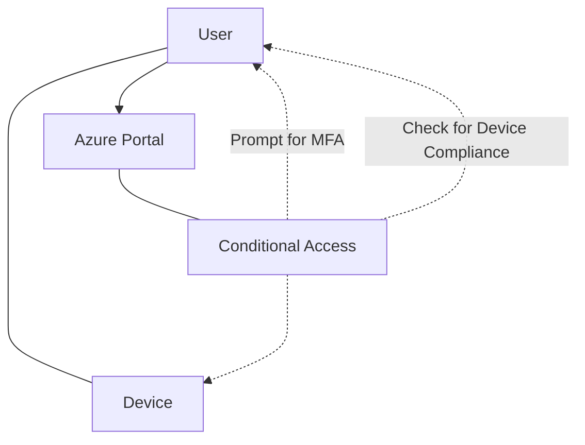
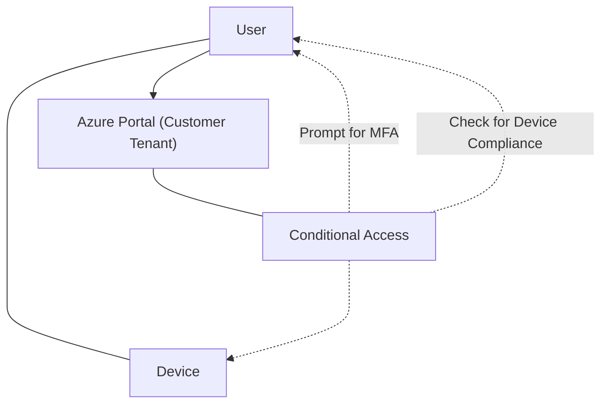

The layout for this article will be quite straightforward. I will create a table for each setting-menu and list the settings I would change. I will also provide a short explanation for why I would change the setting, as well as what the setting is by default.

## Table of Contents

- [User settings](#user-settings)
   - [Default user role permissions](#default-user-role-permissions)
    - [Guest user access](#guest-user-access)
    - [Administration center](#administration-center)
    - [LinkedIn account connections](#linkedin-account-connections)
    - [Show keep user signed in](#show-keep-user-signed-in)
- [External users](#external-users)
    - [Guest invite settings](#guest-invite-settings)
    - [External user leave settings](#external-user-leave-settings)
    - [Collaboration restrictions](#collaboration-restrictions)
    - [User features](#user-features)
- [External Identities - Cross-tenant access settings](#external-identities--cross-tenant-access-settings)
- [Enterprise applications](#enterprise-applications)
    - [Consent and permissions - User consent settings](#consent-and-permissions--user-consent-settings)
    - [Admin consent requests](#admin-consent-requests)
    - [Consent and permissions - Permission classifications](#consent-and-permissions--permission-classifications)
- [Protection - Identity Protection](#protection---identity-protection)
  - [Identity Protection - Conditional Access](#identity-protection--conditional-access)
  - [Identity Protection - User risk policy](#identity-protection--user-risk-policy)
  - [Identity Protection - Sign-in risk policy](#identity-protection--sign-in-risk-policy)
  - [Identity Protection - Multifactor authentication registration policy](#identity-protection--multifactor-authentication-registration-policy)
  - [Security - Named locations](#security--named-locations)
  - [Security - Authentication methods - Policies](#security--authentication-methods--policies)
  - [Security - Authentication methods - Password protection](#security--authentication-methods--password-protection)
  - [Security - Authentication methods - Registration campaign](#security--authentication-methods--registration-campaign)
  - [Security - Authentication methods - Authentication strengths](#security--authentication-methods--authentication-strengths)

## User settings

You can find the user settings [here](https://entra.microsoft.com/#view/Microsoft_AAD_UsersAndTenants/UserManagementMenuBlade/~/UserSettings/menuId/UserSettings) and an overview over default user permissions [on Microsoft Learn](https://learn.microsoft.com/en-us/entra/fundamentals/users-default-permissions/?wt.mc_id=SEC-MVP-5005030)

### Default user role permissions

| Setting | Default | Change | Reason |
| --- | --- | --- | --- |
|Users can register applications | Yes | No | Restrict non-admin users from creating applications |
|Restrict non-admin users from creating tenants | No | Yes | Restrict non-admin users from creating tenants |
|Users can create security groups | Yes | No | Restrict non-admin users from creating security groups |

I find these settings to be the most important to change in small companies. We want to restrict the ability to create applications, tenants and security groups to a select few people. This is to ensure that we have control over what is created in the tenant. For larger companies, I would add the ability to create security groups to more people, but would still do it on a need-to basis.

### Guest user access

| Setting | Default | Change | Reason |
| --- | --- | --- | --- |
|Guest user access restrictions | Limited access (default), Guests can see membership of all non-hidden groups | Restricted access (new), Guests can't see membership of any groups | Restrict guest user access |

This setting is important to restrict what guest users can see in the tenant. 
### Administration center

| Setting | Default | Change | Reason |
| --- | --- | --- | --- |
|Restrict access to Microsoft Entra admin center | No | Yes | Restrict access to the admin center |

This setting still only works for the user interface of the admin center, but it's a good setting to have in place. It restricts access to the admin center to a select few people. Tools like AzureHound can still be used to gather information about the tenant.

From Microsoft Learn:

> When should I not use this switch?
> Don't use this switch as a security measure. Instead, create a Conditional Access policy that targets Windows Azure Service Management API that blocks nonadministrators access to [Windows Azure Service Management API](https://learn.microsoft.com/en-us/entra/identity/conditional-access/concept-conditional-access-cloud-apps#windows-azure-service-management-api/?wt.mc_id=SEC-MVP-5005030). 

### LinkedIn account connections

| Setting | Default | Change | Reason |
| --- | --- | --- | --- |
|Allow users to connect their LinkedIn accounts | Yes | No | Restrict users from connecting their LinkedIn accounts |

You can read more about [data sharing with LinkedIn](https://learn.microsoft.com/en-us/entra/identity/users/linkedin-user-consent/?wt.mc_id=SEC-MVP-5005030) on Microsoft Learn. I think this setting depends on **what you are using the tenant for**. If it's a company tenant for collaboration, leave this on. If it's a management tenant for a managed services, turn it off.

### Show keep user signed in

| Setting | Default | Change | Reason |
| --- | --- | --- | --- |
|Show keep user signed in| Yes | No | Remove the option to keep users signed in |

I would turn this off. If you want to read more about what the [KMSI setting does](https://stackoverflow.com/questions/64850508/what-does-kmsi-in-azure-b2c-actually-do#64851053) you can read more on StackOverflow, but the general idea is that we want to remove the option to keep users signed in and have persistent sessions. 

We can manage this with Conditional Access and other settings, but disabling this setting is also an idea. We also did some testing trying to capture tokens using Evilginx2, and we found that turning the KMSI setting on was the only way to actually capture tokens in our tenant. I didn't to any actual testing to verify this, but since then I've just always turned it off. If someone has more information on this, please let me know.

## External users

You can find the external collaboration settings [here.](https://entra.microsoft.com/#view/Microsoft_AAD_IAM/AllowlistPolicyBlade).

It's start out with the same guest access setting we had in the user settings, then moves on to Guest invite settings.

### Guest invite settings

| Setting | Default | Change | Reason |
| --- | --- | --- | --- |
| Guest invite restrictions | Member users and users assigned to specific admin roles can invite guest users including guests with member permissions | Only users assigned to specific admin roles can invite guest users| Restrict guest user access |

Restricting who can invite guest users is important to prevent unauthorized access and persistent access to the tenant. 

### External user leave settings

I would not change any of these settings for security purposes, so this section is blank.

### Collaboration restrictions

| Setting | Default | Change | Reason |
| --- | --- | --- | --- |
| Collaboration restrictions | Allow invitations to be sent to any domain (most inclusive) | Allow invitations only to the specified domains (most restrictive) | Allowslist partners for collaboration only |

This setting is important to restrict who can be invited to the tenant. I would set this to the most restrictive setting, which is to only allow invitations to the specified domains. This is to ensure that we have control over who can be invited to the tenant. This goes no matter how small or big the tenant is in my eyes, this is a setting that should be changed and you should have control over.

### User features

You can find the user features settings [here.](https://entra.microsoft.com/#view/Microsoft_AAD_IAM/FeatureSettingsBlade).

I would not change any of these settings for security purposes, so this section is blank.

## External Identities | Cross-tenant access settings

Moving on from external user settings, let's take a look at the cross-tenant access settings. You can find the cross-tenant access settings [here.](https://entra.microsoft.com/#view/Microsoft_AAD_IAM/CompanyRelationshipsMenuBlade/~/CrossTenantAccessSettings/menuId/CrossTenantAccessSettings)

### Default settings

I would not necesarilly change any of these default settings, but it's important to know what they are. This section is blank. By default b2b collaboration is turned on and b2b direct access is blocked. Trust settings, which might be most important, are all turned off. These settings are as follows:

1. Trust multifactor authentication from other Entra ID tenants
2. Trust compliant devices
3. Trust Microsoft Entra hybrid joined devices

I would not change these default settings, but 1. and 2. might be changed for security purposes when working with partners. The reason for this is, for example if you're using a service provider for something in Azure. The default flow for the service provider will look something like this by default:

Now, this is just for accessing resources in their own tenant, given the fact that they use conditional access (they should). If they try to change to the customers tenant, this flow will happen again:

Important to note; the device compliance check will fail. This is because the setting is to not trust compliant devices from other tenants. You have two options for this, either you add an exception to users from that service provider (tenant, domain) or you trust compliant devices from that tenant.

As for MFA, currently the service provider would have to prompt for MFA twice. Once for their own tenant, and once for the customer tenant. This quickly leads to MFA fatigue, and might be a reason to trust MFA from other tenants. If you have a conditional access policy in place that requires a certain level of MFA strength, that should still be respected [as far as I can tell from reading Microsoft Learn](https://learn.microsoft.com/en-us/entra/external-id/cross-tenant-access-settings-b2b-collaboration#to-change-inbound-trust-settings-for-mfa-and-device-claims/?wt.mc_id=SEC-MVP-5005030) - the only thing that changes is that you don't have to prompt for MFA twice. 

Important to also know that if you use [granular delegated admin privileges (GDAP)](https://learn.microsoft.com/en-us/partner-center/customers/gdap-introduction/?wt.mc_id=SEC-MVP-5005030), this is like trusting MFA as well:

> When an external user signs in using GDAP, MFA is always required in the user's home tenant, and always trusted in the resource tenant

## Enterprise applications

### Consent and permissions | User consent settings

| Setting | Default | Change | Reason |
| --- | --- | --- | --- |
| User consent for applications | Allow user consent for apps from verified publishers, for selected permissions (Recommended) - All users can consent for permissions classified as "low impact", for apps from verified publishers or apps registered in this organization. | Do not allow user consent - An administrator will be required for all apps. | Restrict user consent | 

This setting is important to restrict what users can consent to. I would change this setting to require an administrator for all apps. This is to ensure that we have control over what is consented to in the tenant. Usually I have seen some malicious apps being consented to, and this is a good way to prevent that. What I have also seen, which prompts me to put do not allow consent, is legitimate apps that have been consented to by "users" that have been taken over, as a way to exfiltrate data. So this setting will stop that as well.

### Admin consent requests

| Setting | Default | Change | Reason |
| --- | --- | --- | --- |
| Users can request admin consent to apps they are unable to consent to​ | No | Yes | Allow users to request admin consent |

The rest of the settings in this section I would not change for security purposes, so this section is blank. Depending on the size of the company, a lot of configuration can be done here to spread the work of consent requests.

### Consent and permissions | Permission classifications

Here we can add [classifications to permissions](https://learn.microsoft.com/en-us/entra/identity/enterprise-apps/configure-permission-classifications?tabs=azure-portal&pivots=portal/?wt.mc_id=SEC-MVP-5005030). Please note that we can only do this for "... delegated permissions that don't require admin consent are supported."  In our case, we set it up so we need admin consent for all apps, so this section is blank.

For larger companies I can see setting the user setting a bit more lenient, like allowing the user to consent to "apps from verified publishers, for selected permissions", where those permissions are the one we classify here as "low impact":

## Protection - Identity Protection

You can get to the Identity Protection settings [here](https://entra.microsoft.com/#view/Microsoft_AAD_IAM/IdentityProtectionMenuBlade/~/OverviewNew/fromNav/Identity).

## Identity Protection | Conditional Access

Conditional access is huge, and I would much rather you go check out [Daniel Chronlund](https://danielchronlund.com/2020/11/26/azure-ad-conditional-access-policy-design-baseline-with-automatic-deployment-support/) and his work on this for a good baseline. 

If all else fails, I'd recommend the following policies to be in place at least:

1. Require MFA for all users
   * Preferably phishing resistant MFA, but passwordless is also an option
2. Require phishing resistant MFA for all administrators
   * Target high privileged admin roles
3. Require compliant devices for all users
   * If all else fails, you can limit this to just administrators or admin portals, but all users is the best idea
4. Disable legacy authentication
5. Session controls for all users
   * Sign-in frequency to 7-9 hours 
   * Persistent browser sessions off
   * Sign-in risk policy for high risk sign-ins or users in block

### Identity Protection | User risk policy

I'd set this to block for high (or medium), depending on company size. You can (and should) do this via conditional access, however. 

### Identity Protection | Sign-in risk policy

I'd set this to block for high (or medium), depending on company size. You can (and should) do this via conditional access, however. 

### Identity Protection | Multifactor authentication registration policy

Access the MFA registration [setting here.](https://entra.microsoft.com/#view/Microsoft_AAD_IAM/IdentityProtectionMenuBlade/~/MfaPolicy/fromNav/Identity)

Only changes I'd make from the default here is to change the default targetting. 

Default it targets all users with no exceptions, I'd change this to **exclude any break the glass users** you might have.

### Security | Named locations

Named locations can be accessed [here](https://entra.microsoft.com/#view/Microsoft_AAD_ConditionalAccess/ConditionalAccessBlade/~/NamedLocations/fromNav/Identity).

I would add at least two named locations here:

1. Office locations
2. Not allowed country list

This is to ensure that we have control over where users can sign in from. I would then create a conditional access policy for securing registration info limited to the office locations, and a policy for blocking sign-ins from the not allowed country list.

### Security | Authentication methods | Policies

| Setting | Default | Change | Reason |
| --- | --- | --- | --- |
| Passkey (FIDO2) | Disabled | Enabled | Enable FIDO2 for phishing resistant sign-in |

I would also remove any other authentication methods that are not needed, or that are not secure. In sum, I'd keep it at Passkey and Microsoft Authenticator only. For some scenarios you'd also need a Temporary Access Pass.

### Security | Authentication methods | Password protection

| Setting | Default | Change | Reason |
| --- | --- | --- | --- |
| Lockout threshold | 10 | 5 | Lower the lockout threshold |
| Lockout duration | 60 | 120 | Extend the lockout duration |
| Custom banned passwords | No | Yes | Add custom banned passwords |
| Enable password protection on Windows Server Active Directory | Mode (Audit) | Mode (Enforce) | Enforce password protection |

I would also add custom banned passwords, and enable password protection on Windows Server Active Directory (this is on by default, just making sure). Usually there's a good chance that you have some "standard" passwords like "Summer2023!" that you want to ban. 

### Security | Authentication methods | Registration campaign

| Setting | Default | Change | Reason |
| --- | --- | --- | --- |
| State | Disabled | Enabled | Enable registration campaign |
| Days allowed to snooze | 14 days | 0 days | Disable snooze |
| Limited number of snoozes | Disabled | Enabled | Limit snoozes |
| Excluded users and groups | None | Break the glass users | Exclude break the glass users |

I would enable the registration campaign, and limit the number of snoozes. I would also exclude break the glass users from the campaign.

### Security | Authentication methods | Authentication strengths

I would not change anything here, unless you have certain requirements for authentication strengths in your company. In this case, create a custom strength and use that in your conditional access policies.